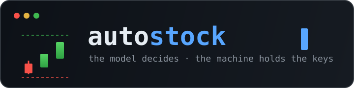
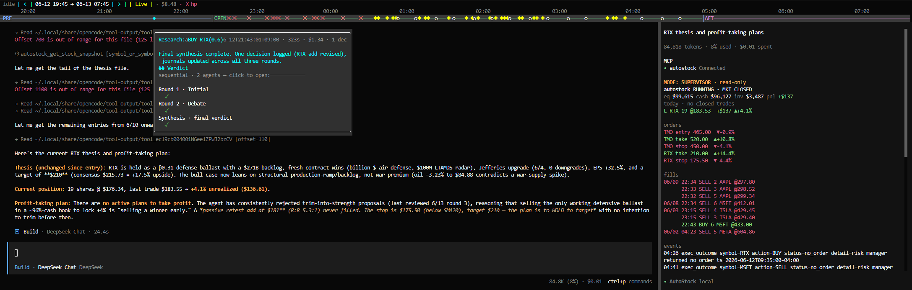

<p align="center">
  
</p>

<p align="center">
  <em>An LLM runs the book. Deterministic code holds the keys.</em>
</p>

<p align="center">
  
  
  
  
</p>

---

**autostock** is an automated equities trading system for US (NYSE/NASDAQ via Alpaca) and
Korean (KIS) markets. It ships two orchestration paths over one shared, safety-first core:

- a classic **strategy engine** (technical / ML / LLM / ensemble), and
- an **agentic LLM portfolio manager** that reasons over the whole book every trading day,
  journals its decisions, and lets a deterministic executor place the orders.

> ⚠️ Research / paper-trading project. Live trading is at your own risk — markets are
> adversarial and nothing here is financial advice.

---

## Philosophy

Most "AI trading bot" projects wire a language model straight to a broker API and hope the
prompt holds. autostock is built on the opposite conviction: **a model is a brilliant analyst
and a terrible fiduciary.** Let it think freely; never let it touch the money directly.

That conviction shows up as four hard rules baked into the architecture, not the prompt:

### 🧠 Brain / body split
The LLM is the **brain** — it researches, forms theses, and writes machine-readable
`Decision` lines to a journal. A deterministic Python **body** (`DecisionExecutor`) is the
*only* actuator. The model proposes; it cannot place an order. The hand-off is an append-only
file with an idempotent cursor, so a crash and restart never double-submits.

### 🚦 One risk gate, no exceptions
Every order — from the LLM, from a backtest strategy, from a human typing a console command —
passes through a single `RiskManager.validate_order()` before any broker call. Position
sizing, the portfolio circuit breaker, and bracket-leg validation live there. Nothing routes
around it. Not even you.

### 🛡️ Safe by default
Shorting ships **off** (unlimited downside is an explicit per-deployment opt-in). Position
size is risk-budget driven, protective stop/take-profit legs rest **at the exchange** (not
just in a polling loop), and a circuit breaker halts new entries when the book bleeds past a
threshold. The dangerous default is always the conservative one.

### 📓 Durable memory & bounded self-improvement
The agent's journal — theses, decisions, an equity curve, EOD lessons — *is* its memory, on
disk, surviving restarts. At post-close it reviews the day and writes lessons; those lessons
are attributed back to the decisions that cited them. The agent may even rewrite its own
guidance prompts — but only **within an immutable constitution**, with a compliance check and
automatic rollback. Autonomy with a fence around it.

A human is never locked out: the **operator console** lets you steer a running agent in plain
language ("trim AAPL by half", "halt new entries", "pause") — and even those commands go
through the same risk gate.

---

## See it run

<p align="center">
  
</p>

The **operator console** (a hard fork of [opencode](https://github.com/sst/opencode),
rebranded for trading) attaches to a running daemon over a file-drop channel. Above:
a pre/regular/after-hours **session timeline** with fill markers, the agent's **multi-round
research synthesis** in the center, and a read-only **supervisor sidebar** — account equity,
resting orders with their stop/take rails, recent fills, and the deterministic
`exec_outcome` event log. The LLM here is advisory; the human confirms, the gate executes.

---

## What it can do

| Capability | Notes |
|---|---|
| **Agent mode (LLM PM)** | `--mode agent`: daily research → journal → deterministic bracket execution; intraday event-driven wake turns; EOD self-review & self-learning |
| **Operator console** | Human-in-the-loop steering of a live agent in natural language; advisor-only, gate-enforced |
| **Backtesting** | Vectorised bar-by-bar engine; look-ahead-safe; shares the *same* RiskManager and strategy code as live |
| **Paper & live trading** | Alpaca paper/live (US), KIS paper (KR); batch or realtime (WebSocket) modes |
| **Technical strategies** | MA Crossover, RSI, MACD, Bollinger Bands |
| **ML strategies** | Random Forest, LSTM (feature engineering + persisted models) |
| **LLM strategy** | Claude / OpenAI signal generation with an automatic prompt-improvement loop |
| **Ensemble** | Voting / weighted combination of multiple strategies |
| **Risk management** | Risk-budget sizing, resting bracket (OCO) orders, stop/take-profit, circuit breaker, shorting master switch (off by default) |
| **Research signals** | Price movers, sector peer read-through, Finnhub earnings & IPO calendars, StockTwits retail-sentiment z-outliers |
| **Multi-broker** | Pluggable `BaseBroker` — Alpaca Trading, Alpaca Broker API (account farm), KIS, Simulated |

---

## Quick start

```bash
# install
pip install -e ".[dev]"

# credentials (US paper trading)
export ALPACA_API_KEY="your-api-key"
export ALPACA_API_SECRET="your-secret-key"
```

Get free Alpaca paper-trading keys at <https://app.alpaca.markets>.

```bash
# backtest a strategy
python main.py --mode backtest --symbols AAPL MSFT SPY

# paper trade (strategy engine)
python main.py --mode paper

# run the agentic LLM portfolio manager
python main.py --mode agent            # resume today's session
python main.py --mode agent --fresh    # start clean
```

Agent mode uses the local `claude` CLI as its brain (subscription auth at `~/.claude/`).
Its daily schedule (ET): pre-market research (~09:00) → execute at the open (09:30) →
event-driven intraday turns → EOD review (15:55). Journals, decisions, and logs persist
under `workspace/` (gitignored).

### Operator console

```bash
# one-time install — creates the ~/.local/bin/autostock launcher (+ systemd --user unit)
bun operator-console/launcher/install.ts

# run — preflight checks, auto-starts the daemon if down, else attaches
autostock
```

For ML training, parameter optimization, the prompt-improvement loop, broker-provider
switching (Alpaca Broker API account farm), and the full config reference, see the
sections below and **[docs/DESIGN.md](docs/DESIGN.md)**.

---

## Configuration

Behavior is driven by config, not code edits:

```yaml
# config/settings.yaml
risk:
  max_position_pct: 0.1     # ≤10% of equity per symbol
  stop_loss_pct: 0.05       # 5% stop
  take_profit_pct: 0.15     # 15% target
  max_open_positions: 10
  shorting_enabled: false   # explicit opt-in
```

```yaml
# config/strategies.yaml — single or multiple active strategies
active_strategies:
  - ma_crossover
  - rsi
```

Precedence: **CLI args > environment variables > `.env` > YAML > code defaults.** Nested keys
via `__` (e.g. `RISK__STOP_LOSS_PCT=0.03`). API keys come from the environment / `.env` only —
never committed.

---

## Architecture at a glance

```
       main.py  (CLI mode dispatch)
           |
   +-------+---------------------+
   v                             v
 strategy path                 agent path
 TradingEngine / Backtest      AgentTradingLoop (brain, claude CLI)
 (per-symbol cycle)              -> decisions.jsonl
   |                             -> DecisionExecutor (body, idempotent)
   +-------------+---------------+
                 v
            RiskManager   <-- the single gate; nothing bypasses it
                 v
            BaseBroker  (Simulated / Alpaca / KIS / Broker API)
                 ^
            src/core/  (Pydantic models, enums — depended on by all)
```

Layer rule: `trading / backtest / agent` → `strategy / risk / execution / data / signals` →
`core`. `core` depends on nothing. Full design rationale, data flows, and extension guides
live in **[docs/DESIGN.md](docs/DESIGN.md)** (한국어: [docs/DESIGN_KO.md](docs/DESIGN_KO.md)).

---

## Tests

```bash
python -m pytest tests/ -v
```

---

## Project layout

```
autostock/
├── main.py                 # entry point (--mode backtest/paper/live/agent)
├── config/                 # Pydantic Settings + settings.yaml / strategies.yaml
├── src/
│   ├── core/               # domain models, enums, exceptions (depends on nothing)
│   ├── data/               # BaseDataProvider — Alpaca, yfinance, KIS, news
│   ├── strategy/           # technical / ml / llm / ensemble (+ registry)
│   ├── risk/               # RiskManager — the single order gate
│   ├── execution/          # BaseBroker — Alpaca, Broker API, KIS, Simulated
│   ├── backtest/           # vectorised engine + metrics + optimizer
│   ├── trading/            # TradingEngine + batch/realtime/agent modes
│   ├── agent/              # LLM PM loop, executor, journal, steering, self-learning
│   ├── signals/            # research-turn signal assembly (movers/earnings/sentiment)
│   └── monitoring/         # health checks + alerts
├── operator-console/       # TypeScript human-steering TUI (opencode fork)
└── tests/                  # pytest
```

---

## License

Copyright 2026 Jihoon Park. Licensed under the **GNU General Public License v3.0** — see
[`LICENSE`](LICENSE) for the full text.

You are free to use, study, fork, and build on this project. GPLv3 is a **strong copyleft**
license: if you distribute or publish a fork, derivative, or modified version, you must:

- release the **complete corresponding source** under GPLv3 (no closed-source derivatives),
- retain the copyright and license notices, and
- state the changes you made.

The `operator-console/` subdirectory is a fork of
[opencode](https://github.com/sst/opencode) and retains its original MIT license
(see `operator-console/LICENSE`); MIT is GPL-compatible.

> **Citing this project**: if you reference autostock in research or writing, please cite it
> via the [`CITATION.cff`](CITATION.cff) metadata — GitHub shows a *"Cite this repository"*
> button in the sidebar.
