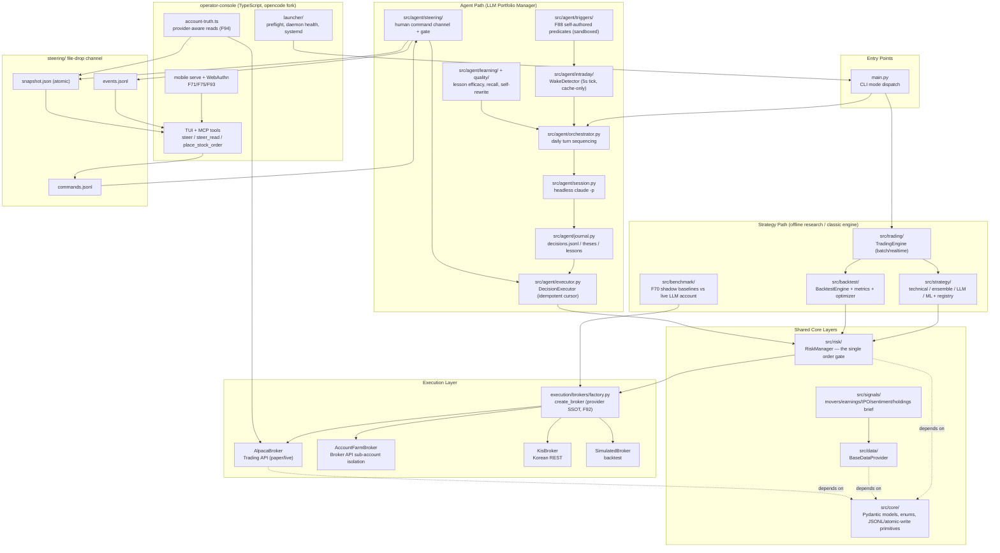
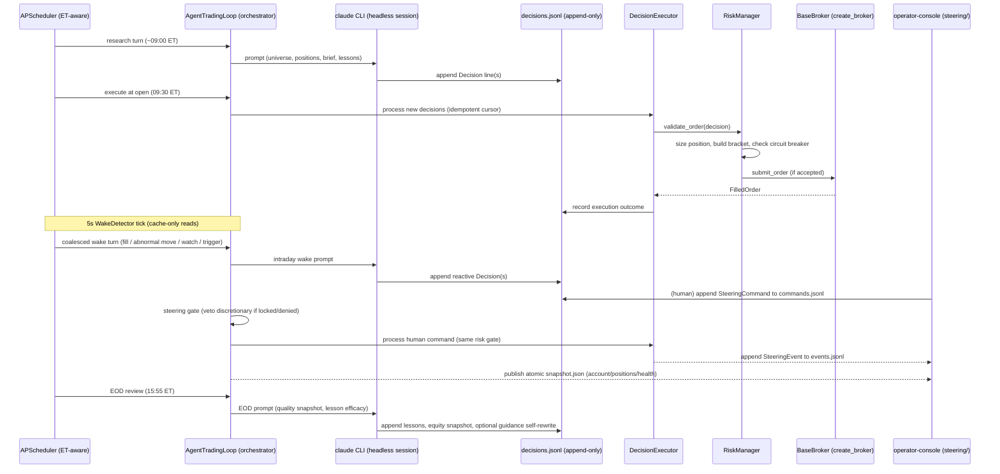

# System Architecture

## Architecture Diagram

## Component Descriptions

### `src/core/`
- **Purpose**: Foundational domain layer — Pydantic models (Order, Position, PortfolioState,
  TradeSignal, FilledOrder, OpenOrder, BacktestResult), enums (Signal, OrderSide, OrderType,
  OrderClass, TimeFrame, PositionSide), exception hierarchy, market-time (ET) helpers, and
  cross-process JSONL/atomic-write primitives.
- **Responsibilities**: Provide the shared vocabulary every other layer builds on; guarantee
  torn-read-safe reads and atomic writes for append-only/rewritable state files.
- **Dependencies**: None (leaf of the dependency graph).
- **Type**: Shared/Model.

### `src/risk/`
- **Purpose**: The single order-validation gate. Converts strategy/agent/human signals into
  broker-ready `Order`s (with bracket legs) or rejects them.
- **Responsibilities**: Position sizing, bracket-order construction (stop/target geometry,
  long and short), circuit breaker (market-halt threshold), shorting master switch + squeeze
  guard, human-order structured gate (F9), polled stop/take-profit backups.
- **Dependencies**: `src/core/`.
- **Type**: Shared.

### `src/execution/`
- **Purpose**: Broker abstraction and adapters.
- **Responsibilities**: `BaseBroker` ABC defines the contract (submit_order, positions,
  portfolio state, cancel/close, fills feed, latest prices). `factory.create_broker(settings)`
  (F92) is the single composition root mapping `broker.provider` (alpaca | kis |
  account_farm) to a concrete broker — every account-truth read path must call it.
- **Dependencies**: `src/core/`.
- **Type**: Shared.

### `src/data/`
- **Purpose**: Market-data abstraction over multiple sources.
- **Responsibilities**: `BaseDataProvider` interface; Alpaca (primary, with F14 HTTP
  timeouts), yfinance (fallback, public), KIS (Korean equities), and a news provider with
  keyword-based sentiment scoring. Concurrent price fetch via bounded thread pool.
- **Dependencies**: `src/core/`.
- **Type**: Shared.

### `src/signals/`
- **Purpose**: Assembles the research-turn "market signal brief" fed to the LLM prompt.
- **Responsibilities**: Price movers, sector/peer read-through, Finnhub earnings & IPO
  calendars, StockTwits retail-sentiment z-outliers, disclosed 13F holdings. Fail-honest:
  every source is best-effort; failures degrade gracefully into a `degraded_sources` list
  rather than aborting the brief.
- **Dependencies**: `src/data/`, `src/core/`.
- **Type**: Shared.

### `src/strategy/`
- **Purpose**: Pluggable, registry-based signal generation for the classic (non-agent) path.
- **Responsibilities**: Technical indicators (RSI, MA crossover, MACD, Bollinger), weighted
  ensemble voting, LLM-powered strategy (Claude/OpenAI/claude_code providers), ML strategies.
- **Dependencies**: `src/core/`, `src/data/` (indirectly via bars).
- **Type**: Shared.

### `src/agent/`
- **Purpose**: The LLM portfolio-manager brain and its deterministic body.
- **Responsibilities**: Daily turn orchestration (research/intraday/EOD), headless Claude CLI
  session, append-only journal (decisions, theses, lessons, equity, turns), idempotent
  `DecisionExecutor`, intraday event-driven wake detection (5s scheduler tick, cache-only
  reads), self-authored long-horizon triggers (sandboxed predicate evaluation), human
  steering channel + approval gate, self-learning (lesson efficacy, situational recall,
  bounded self-rewrite of guidance prompts), aggressiveness knob (risk/prompt/learning
  overlay).
- **Dependencies**: `src/risk/`, `src/execution/`, `src/data/`, `src/signals/`, `src/core/`.
- **Type**: Application.

### `src/trading/`
- **Purpose**: Orchestrates Data → Strategy → Risk → Broker for the classic strategy path, and
  hosts the agent trading mode's market-aware scheduler.
- **Responsibilities**: Batch/realtime cycle execution, universe-based symbol selection,
  polled risk-exit checks, agent-mode scheduling (pre-market research, open execution,
  intraday turns, EOD review).
- **Dependencies**: `src/strategy/`, `src/risk/`, `src/execution/`, `src/data/`, `src/agent/`.
- **Type**: Application.

### `src/backtest/`
- **Purpose**: Vectorised, look-ahead-safe historical simulation.
- **Responsibilities**: Bar-by-bar engine with intra-bar protective-order triggering (gap-safe,
  matches live bracket behavior), FIFO round-trip matching for metrics, fast-path
  precompute optimization, parallel grid-search parameter optimizer.
- **Dependencies**: `src/strategy/`, `src/risk/`, `src/core/`.
- **Type**: Application.

### `src/benchmark/`
- **Purpose**: F70 shadow baselines — runs deterministic strategies on isolated sandbox
  accounts to produce an apples-to-apples comparison against the live LLM account's equity
  curve.
- **Responsibilities**: Background thread ticking independent `TradingEngine`s per baseline,
  masked-account equity snapshots, pure comparative metrics (alpha = LLM return − baseline
  return) computed over a shared overlapping window.
- **Dependencies**: `src/trading/`, `src/execution/` (AccountFarmBroker sandbox), `src/core/`.
- **Type**: Application.

### `src/monitoring/`
- **Purpose**: Operational health checks and alerting.
- **Responsibilities**: Dimension checkers (broker connectivity, risk compliance, account
  health, logs, data pipeline, process/resources) run in parallel via a dispatcher; one
  checker's failure never sinks the overall report.
- **Dependencies**: `src/execution/`, `src/risk/`, `src/core/`.
- **Type**: Shared.

### `src/early_session/`
- **Purpose**: Detects and archives sharp early-session (09:30–10:30 ET) price moves for
  later agent analysis.
- **Responsibilities**: 1-minute circular buffer per symbol, pure threshold detector,
  before/after window dump to workspace.
- **Dependencies**: `src/data/`, `src/core/`.
- **Type**: Application.

### `src/surge/`
- **Purpose**: EOD surge/dive detection across the universe with agent-assisted root-cause
  tagging.
- **Responsibilities**: Daily scan sorted by magnitude, volume-ratio computation, persisted
  history + analysis JSONL.
- **Dependencies**: `src/data/`, `src/core/`.
- **Type**: Shared.

### `src/universe/`
- **Purpose**: Builds and caches the tradeable symbol pool.
- **Responsibilities**: US (S&P 100 via Wikipedia, optional market-cap ranking) and KR (KIS
  ranking) base providers, theme overlays, 1-day-TTL atomic snapshot cache with fail-closed
  fallback to the last good snapshot.
- **Dependencies**: `src/core/`.
- **Type**: Shared.

### `src/evals/` + `evals/`
- **Purpose**: LLM behavior evaluation harness.
- **Responsibilities**: Frozen `Scenario` fixtures (intraday/wake/EOD), sandboxed agent-turn
  execution, tier-1 deterministic grading — extraction integrity, behavior-vs-expectation,
  and **executor replay through the real production `DecisionExecutor`/`RiskManager`** (so
  grading rules can't drift from production behavior). promptfoo integration drives the test
  matrix across guidance versions and models.
- **Dependencies**: `src/agent/`, `src/risk/`, `src/execution/` (SimulatedBroker).
- **Type**: Test.

### `operator-console/`
- **Purpose**: Human-in-the-loop steering TUI (hard fork of `sst/opencode`, MIT-licensed).
- **Responsibilities**: Natural-language command parsing (deterministic, fail-closed) with
  MCP-tool auto-gating for confirmation, structured Alpaca-shaped order tools, read-only
  monitoring (status/positions/orders/thesis/screening/agent-trace), a launcher that
  installs/health-checks a systemd `--user` daemon, and a mobile path (Tailscale-only
  `serve` + WebAuthn passkey gate for remote mutating commands, PWA dashboard).
- **Dependencies**: Talks to the Python daemon exclusively via the `steering/` file-drop
  channel; never imports Python code directly.
- **Type**: Frontend.

## Data Flow

## Design Patterns

### Brain / Body Split
- **Location**: `src/agent/session.py` (brain, LLM) vs. `src/agent/executor.py` (body,
  deterministic).
- **Purpose**: The LLM can reason freely but cannot place an order; only the Python executor
  is an actuator, and it validates every action against `RiskManager` before touching a
  broker.

### Single Order Gate
- **Location**: `src/risk/manager.py` (`RiskManager`), invoked from `executor.py`,
  `trading/engine.py`, and the console's structured order tools (via the daemon).
- **Purpose**: No code path places an order without passing through the gate — sizing,
  bracket geometry, circuit breaker, and shorting checks are centralized once.

### Provider Factory (Composition Root)
- **Location**: `src/execution/brokers/factory.py` (`create_broker`), `main.py`
  (`create_data_provider`, `create_strategies`).
- **Purpose**: Single place mapping config (`broker.provider`, `data.provider`,
  `llm.provider`) to concrete implementations; prevents hard-coded broker construction from
  silently reading the wrong account (the class of bug fixed by F92/F94).

### Torn-Read-Safe Append + Atomic Rewrite
- **Location**: `src/core/jsonl.py` (`read_complete_lines`, `atomic_write_text`,
  `ByteCursor`); mirrored in `operator-console/src/filedrop.ts`.
- **Purpose**: Cross-process JSONL files (decisions, commands, watch, lessons) are read only
  up to the last complete line; files that must be rewritten in place (position theses,
  snapshot.json, executor cursor state) go through temp-file + `os.replace` so no reader ever
  observes a torn write.

### File-Drop IPC (no shared process, no network required)
- **Location**: `src/agent/steering/channel.py` ↔ `operator-console/src/filedrop.ts`.
- **Purpose**: The TypeScript console and Python daemon never call each other directly;
  they communicate purely through files in `steering/` (commands.jsonl, events.jsonl,
  snapshot.json), so either side can restart independently without losing state.

### Fail-Honest / Fail-Closed Split
- **Location**: `src/signals/collector.py` (fail-honest: degrade with a visible marker) vs.
  `src/risk/manager.py` shorting/stop checks and `src/universe/base.py` (fail-closed: refuse
  rather than proceed on missing/invalid data).
- **Purpose**: Research-quality inputs degrade gracefully (better to trade on a partial
  brief than none); safety-critical decisions (order placement, universe selection) refuse
  outright rather than guess.
