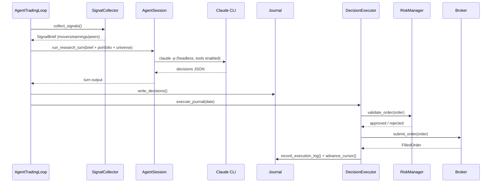

# System Architecture

## System Overview

Autostock has **two distinct orchestration paths** sharing the same domain core (`src/core/`), risk gate (`src/risk/`), and broker abstraction (`src/execution/`):

1. **Strategy path** (original): `TradingEngine` runs pluggable strategies (technical / ML / LLM / ensemble) per symbol. Used by backtest, paper, and realtime modes.
2. **Agent path** (newer, most actively developed): an agentic LLM portfolio manager reasons over the whole book each trading day via the local `claude` CLI, writes machine-readable `Decision` lines to a file journal, and a deterministic `DecisionExecutor` places resting bracket orders. Used by `--mode agent`.

## Architecture Diagram

```text
                         main.py  (CLI mode dispatch)
                             |
       +---------------------+--------------------------+
       |                     |                          |
       v                     v                          v
  backtest mode        paper / realtime modes       agent mode
       |                     |                          |
       v                     v                          v
 BacktestEngine        TradingEngine             AgentTradingMode
 (SimulatedBroker)     (per-symbol cycle)        +----------------------------+
       |                     |                   | AgentTradingLoop           | brain
       |                     |                   |  -> SignalCollector (F61)  |
       |                     |                   |  -> AgentSession           | (claude CLI)
       |                     |                   |  -> Journal (files)        |
       |                     |                   +---------+------------------+
       |                     |                             | decisions.jsonl
       |                     |                             v
       |                     |                   DecisionExecutor              body
       |                     |                   (cursor-idempotent)
       |                     |                             |
       |                     |   [SteeringRuntime + CommandBus — optional]
       |                     |                             |
       +---------+-----------+--------------+--------------+
                 v                          v
           RiskManager  <----------->  BaseBroker
         (signal -> Order)     (Simulated / Alpaca / KIS / BrokerAPI)
                 ^
                 |
           src/core/  (models, enums, exceptions — depended on by all)
```

## Component Descriptions

### AgentTradingLoop (`src/agent/orchestrator.py`)
- **Purpose**: Daily PM cycle — research turn → 0-N intraday turns (event-driven) → EOD review
- **Responsibilities**: Sequences LLM calls, assembles prompts, drives executor, manages journal, handles self-learning recall and constitution/self-rewrite
- **Dependencies**: AgentSession, DecisionExecutor, SignalCollector, SteeringRuntime (optional), Journal
- **Type**: Application

### AgentSession (`src/agent/session.py`)
- **Purpose**: Wraps `claude -p` CLI in headless mode with a curated tool manifest
- **Responsibilities**: Spawns subprocess, streams JSON output, enforces turn timeout, exposes market tools (quote, indicators, scoreboard, fundamentals, earnings) to LLM
- **Dependencies**: Claude Code CLI (subscription auth at `~/.claude/`), `src/agent/tools/__main__.py`
- **Type**: Application

### DecisionExecutor (`src/agent/executor.py`)
- **Purpose**: Converts LLM journal decisions into real broker orders — the only actuator in agent mode
- **Responsibilities**: Idempotent cursor-based replay, pool/expiry/circuit-breaker checks, gates through RiskManager (bracket mode), records execution log, atomic cursor writes
- **Dependencies**: RiskManager, BaseBroker, Journal
- **Type**: Application

### SteeringRuntime (`src/agent/steering/runtime.py`)
- **Purpose**: Human-in-the-loop daemon engine — optional (`--steering` flag)
- **Responsibilities**: Polls file-drop channel, dispatches through CommandBus, publishes monitor.json snapshot, coordinates turn sequencing via TurnCoordinator
- **Dependencies**: CommandBus, SteeringChannel, TurnCoordinator, ReconcileWorker
- **Type**: Application

### CommandBus (`src/agent/steering/bus.py`)
- **Purpose**: Single-writer queue for all broker operations (NFR-2)
- **Responsibilities**: Serialises concurrent command/snapshot requests onto one worker thread; prevents order/fill races between LLM executor and human commands
- **Dependencies**: BaseBroker, RiskManager
- **Type**: Shared

### SignalCollector (`src/signals/collector.py`)
- **Purpose**: Pre-research signal assembly (F61/F77) — movers, peer read-through, earnings, retail sentiment
- **Responsibilities**: Scans price movers (price % or volume multiple), propagates to sector peers via static PeerMap (R6/R7), fetches Finnhub earnings calendar (R3), aggregates StockTwits retail sentiment z-outliers (F77), builds markdown/structured brief injected into research prompt; TTL-cached to share between push (prompt) and pull (agent tools) paths
- **Dependencies**: AlpacaProvider, FinnhubEarnings, StockTwitsSource, PeerMap
- **Type**: Shared

### TradingEngine (`src/trading/engine.py`)
- **Purpose**: Strategy evaluation loop for non-agent modes
- **Responsibilities**: Iterates universe symbols, calls `strategy.generate_signal()`, gates through RiskManager, submits to broker, polls stop/take-profit exits
- **Dependencies**: BaseStrategy, RiskManager, BaseBroker, BaseDataProvider
- **Type**: Application

### RiskManager (`src/risk/manager.py`)
- **Purpose**: Single gate from signal/decision to Order — no LLM involvement
- **Responsibilities**: Position-size limits, portfolio circuit breaker, short master switch (F60), short-specific halt rules (F54), bracket leg validation (long vs short direction), market-halt halts
- **Dependencies**: BaseBroker (for portfolio state), RiskConfig
- **Note**: Dual-mode — `use_bracket_orders` selects legacy market-order+polled-exits vs resting BRACKET/OCO (structural debt S-2)
- **Type**: Shared

### BaseBroker (`src/execution/base.py`)
- **Purpose**: Abstract broker interface; implementations swap without changing callers
- **Implementations**: AlpacaBroker (paper/live), BrokerApiBroker (sandbox farm), KisPaperBroker (Korean equities), SimulatedBroker (backtest)
- **Type**: Shared

### BacktestEngine (`src/backtest/engine.py`)
- **Purpose**: Vectorised bar-by-bar simulation against SimulatedBroker
- **Responsibilities**: Iterates historical bars, applies strategy + risk + SimulatedBroker; collects BacktestResult metrics; optionally drives prompt auto-improvement loop
- **Type**: Application

### BrokerApiBroker (`src/execution/brokers/broker_api_broker.py`)
- **Purpose**: Broker implementation using the Alpaca Broker API (sandbox farm)
- **Responsibilities**: Shares all request-building / fill-polling / position-mapping logic with `AlpacaBroker` via `AlpacaShapedBroker`; supplies only the Broker-API client hooks and account-ID routing
- **R7 fix**: Short-cover side mapping corrected (`sell` → `buy_to_cover`); TIF handling is now fail-closed (unsupported TIF raises, not silently downgrades)
- **Type**: Shared

## Data Flow (Agent Turn — Simplified)



## Design Patterns

### Strategy Registry
- **Location**: `src/strategy/registry.py`
- **Purpose**: `@register_strategy` decorator auto-registers strategy classes; `create_strategy()` factory resolves by name from `strategies.yaml`

### Port/Adapter (Broker + Data)
- **Location**: `src/execution/base.py`, `src/data/base.py`
- **Purpose**: Swap broker (Alpaca/KIS/Simulated) or data provider (Alpaca/yfinance/KIS) without changing callers

### Brain/Body Split (Agent)
- **Location**: `src/agent/orchestrator.py` (brain), `src/agent/executor.py` (body)
- **Purpose**: LLM reasons and journals; deterministic executor is the sole actuator; crash safety via cursor file

### Idempotent Cursor Replay
- **Location**: `src/agent/executor.py`
- **Purpose**: Atomic `os.replace()` cursor write; restart replays only decisions after cursor index; torn-file impossible with single-writer CommandBus

### Single-Writer CommandBus
- **Location**: `src/agent/steering/bus.py`
- **Purpose**: All broker mutations serialised on one worker thread (NFR-2); prevents concurrent order/fill corruption

## Layer Dependency Rule

```
trading / backtest / agent  →  strategy / risk / execution / data / signals  →  core
core depends on nothing
```

## Known Structural Debt

- **S-2**: `RiskManager` is dual-mode toggled by `use_bracket_orders` — legacy market-order + polled exits vs resting BRACKET/OCO; the two modes diverge in behavior.
- **S-3**: Some `src/` modules reach into the config singleton directly (layer violation vs injection through `main.py`).
