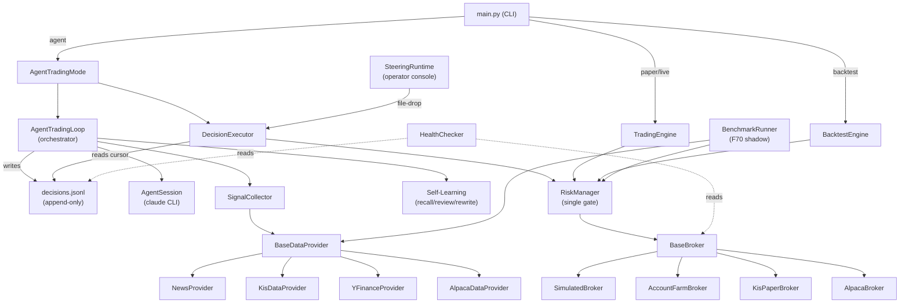

# System Architecture

## Architecture Diagram



## Component Descriptions

### `src/core/`
- **Purpose**: Domain model layer — Pydantic models, enums, pure helpers
- **Responsibilities**: Bar, TradeSignal, Order, Position, PortfolioState, FilledOrder, OpenOrder, BacktestResult; Signal/OrderSide/OrderType/OrderClass/TimeFrame enums; FIFO trade matching (trades.py)
- **Dependencies**: Nothing (no upward imports)
- **Type**: Shared

### `src/agent/orchestrator.py` — AgentTradingLoop
- **Purpose**: Sequences the PM agent's daily session turns (morning research, intraday wakes, EOD review)
- **Responsibilities**: Dispatches multi-agent sub-tasks via ThreadPoolExecutor; universe-pool enforcement; injects signal brief, reflection lessons, and aggressiveness disposition into prompts; caches efficacy outcomes per session day
- **Dependencies**: AgentSession, Journal, SignalCollector, self-learning modules
- **Type**: Application

### `src/agent/executor.py` — DecisionExecutor
- **Purpose**: Deterministic, idempotent translation of journal decisions into broker orders
- **Responsibilities**: Reads decisions.jsonl with an append-only cursor; deduplicates by turn_id; routes BUY to bracket order, SELL to exit, ADJUST_STOP to replace; all orders pass through RiskManager
- **Dependencies**: RiskManager, BaseBroker, BaseDataProvider, Journal
- **Type**: Application

### `src/agent/journal.py` — Journal
- **Purpose**: Durable file-based memory for the agent across daily sessions
- **Responsibilities**: Writes/reads decisions.jsonl (machine), theses.md (narrative), lessons.jsonl, equity_curve.jsonl; manages session resumption (same-day vs fresh)
- **Dependencies**: src/core/models
- **Type**: Application

### `src/agent/steering/` — SteeringRuntime + SteeringChannel
- **Purpose**: Human-in-the-loop steering channel between operator console and daemon
- **Responsibilities**: commands.jsonl (operator to daemon) file-drop with HMAC token validation, dedup, command verb dispatch; events.jsonl (daemon to operator) append-only event feed; snapshot.json atomic live read view; off-hours order queue
- **Dependencies**: DecisionExecutor, RiskManager, Journal
- **Type**: Application

### `src/agent/learning/`
- **Purpose**: Bounded self-improvement loop
- **Responsibilities**: constitution.py — immutable governance rules pinned by CI checksum; self_rewrite.py — guided prompt rewriting within constitution bounds; efficacy.py — decision-level outcome grading; recall.py — situational lesson recall; review.py — EOD self-review
- **Dependencies**: Journal, AgentSession
- **Type**: Application

### `src/risk/manager.py` — RiskManager
- **Purpose**: The single, non-bypassable order gate
- **Responsibilities**: Position sizing (risk-budget driven); bracket order construction (stop + take-profit as OCO legs at exchange); circuit breaker (halt new entries when portfolio drawdown exceeds threshold); short-safety gate (ETB check, mandatory stop, inverted bracket geometry); validate_order() is the single entry point
- **Dependencies**: PositionSizer, src/core
- **Type**: Shared

### `src/execution/`
- **Purpose**: Broker abstraction layer
- **Responsibilities**: BaseBroker ABC; AlpacaBroker (Alpaca Trading API, US live/paper); AccountFarmBroker (Alpaca Broker API, multi-account sandbox); KisPaperBroker (Korea Investment & Securities, paper); SimulatedBroker (in-process simulation); session_timeout.py (KIS token refresh)
- **Dependencies**: src/core, alpaca-py, python-kis
- **Type**: Shared

### `src/data/`
- **Purpose**: Market data abstraction layer
- **Responsibilities**: BaseDataProvider ABC; OHLCV bars, latest prices, news; AlpacaDataProvider, YFinanceProvider, KisDataProvider, NewsProvider; intraday/ — per-symbol Parquet feature store (IntradayFeatureStore) auto-collected on daemon start (F82)
- **Dependencies**: src/core, alpaca-py, yfinance, pyarrow/pandas
- **Type**: Shared

### `src/signals/`
- **Purpose**: Research-turn market intelligence assembly
- **Responsibilities**: SignalCollector — price movers, peer read-through, earnings calendar, IPO calendar, retail sentiment, disclosed institutional holdings; brief.py — formats signal bundle as prompt text; holdings/ — SEC 13F ingestion, CUSIP-ticker mapping
- **Dependencies**: src/data, src/core, Finnhub/StockTwits/SEC HTTP
- **Type**: Shared

### `src/strategy/`
- **Purpose**: Deterministic signal generation for non-agent path
- **Responsibilities**: BaseStrategy ABC; technical (MA crossover, RSI, MACD, Bollinger); ensemble (voting, weighted); LLM strategy (wraps Claude/GPT session); ML feature engineering; strategy registry
- **Dependencies**: src/core, src/data
- **Type**: Shared

### `src/backtest/`
- **Purpose**: Offline strategy evaluation
- **Responsibilities**: Vectorised backtest engine (look-ahead-safe); performance metrics (Sharpe, max drawdown, win rate, profit factor); parameter optimizer
- **Dependencies**: src/core, src/risk, src/strategy
- **Type**: Application

### `src/benchmark/` — BenchmarkRunner (F70)
- **Purpose**: Shadow deterministic baselines alongside the live agent
- **Responsibilities**: Runs buy-and-hold / MA / RSI / MACD / Bollinger on dedicated sandbox accounts; records equity alongside LLM account for comparison
- **Dependencies**: src/risk, src/data, src/strategy, AccountFarmBroker
- **Type**: Application

### `src/monitoring/`
- **Purpose**: Operational health and alerting
- **Responsibilities**: HealthChecker — parallel dimension checkers (account, broker, LLM, config/env, data pipeline, logs, process, resources, risk); alerts.py — Slack/Telegram webhook publisher
- **Dependencies**: src/core, src/risk, src/execution
- **Type**: Shared

### `operator-console/`
- **Purpose**: Human-steering TUI for the running agent
- **Responsibilities**: Attaches to daemon via file-drop steering channel; displays live session timeline, multi-agent research synthesis, supervisor sidebar (positions, orders, fills, events); sends steering commands (buy/sell/halt/pause/directive)
- **Dependencies**: TypeScript (Bun), opencode fork, MCP SDK
- **Type**: Frontend

## Data Flow

```mermaid
sequenceDiagram
    participant ATM as AgentTradingMode
    participant LOOP as AgentTradingLoop
    participant SESSION as AgentSession (claude)
    participant EXEC as DecisionExecutor
    participant RISK as RiskManager
    participant BROKER as Broker

    ATM->>LOOP: morning_research_turn()
    LOOP->>SESSION: run(research prompt + signals)
    SESSION-->>LOOP: AgentTurnResult (decisions[])
    LOOP->>LOOP: filter_in_universe()
    LOOP->>JOURNAL: append decisions.jsonl
    LOOP-->>ATM: last_new_decisions

    ATM->>EXEC: execute_pending()
    EXEC->>JOURNAL: read cursor
    EXEC->>RISK: validate_order(order)
    RISK-->>EXEC: approved + bracket levels
    EXEC->>BROKER: place_order(bracket order)
    BROKER-->>EXEC: FilledOrder
    EXEC->>JOURNAL: mark executed
```

## Design Patterns

### Brain / Body Split
- **Location**: `src/agent/orchestrator.py` (brain) + `src/agent/executor.py` (body)
- **Purpose**: LLM can propose decisions but can never directly call the broker; deterministic Python is the sole actuator

### Single Order Gate
- **Location**: `src/risk/manager.py:RiskManager.validate_order()`
- **Purpose**: All orders from every path (LLM, strategy engine, human steering) funnel through one validate method; nothing bypasses it

### Append-Only Journal + Idempotent Cursor
- **Location**: `src/agent/journal.py`, `src/agent/executor.py`
- **Purpose**: decisions.jsonl grows only forward; executor tracks a byte cursor so crash + restart never double-submits

### File-Drop Steering Channel
- **Location**: `src/agent/steering/channel.py`
- **Purpose**: Operator console and daemon share no in-process state; commands arrive via commands.jsonl, outcomes via events.jsonl, live view via snapshot.json (atomic write)

### Resting Bracket Orders (Exchange-held protective legs)
- **Location**: `src/risk/manager.py`, `src/core/models.py:Order`
- **Purpose**: Stop-loss + take-profit submitted as an OCO pair directly to the exchange; no polling loop needed; gap-safe
