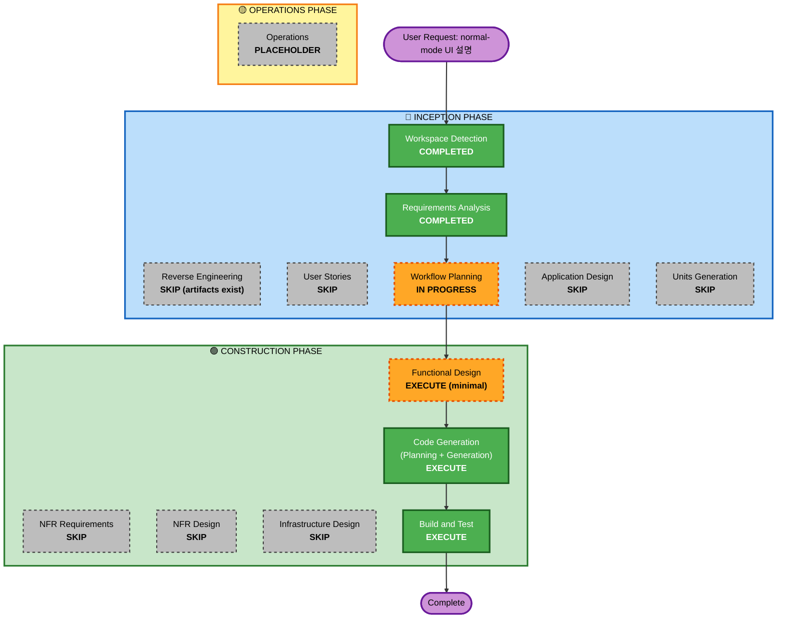

# F28 — Normal-mode UI Self-Explanation 실행 계획

> Track: F28 · Created: 2026-06-02
> Based on: `aidlc-docs/inception/requirements/normal-ui-help.md`

## Detailed Analysis Summary

### Transformation Scope (단순화 2026-06-02 — critic 후 범위 축소)
- **Transformation Type**: Single component — `steer_read`에 `/ui-legend` read verb + 정적 사전
- **Primary Changes**: (1) 정적 `ui-legend.json`(사람 유지), (2) `parser.ts` verb + `steer-handler.ts` 분기로 서빙
- **Related Components**: parent repo `operator-console/src/{parser,steer-handler}.ts` + `ui-legend.json`만. **서브모듈·파이썬 데몬·`$STEERING_DIR` 변경 0.** (현재값 매핑·TUI 자동생성·fallback 전부 제거 — 사용자 "최소: 의미만 정적 파일" 선택.)

### Change Impact Assessment
- **User-facing changes**: Yes — 에이전트가 UI 질문에 답할 수 있게 됨 (normal mode)
- **Structural changes**: No — 기존 MCP/steering/allowlist 구조 그대로
- **Data model changes**: Yes — `ui-legend.json` 스키마 신규 (경량, 확장 가능)
- **API changes**: No — `steer_read` view 추가일 뿐, 기존 계약 변경 없음
- **NFR impact**: No — 0 new runtime deps, 데몬 매매 불변, 토큰 비용 없음(MCP pull)

### Component Relationships
- **Primary Component**: `steer_read` MCP (daemon 측, `runtime.py`), TUI startup hook (서브모듈)
- **Shared Components**: `$STEERING_DIR/ui-legend.json` (계약 — JSON 스키마)
- **Dependent Components**: None (에이전트는 기존 MCP 도구로 접근)
- **Supporting Components**: F26 normal allowlist (`$STEERING_DIR/**` read) — 이미 존재

### Risk Assessment
- **Risk Level**: **Low** — isolated change, easy rollback (파일 삭제·MCP view 제거), well-understood
- **Rollback Complexity**: Easy — legend 파일만 삭제하면 에이전트는 예전처럼 "모른다"고 답함
- **Testing Complexity**: Simple — JSON 스키마 검증 + MCP view 응답 형식 테스트 + TUI legend 생성 검증

## Workflow Visualization

## Phases to Execute

### 🔵 INCEPTION PHASE
- [x] Workspace Detection (COMPLETED)
- [x] Reverse Engineering (SKIP — artifacts exist)
- [x] Requirements Analysis (COMPLETED)
- [x] User Stories (SKIP)
  - **Rationale**: 내부 도구 개선. 단일 운영자 대상. 여러 페르소나나 복잡한 인수 기준 없음. UI 질문→답변 흐름은 FR로 충분히 기술됨.
- [x] Workflow Planning (IN PROGRESS)
- [ ] Application Design — **SKIP**
  - **Rationale**: 신규 컴포넌트이지만 단순 — TUI legend generator + MCP view 확장. Functional Design에서 컴포넌트 구조를 함께 다루기 충분. 별도 Application Design 불필요.
- [ ] Units Generation — **SKIP**
  - **Rationale**: 단일 응집 단위 `ui-legend`. TUI 측(생성) + daemon 측(서빙)은 같은 JSON 스키마 계약으로 연결되며, 순차 개발이 자연스러움. 독립 배포 불필요.

### 🟢 CONSTRUCTION PHASE
- [ ] Functional Design — **EXECUTE (minimal)**
  - **Rationale**: 신규 데이터 스키마(`ui-legend.json`), 비즈니스 규칙(`data_source`→현재값 매핑, fallback), MCP view 계약 설계 필요. 단 단순하여 minimal depth.
- [ ] NFR Requirements — **SKIP**
  - **Rationale**: 0 new runtime deps. 기존 stdlib JSON + MCP/steer_read 인프라 재사용. 기술 스택 결정 완료.
- [ ] NFR Design — **SKIP**
  - **Rationale**: 신규 동시성·NFR 패턴 없음. 단일 파일 read → MCP serve. 토큰 비용·성능·보안 고려사항은 requirements.md NFR로 충분.
- [ ] Infrastructure Design — **SKIP**
  - **Rationale**: 로컬 CLI/daemon, 클라우드 인프라 변경 없음.
- [ ] Code Generation — **EXECUTE (ALWAYS)**
  - **Rationale**: Part 1 plan → Part 2 구현. TUI legend 생성 + daemon MCP view.
- [ ] Build and Test — **EXECUTE (ALWAYS)**
  - **Rationale**: JSON 스키마 검증, MCP view 응답 테스트, TUI legend 생성 검증, regression.

### 🟡 OPERATIONS PHASE
- [ ] Operations — PLACEHOLDER

## Package Change Sequence (단순화)
단일 단위, parent repo만 — worktree `feat/F28` (서브모듈 브랜치 불필요, 읽기만):
1. **Functional Design**: JSON 스키마 + `/ui-legend` verb 계약 (완료, critic 후 단순화)
2. **Code Generation Part 1**: 구현 계획
3. **Code Generation Part 2** (worktree): 정적 `ui-legend.json` 작성(F25/F6 코드 읽어 의미 확정) + `parser.ts` verb + `steer-handler.ts` 분기
4. **Build and Test**: verb 파싱·element 필터 단위 테스트 + TS 빌드 + regression

## Estimated Timeline
- **Total Stages to Execute**: 4 (Functional Design → Code Gen Part 1 → Code Gen Part 2 → Build & Test)
- **Estimated Duration**: 소규모 — 설계 1세션, 구현 1세션

## Success Criteria
- **Primary Goal**: normal mode 에이전트가 `steer_read{view:"ui_legend", element:"topbar.today_cost"}` 호출 시 의미 + 현재 값을 반환
- **Key Deliverables**:
  1. `ui-legend.json` JSON 스키마 문서 (Functional Design)
  2. TUI startup 시 `$STEERING_DIR/ui-legend.json` 자동 생성 (서브모듈)
  3. `steer_read{view:"ui_legend"}` MCP view (daemon)
  4. `data_source` → 현재 값 매핑 구현
  5. 정적 fallback (TUI-off 상황 대비)
- **Quality Gates**:
  - JSON 스키마 준수 검증
  - legend 생성·서빙·현재값 매핑 통합 테스트
  - Full regression green (no daemon 매매 영향)
  - F26 normal allowlist로 legend 읽기 가능 확인
