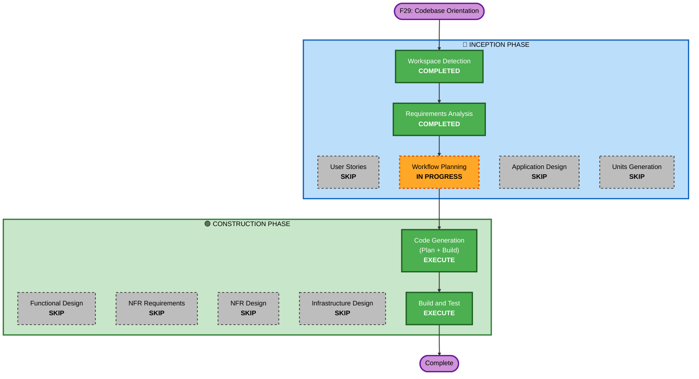

# F29 — Execution Plan

> **Track**: F29 · **Title**: Supervisor-mode codebase orientation
> **Plan created**: 2026-06-02

## Detailed Analysis Summary

### Transformation Scope (Brownfield)
- **Transformation Type**: Single component change — 기존 steering/publish/MCP 패턴 위에 지식 레이어 추가
- **Primary Changes**: 데몬이 코드베이스 디렉터리 트리를 `steering/codebase.json`으로 발행, MCP `steer_read`가 `/codebase` verb 제공, 런처가 supervisor system prompt에 지침 1~2줄 추가
- **Related Components**: 없음 (독립적 변경)

### Change Impact Assessment
- **User-facing changes**: No — supervisor 에이전트의 내부 지식 향상, 일반 사용자 영향 없음
- **Structural changes**: No — 기존 publish/snapshot/steer_read 패턴 재사용
- **Data model changes**: No — 새 Pydantic 모델 없음 (트리는 텍스트/JSON 문자열)
- **API changes**: No — MCP tool description에 verb만 추가
- **NFR impact**: No — 시작 시 1회 트리 스캔, 런타임 영향 없음

### Component Relationships
- **Primary Component**: `src/agent/steering/runtime.py` (데몬 — 트리 생성)
- **Supporting Component**: `src/agent/steering/channel.py` (codebase.json 발행)
- **MCP Component**: `operator-console/src/steer-handler.ts` (verb 디스패치)
- **Launcher Component**: `operator-console/launcher/config.ts` (system prompt 지침)
- **No dependencies between these changes** — 병렬 구현 가능

### Risk Assessment
- **Risk Level**: Low — isolated, easy rollback, well-understood pattern
- **Rollback Complexity**: Easy — git revert
- **Testing Complexity**: Simple — tree generation unit test + MCP verb smoke test + launcher unit test

## Workflow Visualization

## Phases to Execute

### 🔵 INCEPTION PHASE
- [x] Workspace Detection (COMPLETED)
- [x] Requirements Analysis (COMPLETED)
- [x] User Stories — **SKIP**
  - **Rationale**: 내부 도구 개선, 사용자 페르소나 없음, 단일 개발자
- [~] Workflow Planning (IN PROGRESS)
- [ ] Application Design — **SKIP**
  - **Rationale**: 새 컴포넌트/서비스 없음. 기존 steering/publish/MCP 패턴 그대로 재사용. 설계 결정은 requirements.md에서 완료.
- [ ] Units Generation — **SKIP**
  - **Rationale**: 단일 소규모 변경. 5개 파일, 병렬 구현 가능한 독립적 변경들. 분해 불필요.

### 🟢 CONSTRUCTION PHASE
- [ ] Functional Design — **SKIP**
  - **Rationale**: 새 데이터 모델/비즈니스 로직 없음. 디렉터리 트리 스캔은 표준 라이브러리 작업, MCP verb 디스패치는 기존 `MONITOR_VERBS`에 1줄 추가, 프롬프트 지침은 문자열 1~2줄. 모든 구현 세부사항은 requirements.md에 이미 명시됨.
- [ ] NFR Requirements — **SKIP**
  - **Rationale**: 새 런타임 의존성 없음. 기존 성능/보안 특성 변경 없음.
- [ ] NFR Design — **SKIP**
  - **Rationale**: NFR Requirements skip → NFR Design 불필요. 기존 concurrency/boundary 패턴 재사용.
- [ ] Infrastructure Design — **SKIP**
  - **Rationale**: 로컬 CLI/데몬, 인프라 변경 없음.
- [ ] Code Generation — **EXECUTE** (ALWAYS)
  - **Rationale**: 5개 파일 구현 + 테스트
- [ ] Build and Test — **EXECUTE** (ALWAYS)
  - **Rationale**: 트리 생성 단위 테스트, MCP verb 연기 테스트, 런처 설정 테스트, 전체 regression

### 🟡 OPERATIONS PHASE
- [ ] Operations — PLACEHOLDER

## 예상 변경 파일 (5 files)

| # | 파일 | 언어 | 변경 내용 |
|---|------|------|----------|
| 1 | `src/agent/steering/runtime.py` | Python | `_publish_codebase()` — 시작 시 디렉터리 트리 스캔, `steering/codebase.json` 발행 |
| 2 | `src/agent/steering/channel.py` | Python | `publish_codebase()` 또는 `publish_monitor` 확장 (codebase key) |
| 3 | `operator-console/src/steer-handler.ts` | TS | `MONITOR_VERBS`에 `codebase` 추가, `handleSteerRead` 분기 |
| 4 | `operator-console/src/filedrop.ts` | TS | `readCodebase()` 헬퍼 (선택 — `readMonitor` 재사용 가능) |
| 5 | `operator-console/launcher/config.ts` | TS | `consoleEnv()` supervisor일 때 system prompt 지침 추가 |

## Estimated Timeline
- **Total Stages**: 2 (Code Generation + Build & Test)
- **Estimated Duration**: 소규모 — 5개 파일, 단순 변경

## Success Criteria
- **Primary Goal**: Supervisor 에이전트가 `steer_read{command:/codebase}`로 프로젝트 구조를 첫 턴부터 확인 가능
- **Key Deliverables**: 트리 생성 로직, MCP verb, system prompt 지침, 테스트
- **Quality Gates**: Python tests green (tree gen + channel), TS tests green (MCP dispatch + launcher config), `pip check` / `bun run typecheck` clean, docker-verify attach smoke (supervisor에서 `/codebase` 호출 확인)
