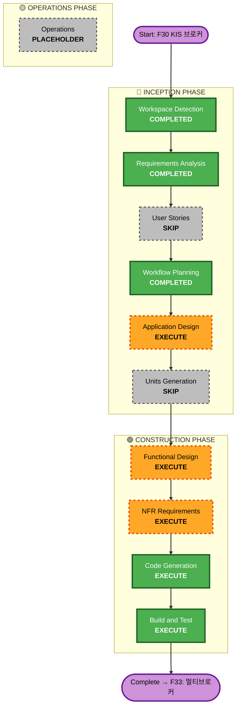

# F30 KIS OpenAPI 브로커 확장 — 실행 계획 (v2 — Critic 반영)

> **2026-06-02 Critic 검토 결과 반영**: Functional Design 추가, F30 범위를 KIS 단독 PoC로 축소, 멀티브로커 동시 운영은 F31로 분리

## Detailed Analysis Summary

### Transformation Scope
- **Transformation Type**: Single component addition + minor structural changes
- **Primary Changes**: `KisBroker` (NEW), `KisDataProvider` (NEW), `DecisionExecutor` KIS 분기 (MODIFY), `TradingScheduler` KST 지원 (MODIFY), KIS 환경변수 설정
- **Related Components**: `pyproject.toml`, `src/agent/executor.py`, `src/trading/scheduler.py`, `src/risk/manager.py`

### Change Impact Assessment
| 영역 | 영향 | 설명 |
|---|---|---|
| **User-facing** | No | 내부 인프라 확장 |
| **Structural** | Moderate | DecisionExecutor bracket 검증 우회, TradingScheduler KST 추가 |
| **Data model** | No | 기존 Order/Position/PortfolioState 재사용 (단, KIS 제약에 맞는 변환 로직 필요) |
| **API changes** | No | BaseBroker 인터페이스 불변 |
| **NFR impact** | Yes | Rate limiting, 토큰 관리, HTTP timeout (F14 패턴), KST 장 시간 |

### Component Relationships (Critic verified)
```
기존 시스템                         F30 변경
─────────────────────────────────────────────────
src/execution/base.py          →  변경 없음 (ABC)
src/execution/brokers/         →  + kis_broker.py (NEW)
src/execution/brokers/alpaca_broker.py → 변경 없음 (참조)
src/data/providers/            →  + kis_provider.py (NEW)
src/agent/executor.py          →  MODIFY: bracket 검증 우회 + HOLD/ADJUST_STOP KIS no-op
src/trading/scheduler.py       →  MODIFY: add_market_open_job 타임존 파라미터 추가
src/trading/modes/agent.py     →  MODIFY: KIS 브로커 주입 + 연구 스케줄 수정
src/risk/manager.py            →  검증: use_bracket_orders=False 경로 확인
src/core/models.py             →  변경 없음
pyproject.toml                 →  + open-trading-api git dependency
.env / config                  →  + KIS_* 환경변수
```

### Risk Assessment
- **Risk Level**: Medium → **Medium-High** (Critic 발견: 구조적 변경이 예상보다 큼)
- **주요 리스크**: 
  - DecisionExecutor bracket-only 검증 차단 (executor.py:58-62)
  - TradingScheduler US Eastern 하드코딩 (scheduler.py:84-114)
  - _place_protection OCO/STOP 생성 → KIS 미지원 (executor.py:261-270)
  - close_position ABC 가격 파라미터 부재 (base.py:88-90)
- **Rollback Complexity**: Easy (새 파일 삭제 + executor/scheduler revert)
- **Testing Complexity**: Moderate (모의투자 계좌 필요)

---

## Workflow Visualization



---

## Phases to Execute

### 🔵 INCEPTION PHASE

| Stage | Status | Rationale |
|---|---|---|
| Workspace Detection | ✅ COMPLETED | |
| Requirements Analysis | ✅ COMPLETED | 리스크 평가 포함 |
| User Stories | ⏭️ SKIP | 내부 인프라 |
| Workflow Planning | ✅ COMPLETED | Critic 검토 반영 완료 |
| **Application Design** | ▶️ EXECUTE | KisBroker + KisDataProvider 컴포넌트 인터페이스 설계 |
| Units Generation | ⏭️ SKIP | 단일 유닛 |

### 🟢 CONSTRUCTION PHASE

| Stage | Status | Rationale |
|---|---|---|
| **Functional Design** | ▶️ EXECUTE | **Critic #5**: 주문 매핑 매트릭스, KRW 변환, 수량 정수화, 거래소 코드, universe 정의 등 미해결 설계 다수 |
| **NFR Requirements** | ▶️ EXECUTE | Rate limiting 전략, 토큰 관리, HTTP timeout (F14 패턴), KST 장 시간 |
| NFR Design | ⏭️ SKIP | 코드에서 직접 구현 |
| Infrastructure Design | ⏭️ SKIP | 인프라 변경 없음 |
| **Code Generation** | ▶️ EXECUTE (ALWAYS) | KisBroker + KisDataProvider + executor/scheduler 수정 |
| **Build and Test** | ▶️ EXECUTE (ALWAYS) | 유닛 테스트 + 모의투자 검증 |

### 🟡 OPERATIONS — PLACEHOLDER

---

## 실행 요약

| 항목 | 값 |
|---|---|
| **실행 예정** | 6 (App Design, Functional Design, NFR Req, Code Gen, Build&Test) |
| **스킵** | 4 (User Stories, Units, NFR Design, Infra Design) |
| **완료** | 3 (WD, RA, Workflow Planning) |
| **F30 범위** | KIS 단독 PoC — 한국주식 Paper Trading |
| **F33으로 분리** | 멀티브로커 동시 운영 (Alpaca US + KIS KR) |

## Package Change Sequence

```
1. pyproject.toml                      — open-trading-api git dependency
2. src/config/                         — KIS 환경변수 (pydantic Settings)
3. src/trading/scheduler.py            — MODIFY: add_market_open_job KST 파라미터
4. src/agent/executor.py               — MODIFY: bracket 검증 우회, HOLD/ADJUST_STOP no-op
5. src/trading/modes/agent.py          — MODIFY: KIS 브로커 + KST 스케줄
6. src/execution/brokers/kis_broker.py — NEW: KisBroker 구현
7. src/data/providers/kis_provider.py  — NEW: KIS 시세 데이터
```

## Critic 발견사항 추적

| # | 심각도 | 발견사항 | 처리 |
|---|---|---|---|
| 1 | HIGH | DecisionExecutor hard-rejects use_bracket_orders=False | F30에서 우회 로직 구현 |
| 2 | HIGH | TradingScheduler US Eastern 하드코딩 | F30에서 KST 파라미터 추가 |
| 3 | HIGH | _place_protection이 OCO/STOP 생성 | F30에서 KIS no-op 처리 |
| 4 | HIGH | close_position ABC 가격 파라미터 부재 | Functional Design에서 전략 정의 |
| 5 | MEDIUM | Functional Design 스킵 오판 | 실행 계획에 추가 |
| 6 | MEDIUM | 멀티브로커 동시 운영 불가 | → F33으로 분리 |
| 7 | LOW | is_market_open() 기본값 True | Code Gen에서 override 보장 |
| 8 | LOW | HTTP timeout 미적용 | NFR Requirements + Code Gen |
| 9 | LOW | MARKET 주문 → KIS 변환 | Functional Design에서 정의 |

## Success Criteria
- **Primary Goal**: KIS Paper 계좌로 KOSPI 200 + KOSDAQ 150 종목 단독 자동 거래
- **Key Deliverables**: `KisBroker`, `KisDataProvider`, KIS 설정, executor/scheduler KIS 분기, 유닛 테스트
- **Quality Gates**: 
  - BaseBroker ABC 완전 구현
  - 모의투자 환경에서 주문 실행 검증
  - DecisionExecutor KIS 경로 동작 확인
  - TradingScheduler KST 정상 스케줄링 확인
  - close_position 지정가 청산 동작 확인
- **F33 진입 조건**: F30 merge 후 KIS 단독 운영 안정화 → 멀티브로커 설계 시작
