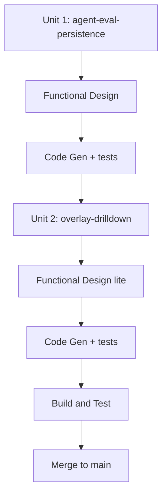

# F41 — Workflow Plan (실행 계획)

> Track F41 · Brownfield · 2026-06-03 · 요구사항: `inception/requirements/F41-research-turn-overlay.md`

## 실행할 단계 / 스킵할 단계

| 단계 | 결정 | 근거 |
|------|------|------|
| Workspace Detection | ✅ 완료 | Brownfield |
| Reverse Engineering | ⏭ SKIP | 기존 아티팩트 존재; 영향 코드 이미 역매핑 |
| Requirements Analysis | ✅ 승인 | Standard depth |
| User Stories | ⏭ SKIP | 내부 운영자 TUI/저널 개선, 신규 사용자 워크플로 없음 |
| Workflow Planning | ✅ 본 문서 | 항상 |
| Application Design | ⏭ SKIP | 신규 컴포넌트 아님 → Functional Design으로 흡수 |
| Units Generation | ⏭ SKIP | 아래 2개 유닛으로 본 계획에 정의 |
| **Construction (per-unit)** | ✅ | 아래 |
| Build & Test | ✅ | 항상 |

## 유닛 분해 (의존 순서)

### Unit 1 — `agent-eval-persistence` (Python, 데이터 기반)
multi-agent 평가를 영속하고 turn 레코드 버그를 고친다. **선행 유닛**(Unit 2가 읽을 데이터 생성).
- Functional Design: 통일 평가 스키마(FR-1) — sequential 라운드 / parallel sub-agent 매핑, 사이드카 저장 위치/조회, 마스킹(NFR-4).
- Code Gen:
  - 신규 영속 모듈 (`agent_reports` 스키마 write/read).
  - `orchestrator._run_sequential_research`: 라운드별 `run_turn` 결과 캡처 + 영속.
  - `orchestrator._run_parallel_research`: `SubAgentReport` 캡처 + 영속.
  - `record_turn(...)` 두 경로에 `turn_id`(generate_turn_id) + `summary`(build_turn_summary) 주입 (FR-2).
  - best-effort 격리(NFR-1), 추가 LLM 호출 없음(NFR-2).
- 테스트: 스키마 라운드트립, sequential/parallel 캡처, summary/turn_id 채움, best-effort 실패 무영향.
- NFR Requirements/Design: 최소(격리·마스킹은 FD에 흡수, 별도 NFR 단계 SKIP 후보).

### Unit 2 — `overlay-drilldown` (Python steering 노출 + TS TUI)
영속 데이터를 monitor/historical 경로로 노출하고 drill-down 오버레이 구현.
- Functional Design(경량): monitor payload 형태(인라인 목록 + on-demand 전문, NFR-3), 과거세션 사이드카 조회(F36 확장점), drill-down 상태/네비게이션.
- Code Gen:
  - `steering/runtime.py`: `_turns_summary`/`publish_monitor`에 agent-eval 존재/데이터 노출, `steer_read` 경로.
  - TUI `types.ts`: 평가 타입 추가.
  - `turn-overlay.tsx`: agents 목록 + synthesis 요약 + drill-down 전문 패널(스크롤), 무회귀 fallback.
  - 데이터 hook / historical 읽기 경로.
- 테스트: Python 노출 단위 테스트, TS 데이터 매핑/렌더 테스트, 비-multi-agent fallback.

## 의존 / 검증
- 순서: **Unit 1 → Unit 2** (Unit 2는 Unit 1의 스키마/데이터에 의존).
- 코드 게이트: Code Gen Part 2 전에 worktree 생성 (`scripts/worktree-setup.sh F41 --py --ts`).
- 검증: Python `pytest` 회귀 0, TS `bun run typecheck` + 테스트, 가능하면 docker-verify 또는 live read-only 스냅샷으로 오버레이 확인.

## 실행 흐름

## 자율 진행 합의
설계(Functional Design) 승인 후 Construction(코드+테스트)은 자율 진행하고, 진짜 사람 판단이
필요할 때만 멈춘다([[feedback-autonomy-construction]]).
