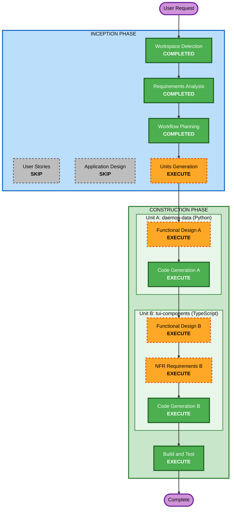

# Execution Plan — AI 협업 TUI 개선 (F22)

## Detailed Analysis Summary

### Transformation Scope
- **Transformation Type**: Multi-component enhancement (Python daemon + TypeScript TUI)
- **Primary Changes**: TUI에 AI 협업 전용 UI 추가 (타임라인 바 + 호버 오버레이)
- **Related Components**:
  - `src/agent/steering/runtime.py` — monitor.json 확장 (턴 ID, 요약, 결정-턴 링크)
  - `src/mcp/` — 턴 상세/논거 조회 MCP 도구 추가
  - `operator-console/cli/packages/` — 새 TUI 패키지 + 메인 레이아웃 수정

### Change Impact Assessment
- **User-facing changes**: Yes — 운영자 TUI에 타임라인 바와 오버레이 UI 추가
- **Structural changes**: Yes — opencode 포크에 별도 패키지(`packages/tui-trading/`) 추가
- **Data model changes**: Yes — monitor.json 스키마 확장 (하위호환, 필드 추가만)
- **API changes**: Yes — MCP 도구 추가 (`steer_read turn <ID>`, `steer_read thesis <SYM>`)
- **NFR impact**: No — 기존 폴링 주기/인프라 무변경

### Component Relationships
```
  daemon (Python)                    console (TypeScript, opencode fork)
  +-----------------------+          +----------------------------+
  | steering/runtime.py   |  file    | packages/tui-trading/ NEW  |
  |   publish_monitor()   | -------> |   TimelineBar              |
  |   (monitor.json 확장) |  drop    |   TurnOverlay              |
  +-----------------------+          |   SymbolOverlay             |
  | mcp/commands.py       |  MCP     |   data polling/parsing     |
  |   steer_read turn/    | <------> +----------------------------+
  |   thesis              |          | packages/app/src/          |
  +-----------------------+          |   layout wiring            |
                                     +----------------------------+
```

### Risk Assessment
- **Risk Level**: **Medium**
  - TUI 변경이지만 거래 경로(RiskManager→Broker)에 영향 없음
  - opencode 포크 구조 이해 필요 (Ink/React 기반 터미널 UI)
  - 호버 이벤트가 터미널에서 제한적일 수 있음 → 키보드 네비게이션 대안 준비
- **Rollback Complexity**: Easy — worktree/branch 격리, 코드만 제거하면 원복
- **Testing Complexity**: Moderate — Python(daemon) 유닛 테스트 + TS(TUI) 컴포넌트 테스트 + 통합 확인

## Workflow Visualization



### Text Alternative
```
Phase 1: INCEPTION
- Workspace Detection (COMPLETED)
- Requirements Analysis (COMPLETED)
- User Stories (SKIP)
- Workflow Planning (COMPLETED)
- Application Design (SKIP — folded into per-unit Functional Design)
- Units Generation (EXECUTE — 2 units)

Phase 2: CONSTRUCTION
  Unit A: daemon-data (Python, FIRST)
  - Functional Design A (EXECUTE)
  - NFR Requirements A (SKIP — 0 new deps, existing infra)
  - NFR Design A (SKIP — no new patterns)
  - Infrastructure Design A (SKIP — local daemon)
  - Code Generation A (EXECUTE)
  
  Unit B: tui-components (TypeScript, SECOND)
  - Functional Design B (EXECUTE — UI 설계, mockup, 컴포넌트 구조)
  - NFR Requirements B (EXECUTE — minimal, TS 패키지 구조/의존성)
  - NFR Design B (SKIP — React/Ink 패턴)
  - Infrastructure Design B (SKIP)
  - Code Generation B (EXECUTE)
  
  Build and Test (EXECUTE — 전체)
```

## Phases to Execute

### INCEPTION PHASE
- [x] Workspace Detection — COMPLETED (Brownfield, existing RE artifacts)
- [x] Reverse Engineering — SKIP (기존 아티팩트 활용)
- [x] Requirements Analysis — COMPLETED (Standard depth, 12 Q&A)
- [x] User Stories — SKIP (단일 운영자 도구, FR 기반으로 충분)
- [x] Workflow Planning — COMPLETED (이 문서)
- [ ] Application Design — **SKIP** (per-unit Functional Design에 흡수. 컴포넌트 구조가 명확: daemon 데이터 확장 + TUI 패키지)
- [ ] Units Generation — **EXECUTE (minimal)** — 2 units 분할

### CONSTRUCTION PHASE

**Unit A: `daemon-data` (Python)** — daemon이 TUI에 보낼 데이터를 확장
- [ ] Functional Design A — **EXECUTE**
  - monitor.json 스키마 확장 설계 (턴 ID, 요약, 결정-턴 링크)
  - MCP 도구 설계 (`steer_read turn <ID>`, `steer_read thesis <SYM>`)
  - 턴 ID 생성 방식 결정
- [ ] NFR Requirements A — **SKIP** (0 new runtime deps, 기존 loguru/pydantic/steering 구조)
- [ ] NFR Design A — **SKIP** (기존 `publish_monitor` 확장, 새 동시성 패턴 불필요)
- [ ] Infrastructure Design A — **SKIP** (local daemon)
- [ ] Code Generation A — **EXECUTE**

**Unit B: `tui-components` (TypeScript)** — opencode 포크에 AI 협업 UI 구축
- [ ] Functional Design B — **EXECUTE**
  - 타임라인 바 컴포넌트 상세 설계 (마커 디자인, 시간축, 레이아웃)
  - 호버 오버레이 컴포넌트 설계 (턴 상세, 심볼 논거)
  - 패키지 구조 (`packages/tui-trading/`)
  - 메인 레이아웃 통합 방식
  - **UI 설계는 구체적 질문으로 확인** ([[feedback-ui-concretization]])
- [ ] NFR Requirements B — **EXECUTE (minimal)**
  - 새 TS 패키지 의존성 (ink, react 등 기존 것 재사용 vs 추가)
  - 빌드 설정 (tsgo, bun)
- [ ] NFR Design B — **SKIP** (React/Ink 컴포넌트 패턴 — 기존 포크 패턴 따름)
- [ ] Infrastructure Design B — **SKIP**
- [ ] Code Generation B — **EXECUTE**

**Build and Test** — **EXECUTE**
- Python: daemon monitor 확장 유닛 테스트 + MCP 도구 테스트
- TypeScript: TUI 컴포넌트 테스트
- 통합: monitor.json 데이터 → TUI 렌더링 end-to-end
- 회귀: 전체 기존 테스트 스위트 통과

## Unit Update Sequence

```
Unit A (daemon-data, Python)  ──FIRST──>  Unit B (tui-components, TS)
        │                                         │
        └── monitor.json 스키마 확정 ──────────────┘
            MCP 도구 구현                   TUI가 소비하는 데이터 계약
```

- **Unit A FIRST**: daemon이 생산하는 데이터 형태(계약)가 확정되어야 TUI가 소비 가능
- **Unit B SECOND**: 확정된 데이터 계약 위에 TUI 컴포넌트 구축

## Estimated Timeline
- **Total Stages**: 8 (Units Gen + 2×FD + 1×NFR + 2×CG + B&T)
- **Estimated effort**: Medium-Large (daemon 확장 소규모 + TUI 패키지 중규모)

## Success Criteria
- **Primary Goal**: 운영자가 AI 턴 활동을 TUI에서 실시간으로 모니터링하고 맥락을 파악할 수 있음
- **Key Deliverables**:
  1. 타임라인 바 (채팅 상단, 마커로 턴 시각화)
  2. 턴 오버레이 (결정 피드 + 추론 요약)
  3. 심볼 오버레이 (논거 뷰어)
  4. 턴 고유 ID + 상세 조회 (대화형)
  5. daemon monitor.json 확장 + MCP 도구
- **Quality Gates**:
  - 전체 기존 테스트 스위트 통과 (0 regressions)
  - 새 Python 유닛 테스트 추가 (monitor 확장, MCP 도구)
  - TUI 컴포넌트 렌더링 확인
  - Security Baseline 준수 (SECURITY-03/11/15)
  - PBT Partial 적용 (해당 순수 함수)
