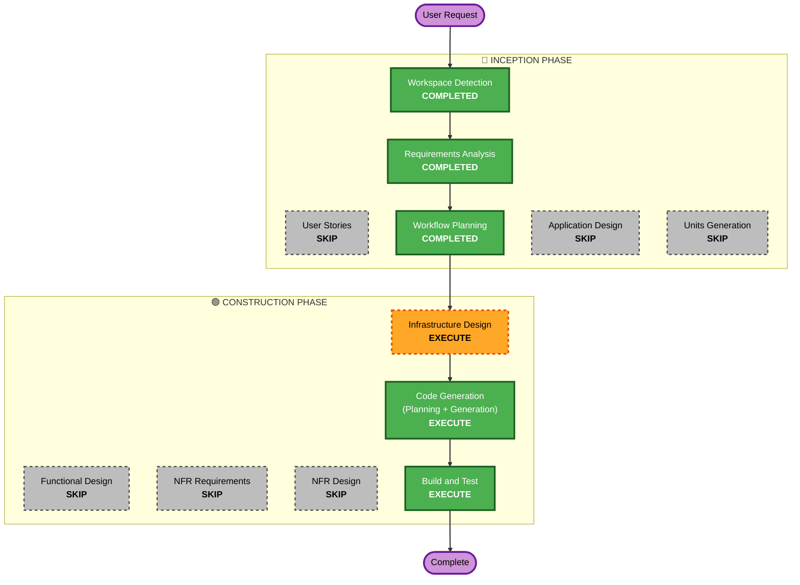

# F27 실행 계획 — docker-verify 하네스 non-root 실행

> Track F27. Brownfield / 인프라 refactor. 단일 모듈(parent repo의 3~4개 파일).

## 상세 분석 요약

### Transformation Scope
- **유형**: Infrastructure 변경 (검증 하네스 컨테이너 실행 모델). 애플리케이션/배포 prod 무관.
- **주 변경**: 컨테이너를 root → 호스트 UID:GID 실행으로 전환. 그로 인해 불필요해진 사후 수습 우회 코드 제거.
- **관련 컴포넌트**: `Dockerfile.verify`, `docker-compose.verify.yml`, `scripts/verify.sh`, (선택) `scripts/verify-run.sh` 또는 `.env`.

### Change Impact Assessment
- **User-facing changes**: No (개발 인프라 전용).
- **Structural changes**: No (앱 아키텍처 불변).
- **Data model changes**: No.
- **API changes**: No.
- **NFR impact**: 부분 — Security(SECURITY-15 fail-safe): non-root 권한·HOME 경로. 성능/확장성 무관.

### Component Relationships
- **Primary**: `scripts/verify.sh` (cleanup/run_attach 로직), `docker-compose.verify.yml` (user/HOME/volumes), `Dockerfile.verify` (USER/HOME).
- **Dependent**: 4개 실행 모드(typecheck/unit/smoke/attach) — 회귀 검증 대상.
- **Supporting**: claude CLI / bun / pip 툴체인(이미지 빌드 타임 root 설치) — non-root 런타임 쓰기/HOME 함정.

### Risk Assessment
- **Risk Level**: Medium (prod 무관이나 4모드 회귀 + non-root 권한 함정 6종).
- **Rollback Complexity**: Easy (parent repo 3~4 파일, 브랜치/worktree 격리).
- **Testing Complexity**: Moderate~Complex (4모드 × non-root + claude/bun/daemon 동작 실측 필요).

## Workflow Visualization

## Phases to Execute

### 🔵 INCEPTION PHASE
- [x] Workspace Detection (COMPLETED)
- [x] Reverse Engineering (SKIPPED — RE 아티팩트 기존 존재)
- [x] Requirements Analysis (COMPLETED — `docker-verify-nonroot.md`, 승인됨)
- [x] User Stories (SKIP)
  - **Rationale**: 개발 인프라 변경, 사용자 대면/페르소나 없음.
- [x] Workflow Planning (IN PROGRESS → 본 문서)
- [ ] Application Design - **SKIP**
  - **Rationale**: 새 컴포넌트/메서드/서비스 없음. 셸·compose·Dockerfile 설정 변경.
- [ ] Units Generation - **SKIP**
  - **Rationale**: 단일 유닛(`verify-harness`), 분해 불필요.

### 🟢 CONSTRUCTION PHASE
- [ ] Functional Design - **SKIP**
  - **Rationale**: 비즈니스 로직/데이터 모델/스키마 없음.
- [ ] NFR Requirements - **SKIP**
  - **Rationale**: 신규 성능/확장 NFR 없음. Security는 SECURITY-15(fail-safe)만 적용, Infra Design에서 인라인 처리.
- [ ] NFR Design - **SKIP**
  - **Rationale**: NFR Requirements 스킵에 따라 동반 스킵.
- [ ] Infrastructure Design - **EXECUTE** (minimal depth)
  - **Rationale**: 컨테이너 실행 모델·UID 주입·HOME·named volume이 이 트랙의 핵심 설계. 요구사항이 미룬 **D-1(UID override 방식)·D-2(named volume 유지 범위)·D-3(HOME 처리)**와 함정 **G-1~G-6**을 여기서 확정. 코드 생성 전 설계 게이트.
- [ ] Code Generation - **EXECUTE** (ALWAYS)
  - **Rationale**: Dockerfile/compose/verify.sh 변경 + 우회 코드 제거 구현. worktree `feat/F27`는 Code Gen Part 2에서 생성.
- [ ] Build and Test - **EXECUTE** (ALWAYS)
  - **Rationale**: 4모드(typecheck/unit/smoke/attach) non-root 회귀 + claude/bun/daemon 동작 실측. **이 트랙의 비중 최대.**

### 🟡 OPERATIONS PHASE
- [ ] Operations - PLACEHOLDER

## Package Change Sequence
단일 모듈(parent repo). 순서: Infrastructure Design → Code Gen(Dockerfile.verify → compose → verify.sh → 선택 verify-run.sh/.env) → Build & Test 4모드.

## Estimated Timeline
- **실행 stage 수**: 4 (WP + Infra Design + Code Gen + Build&Test).
- **예상 소요**: 설계 1 + 구현 1 + 테스트(4모드 반복) 비중 큼.

## Success Criteria
- **Primary Goal**: 검증 컨테이너가 호스트 UID:GID로 실행되어 bind-mount 산출물이 처음부터 호스트 소유 (R-1/R-2 소멸).
- **Key Deliverables**: 호스트 사용자 실행 compose/Dockerfile, 제거된 우회 코드(chown handback·.git 백업·safe.directory), UID 주입 메커니즘.
- **Quality Gates**: 4모드 non-root 전부 통과(회귀 없음), `git worktree remove` sudo 불필요, in-container git이 호스트 `.git` 거부 안 함.
- **Integration Testing**: claude CLI + bun + 데몬이 non-root에서 동작.
- **Operational Readiness**: N/A (검증 하네스, prod 배포 없음).
