# 실행 계획 — F2 에이전트 모드용 휴먼 스티어링 콘솔

_AI-DLC 트랙 F2. 브라운필드. Workflow Planning 단계. 작성 2026-05-28._
_출처: `aidlc-docs/inception/requirements/human-steering-console.md` (승인됨)._

## 상세 분석 요약

### 변경 범위 (브라운필드)
- **변경 유형**: 단일 기능, 애플리케이션 계층 한정 (인프라/배포 변경 없음).
- **주요 변경**: `main.py --mode agent` 위의 신규 인-프로세스 콘솔 서브시스템, 단일 직렬화 명령 경로,
  사람-지시(human-directive) 저널 채널, `DecisionExecutor`를 재사용하는 사람-매매 경로, 오케스트레이터의
  reconcile(재정렬) 턴 트리거.
- **관련 컴포넌트**: `main.py`(연결), `src/trading/modes/agent.py`(스케줄러/루프 통합 + lifecycle 상태),
  `src/agent/executor.py`(사람-소스 결정 실행), `src/agent/orchestrator.py` + `src/agent/prompts.py`
  (reconcile 턴 + 지시 노출), `src/agent/journal.py`(신규 채널/레코드), `src/agent/` 또는 `src/console/`
  아래 신규 모듈.

### 변경 영향 평가
- **사용자 대면 변경**: **예** — 신규 대화형 콘솔(REPL)이 이 기능의 본체. *(UI/UX는 사용자 지침에 따라
  Functional Design 단계에서 확인 질문으로 구체화한다.)*
- **구조적 변경**: **예(중간)** — 기존에 sleep 루프만 돌던 데몬에 동시성 제어(단일 직렬화 명령 경로)를
  도입하고 lifecycle 실행 상태(run-state)를 추가.
- **데이터 모델 변경**: **예(추가형)** — 신규 `HumanDirective`/개입 레코드 + 결정에 `source` 태그.
  기존 스키마의 의미 변경은 없음.
- **API 변경**: **외부 API 없음.** 신규 내부 명령 문법(인-프로세스 REPL)만 추가.
- **NFR 영향**: **예** — 동시성 안전성, 보안(강제), fail-closed 신뢰성, 무회귀(no-regression).

### 컴포넌트 관계 (브라운필드)
- **주 컴포넌트**: 신규 콘솔 서브시스템.
- **공유 컴포넌트**: `Journal`(신규 채널), `Decision` 모델(+`source`).
- **의존/영향 받는 것**: `AgentTradingMode`(콘솔 + lifecycle 상태 + 직렬화 호스팅),
  `DecisionExecutor`(사람 결정 실행), `AgentTradingLoop`(reconcile 턴).
- **지원 컴포넌트**: `monitoring/logger`(개입 로깅), 테스트.

### 리스크 평가
- **리스크 수준**: **중간~높음** — 라이브 주문 경로를 건드리고, 돌아가는 트레이딩 데몬에 동시성을 추가
  (broker/cursor/CLI-세션 레이스가 핵심 위험).
- **롤백 난이도**: **쉬움** — 격리된 git worktree/브랜치에서 개발(Q8=A); 검증 전까지 `main`에 머지 안 함.
  콘솔은 미연결 시 자동 비활성화되므로, 머지됐지만 미사용 상태의 콘솔은 무해(inert).
- **테스트 난이도**: **높음** — 동시성, 확인 흐름, lifecycle 게이팅, reconcile 턴 결함 격리, 기존 196개
  테스트의 무회귀.

## 워크플로 시각화

```mermaid
flowchart TD
    Start(["사용자 요청"])

    subgraph INCEPTION["INCEPTION 단계"]
        WD["Workspace Detection<br/><b>완료</b>"]
        RE["Reverse Engineering<br/><b>완료 (재사용)</b>"]
        RA["Requirements Analysis<br/><b>완료</b>"]
        US["User Stories<br/><b>생략</b>"]
        WP["Workflow Planning<br/><b>진행 중</b>"]
        AD["Application Design<br/><b>생략 (FD에 흡수)</b>"]
        UG["Units Generation<br/><b>생략 (단일 유닛)</b>"]
    end

    subgraph CONSTRUCTION["CONSTRUCTION 단계 (유닛: human-steering-console)"]
        FD["Functional Design<br/>+ 콘솔 UX 질문<br/><b>실행</b>"]
        NFRA["NFR Requirements<br/><b>실행 (최소)</b>"]
        NFRD["NFR Design<br/>동시성 + 보안<br/><b>실행</b>"]
        ID["Infrastructure Design<br/><b>생략</b>"]
        CG["Code Generation<br/>(계획 + 생성)<br/><b>실행</b>"]
        BT["Build and Test<br/><b>실행</b>"]
    end

    subgraph OPERATIONS["OPERATIONS 단계"]
        OPS["Operations<br/><b>플레이스홀더</b>"]
    end

    Start --> WD
    WD --> RE
    RE --> RA
    RA --> US
    US --> WP
    WP --> AD
    AD --> UG
    UG --> FD
    FD --> NFRA
    NFRA --> NFRD
    NFRD --> ID
    ID --> CG
    CG --> BT
    BT --> OPS
    BT --> End(["완료"])

    style WD fill:#4CAF50,stroke:#1B5E20,stroke-width:3px,color:#fff
    style RE fill:#4CAF50,stroke:#1B5E20,stroke-width:3px,color:#fff
    style RA fill:#4CAF50,stroke:#1B5E20,stroke-width:3px,color:#fff
    style WP fill:#4CAF50,stroke:#1B5E20,stroke-width:3px,color:#fff
    style CG fill:#4CAF50,stroke:#1B5E20,stroke-width:3px,color:#fff
    style BT fill:#4CAF50,stroke:#1B5E20,stroke-width:3px,color:#fff
    style FD fill:#FFA726,stroke:#E65100,stroke-width:3px,stroke-dasharray: 5 5,color:#000
    style NFRA fill:#FFA726,stroke:#E65100,stroke-width:3px,stroke-dasharray: 5 5,color:#000
    style NFRD fill:#FFA726,stroke:#E65100,stroke-width:3px,stroke-dasharray: 5 5,color:#000
    style US fill:#BDBDBD,stroke:#424242,stroke-width:2px,stroke-dasharray: 5 5,color:#000
    style AD fill:#BDBDBD,stroke:#424242,stroke-width:2px,stroke-dasharray: 5 5,color:#000
    style UG fill:#BDBDBD,stroke:#424242,stroke-width:2px,stroke-dasharray: 5 5,color:#000
    style ID fill:#BDBDBD,stroke:#424242,stroke-width:2px,stroke-dasharray: 5 5,color:#000
    style OPS fill:#BDBDBD,stroke:#424242,stroke-width:2px,stroke-dasharray: 5 5,color:#000
    style INCEPTION fill:#BBDEFB,stroke:#1565C0,stroke-width:3px,color:#000
    style CONSTRUCTION fill:#C8E6C9,stroke:#2E7D32,stroke-width:3px,color:#000
    style OPERATIONS fill:#FFF59D,stroke:#F57F17,stroke-width:3px,color:#000
    style Start fill:#CE93D8,stroke:#6A1B9A,stroke-width:3px,color:#000
    style End fill:#CE93D8,stroke:#6A1B9A,stroke-width:3px,color:#000

    linkStyle default stroke:#333,stroke-width:2px
```



### 텍스트 대안 (항상 포함)
```
INCEPTION 단계
- Workspace Detection ......... 완료
- Reverse Engineering ......... 완료 (재사용, 아티팩트 존재)
- Requirements Analysis ....... 완료 (승인됨)
- User Stories ................ 생략
- Workflow Planning ........... 진행 중 (본 문서)
- Application Design .......... 생략 (Functional Design에 흡수)
- Units Generation ............ 생략 (단일 응집 유닛)

CONSTRUCTION 단계 (유닛: human-steering-console)
- Functional Design ........... 실행  (+ 콘솔 UX 확인 질문)
- NFR Requirements ............ 실행  (최소: 기술 스택, NFR 목표)
- NFR Design .................. 실행  (동시성/직렬화 + 보안)
- Infrastructure Design ....... 생략
- Code Generation ............. 실행  (계획 + 생성)
- Build and Test .............. 실행

OPERATIONS 단계
- Operations .................. 플레이스홀더
```

## 실행할 단계

### INCEPTION 단계
- [x] Workspace Detection (완료)
- [x] Reverse Engineering (완료 — 재사용)
- [x] Requirements Analysis (완료)
- [x] User Stories (생략)
  - **근거**: 단일 운영자용 개인 도구이며, 운영자의 워크플로는 요구사항 문서에 이미 FR로 캡처됨.
    사용자가 "User Stories 추가" 대신 "승인 후 진행"을 선택함.
- [x] Workflow Planning (진행 중)
- [ ] Application Design — **생략**
  - **근거**: 작고 강하게 결합된 컴포넌트 집합의 단일 응집 유닛. 컴포넌트 식별과 관계는 Functional Design
    상단에서 다룰 예정 — 별도 고수준 패스는 중복 절차가 됨. (사용자가 추가 선택 가능.)
- [ ] Units Generation — **생략**
  - **근거**: 이 기능은 단일 작업 유닛(`human-steering-console`). 내부 분해는 Code Generation 계획에서 처리.

### CONSTRUCTION 단계 — 유닛: `human-steering-console`
- [ ] Functional Design — **실행**
  - **근거**: 신규 데이터 모델(`HumanDirective` 레코드, 명령 문법, `source` 태그), 비즈니스 로직(파서,
    확인 흐름, lifecycle 상태머신, reconcile 의미, 지시 노출), 컴포넌트 분해/관계(Application Design 흡수),
    그리고 **콘솔 UX** — 사용자 지침에 따라 **확인 질문으로 구체화**한다. 파서/레코드의 테스트 가능 속성
    (PBT-01) 식별.
- [ ] NFR Requirements — **실행 (최소)**
  - **근거**: 기술 스택 확정(목표: 신규 *런타임* 의존성 0 — Python stdlib `threading`/`cmd`/`readline`;
    Hypothesis는 PBT-09용 dev 의존성으로 이미 존재) 및 NFR 목표 재확인(동시성 안전성, 보안 강제,
    fail-closed 신뢰성, 무회귀).
- [ ] NFR Design — **실행**
  - **근거**: 단일 직렬화 명령 경로 설계(락 vs 단일 워커 큐; APScheduler 워커 구성; 예약 턴과 reconcile
    턴이 공유하는 turn-lock), 보안 컨트롤 배치(SECURITY-03/11/13/15), 결함 격리(reconcile 턴 best-effort;
    콘솔 에러가 데몬을 죽이지 않음). 이 기능의 핵심/위험 지점.
- [ ] Infrastructure Design — **생략**
  - **근거**: 로컬 CLI 프로세스. 클라우드 리소스/네트워킹/배포 모델 변경 없음.
- [ ] Code Generation — **실행 (항상)**
  - **근거**: 유닛의 구현 + 테스트 (Part 1 계획 → Part 2 생성).
- [ ] Build and Test — **실행 (항상)**
  - **근거**: 전체 스위트 실행(기존 196개 테스트 무회귀) + 신규 단위/PBT/동시성 테스트; worktree에서 콘솔
    수동 스모크 테스트.

### OPERATIONS 단계
- [ ] Operations — 플레이스홀더

## 모듈 업데이트 전략
- **접근**: 단일 유닛, 내부 순서(제안 — Code-Gen 계획에서 확정):
  (1) `HumanDirective` 레코드 + 저널 채널 + `source` 태그, (2) 명령 파서 + 개입 로그, (3) 직렬화 명령 경로 +
  lifecycle run-state, (4) `DecisionExecutor`를 통한 사람-매매 경로, (5) reconcile 턴 트리거 + 프롬프트 노출,
  (6) 콘솔 REPL + `main.py` 연결.
- **임계 경로(Critical Path)**: 직렬화 명령 경로(3)가 (4)~(6)의 안전한 연결을 게이팅함.
- **테스트 체크포인트**: 파서/레코드 PBT(1~2 이후); 동시성/결함 테스트(3~5 이후); 전체 스위트 무회귀 +
  수동 스모크(Build and Test).

## 개발 환경
- **git worktree + 브랜치**(Q8=A), **Construction 진입 시점**에 생성(Functional Design은 코드 불필요).
  검토 후 머지 전까지 돌아가는 `main` 트레이더는 그대로 유지.

## 예상 일정
- **실행 단계 수**: 4개(Functional Design, NFR Requirements, NFR Design, Code Generation) + Build and Test.
- **예상 노력**: 설계 패스 ~1회(UX 질문 게이트 1회 포함) + 코드 생성 패스 1회 + 테스트/검증.

## 성공 기준
- **핵심 목표**: 사람이 자연어로 돌아가는 에이전트를 조종할 수 있고, 개입은 안전하며(동일 리스크 게이트)
  영구적으로 로깅되고, 에이전트가 상태를 재정렬하여 일관성이 유지된다.
- **주요 산출물**: 콘솔 REPL, 명령 파서, 직렬화 명령 경로, 사람-지시 로그/채널, reconcile 턴, 테스트
  (example + PBT), 무회귀.
- **품질 게이트**: 기존 196개 테스트 그린 유지; 신규 PBT/동시성 테스트 통과; 보안(SECURITY-03/11/13/15) 및
  PBT-부분 컴플라이언스에 차단 항목 없음; 콘솔 수동 스모크 테스트.
