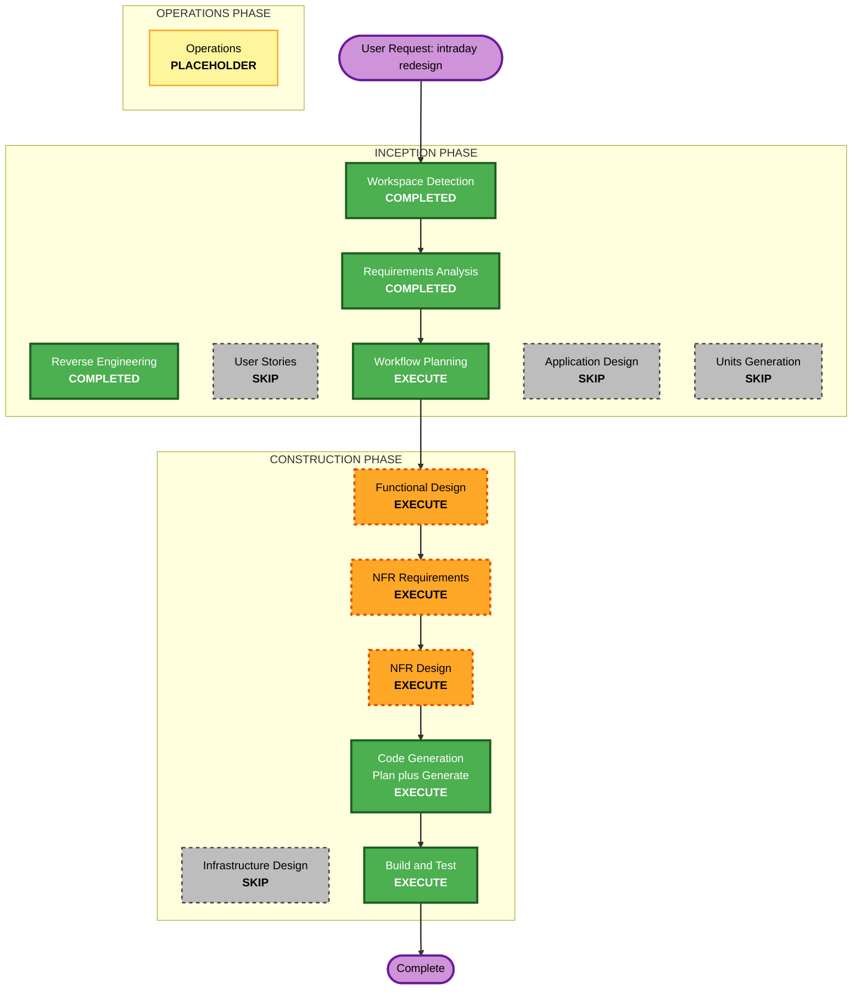

# Execution Plan — Intraday 루프 재설계 (F3)

## Detailed Analysis Summary

> **2026-05-30 재정합 (F4 머지 후, /ai-dlc-resume)**: 이 계획은 통합 기반으로 **미머지 F2@f63fad2** 엔진을 가정했으나, F4가 그 엔진을 재구현해 **`main`에 머지**(`1719fcf`)했다. 아래에서 "F2 `steering/`"는 **"main의 `src/agent/steering/`(F4 재구현체)"**로 읽는다. 효과: critic C-1(`try_scheduled_turn`)/C-4(per-kind `ReconcileWorker`)/C-5(`jsonl`+`ByteCursor`)는 **main에 이미 구현** → F3 범위 축소. 잔여 신규 = brief 조립·new-fill 감지(C-3 snapshot에 fills 커서 추가)·뉴스 diff·watch.jsonl·entries_halted 훅. 상세는 requirements §11.0 표 참조. 구현 베이스 = **main에서 분기한 worktree**.

### Transformation Scope (Brownfield)
- **Transformation Type**: Single-unit application change (agentic 경로의 intraday 루프 + F2 동시성 모델 재사용). 인프라/배포 모델 변경 없음.
- **Primary Changes**: 15분 스케줄 intraday turn을 구조화 brief로 cheap·정확하게 + 이벤트 기반 wake turn(우선 발화)을 F2 background-turn 엔진 일반화로 추가.
- **Related Components**: `src/agent/` (prompts/orchestrator + 신규 brief·wake·watch 모듈), `src/trading/modes/agent.py`, **F2 `src/agent/steering/`** (TurnCoordinator/ReconcileWorker→일반화, CommandBus, SteeringState), `src/agent/review.py`, `src/agent/tools/market.py`, `src/agent/journal.py`.

### Change Impact Assessment
- **User-facing changes**: No — 내부 agent 동작 변경(사람-조작 콘솔은 F2의 surface, F3 아님).
- **Structural changes**: Yes(중간) — F2 ReconcileWorker를 공유 event-turn 엔진으로 일반화하고 트리거 소스(체결/움직임/watch-trigger) 추가; 스케줄 turn에 non-blocking 획득(skip-if-busy) 도입.
- **Data model changes**: Yes — 신규 `workspace/watch.jsonl` 스키마(구조화 watch-trigger); intraday brief 조립 구조(대부분 transient).
- **API changes**: 내부만 — `run_intraday`/brief 인터페이스, 일반화된 worker 인터페이스, 신규 wake-detection 모듈. 외부 API 없음.
- **NFR impact**: Yes — 동시성(turn_lock 재사용), 비용(스케줄 turn cheap화), 정합성(account 진실), 반응성(이벤트 wake).

### Component Relationships
- **Primary Component**: `src/agent/` intraday 경로 + `modes/agent._intraday`.
- **Dependency (reuse, 변경 최소화)**: **main `src/agent/steering/`(F4)** — `TurnCoordinator.try_scheduled_turn`(이미 skip-if-busy)·`reconcile_turn`(turn_lock), `ReconcileWorker.trigger(kind=)`(per-kind, F3가 wake kind 추가), `SteeringState.run_state()`/lock/pending, `runtime.publish_snapshot`(positions+open_orders, 5초 bus job — F3가 fills 커서 추가), `jsonl.read_complete_lines`+`ByteCursor`(watch.jsonl 재사용); `review.outcome_lines`(brief 패턴); `tools/market`(quote/news/account); `journal`.
- **Dependent Component**: 라이브 agent 데몬(`modes/agent`), `DecisionExecutor`(decisions 소비 — 경로 불변, advisor-only).
- **Supporting Component**: `turns.jsonl` 텔레메트리, `scheduler`(max_instances=1/coalesce — main에 이미 설정).
- **Change Type/Priority**: main steering(F4) = Minor(일반화 확장, 비파괴; C-1/C-4/C-5 기이행이라 surface 안정). agent intraday 모듈 = Major(신규 로직: brief/wake/news/watch), Critical.

### Risk Assessment
- **Risk Level**: **Medium → Medium-Low**. 라이브 agent 의사결정 경로에 닿지만 **advisor-only**(RiskManager→Broker 게이트 불변, 직접 주문 없음)이고 새 동시성 프리미티브를 만들지 않고 main(F4) 것을 재사용. C-1/C-4/C-5가 main에 이미 구현돼 가장 위험했던 동시성 수정이 선반영됨. worktree 격리.
- **Rollback Complexity**: Easy (worktree/branch, 머지 전까지 main 무영향).
- **Testing Complexity**: Moderate (결정형 wake/거리/watch-trigger 파싱 = PBT 적합; 동시성 skip-if-busy = 통합 테스트 — main `try_scheduled_turn` 기준).
- **주요 의존성/제약**: ~~F2 initial 구현 완료 필요~~ → **충족됨**: F4가 동시성 엔진을 재구현해 **main에 머지**(`1719fcf`). 구현 베이스 = main에서 분기한 worktree(F2 브랜치 폐기).

## Workflow Visualization

### Mermaid Diagram


### Text Alternative
```
INCEPTION PHASE
- Workspace Detection .... COMPLETED (reused)
- Reverse Engineering .... COMPLETED (reused)
- Requirements Analysis .. COMPLETED (approved)
- User Stories ........... SKIP (internal agent-behavior; workflows captured as FRs)
- Workflow Planning ...... EXECUTE (this stage)
- Application Design ..... SKIP (folded into Functional Design)
- Units Generation ....... SKIP (single cohesive unit)

CONSTRUCTION PHASE (unit: intraday-redesign)
- Functional Design ...... EXECUTE (watch.jsonl schema, brief assembly, wake detection, business rules)
- NFR Requirements ....... EXECUTE (minimal: no new runtime deps; NFR-1..6 traceability)
- NFR Design ............. EXECUTE (generalize ReconcileWorker, non-blocking scheduled acquire, snapshot/RunState)
- Infrastructure Design .. SKIP (local CLI, no infra)
- Code Generation ........ EXECUTE (plan + generate, in worktree on F2 branch)
- Build and Test ......... EXECUTE (full regression + new unit/PBT)

OPERATIONS PHASE
- Operations ............. PLACEHOLDER
```

## Phases to Execute

### 🔵 INCEPTION PHASE
- [x] Workspace Detection (COMPLETED — reused, brownfield)
- [x] Reverse Engineering (COMPLETED — reused)
- [x] Requirements Analysis (COMPLETED — approved 2026-05-29)
- [x] User Stories (SKIPPED)
  - **Rationale**: 내부 agent 동작 변경, 사용자-대면 UI 없음. 워크플로는 FR-1..7로 포착. F1/F2와 일관.
- [x] Workflow Planning (IN PROGRESS)
- [ ] Application Design — **SKIP**
  - **Rationale**: 신규 서비스 계층/컴포넌트 아키텍처가 Functional Design 범위를 넘지 않음. 단일 응집 변경 + F2 컴포넌트 재사용. (F2도 App Design을 Functional Design에 흡수.)
- [ ] Units Generation — **SKIP**
  - **Rationale**: 단일 응집 유닛 `intraday-redesign` (Q10=A).

### 🟢 CONSTRUCTION PHASE (unit: `intraday-redesign`)
- [ ] Functional Design — **EXECUTE**
  - **Rationale**: 신규 데이터 스키마(`watch.jsonl`), brief 조립 로직, wake 조건 감지, 비즈니스 룰(skip-if-busy, RunState 게이팅, advisor-only ADJUST_STOP 감지, 뉴스 diff) 정의 필요.
- [ ] NFR Requirements — **EXECUTE (minimal)**
  - **Rationale**: 기술 스택 이미 확정(신규 런타임 의존성 0 — F2 + 기존 도구 재사용). NFR-1..6 트레이서빌리티 확정 + (예상) 신규 질문 라운드 없음.
- [ ] NFR Design — **EXECUTE**
  - **Rationale**: 핵심 동시성 설계 — ReconcileWorker를 공유 event-turn 엔진으로 일반화, 스케줄 turn non-blocking 획득(skip-if-busy), `SteeringState.snapshot()` 읽기, RunState 게이팅, fault isolation, debounce/coalesce. F2 turn_lock 불변식 보존.
  - **/critic 반영 필수 항목(requirements §11)**: C-1 TurnCoordinator에 in-flight 플래그+`try_scheduled_turn()` 추가(순수 재사용 아님) + reconcile-yield vs skip 구분 + 통합테스트; C-3 snapshot 페이로드 확장(positions+open_orders+fills 커서) + 짧은 주기 bus job 갱신 + fill diff 감지; C-4 트리거 유형별 run_fn/프롬프트(데드락·debounce 합쳐짐 방지); C-5 공유 JSONL 리더 + fired 커서 영속 + sweep 통합; C-6 뉴스 폴링 별 스레드/bus·TTL·last-seen 영속; C-7 게이트 입력 분리; C-8 보류 로그=wake 감지기, entries_halted 신규 훅, interval anchoring 명시.
- [ ] Infrastructure Design — **SKIP**
  - **Rationale**: 로컬 CLI, 인프라 변경 없음.
- [ ] Code Generation — **EXECUTE (ALWAYS)**
  - **Rationale**: 구현 계획 + 코드 생성. F2 브랜치 위 worktree에서 진행.
- [ ] Build and Test — **EXECUTE (ALWAYS)**
  - **Rationale**: 전체 회귀(F2 포함 ~262) + 신규 단위/PBT/통합 테스트.

### 🟡 OPERATIONS PHASE
- [ ] Operations — PLACEHOLDER

## Module Update Strategy (Brownfield)
- **Update Approach**: Sequential, single unit on the F2 branch.
- **Critical Path**: F2 initial 구현(완료, f63fad2)이 선행 필수 — F3는 그 위에 빌드(CQ-A=A). 새 worktree는 F2 브랜치/머지본 기준으로 분기.
- **Coordination Points**: F2 `steering/` (TurnCoordinator/ReconcileWorker/SteeringState/CommandBus) — F3는 *확장(일반화)* 하되 F2의 turn_lock·단일워커·RunState 계약을 깨지 않음.
- **내부 빌드 순서(요구사항 §8)**: (1) watch.jsonl + brief 조립 → (2) wake 감지(체결/움직임/watch-trigger) → (3) prompts/orchestrator 주입 배선(스케줄 cheap화 + 이벤트 turn) → (4) cadence: skip-if-busy + 이벤트 우선(워커 일반화) → (5) 조건부 ADJUST_STOP 감지 연결 → 전체 회귀+신규 테스트.
- **Rollback**: worktree/branch 폐기 — main 및 F2 머지본 무영향.

## Estimated Timeline
- **Total Stages to Execute**: 5 (Workflow Planning + Functional Design + NFR Requirements + NFR Design + Code Generation + Build & Test = 6 활성, US/AD/UG/ID skip).
- **Estimated Duration**: 설계(Functional+NFR) 1 세션 + Code Generation/Build&Test 1 세션 수준(autonomy 적용 시 연속 실행).

## Success Criteria
- **Primary Goal**: intraday turn이 (a) 구조화 brief로 재계산 없이 cheap·정확(account 진실/뉴스 diff/델타)하고, (b) 판단 필요 이벤트에서 우선 wake 발화하는 더 나은 LLM trader.
- **Key Deliverables**: `watch.jsonl` 스키마 + 평가기; intraday brief 조립기; wake 감지 + 일반화된 event-turn 엔진; cheap화된 스케줄 프롬프트; skip-if-busy; 조건부 ADJUST_STOP 감지; 신규 단위/PBT.
- **Quality Gates**: 모든 LLM 발화가 F2 turn_lock 경유(bare run_turn 0); account는 snapshot 캐시에서만; RunState 존중(pause/halt); 전체 회귀+신규 테스트 green; worktree 격리(미머지).
- **Integration Testing**: 스케줄 turn × 이벤트 wake × F2 reconcile/console이 단일 turn_lock에서 올바르게 직렬화(특히 skip-if-busy와 reconcile-priority 상호작용).
```
