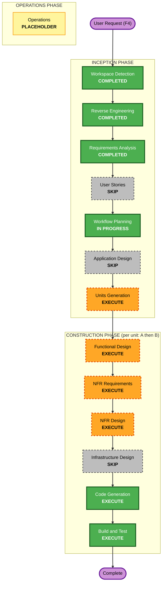

# F4 — Steering Console 재설계 — 실행 계획 (Execution Plan)

_INCEPTION → Workflow Planning. 근거: `steering-console-redesign.md`(요구사항, 승인됨) + Q1–Q9/Clarif-1/2._

## 1. 상세 분석 요약

### 변환 범위 (Brownfield)
- **유형**: 아키텍처 변경(기존 컴포넌트 경계 안 + 신규 컴포넌트 + 신규 외부 도구). 단일 컴포넌트 변경 아님.
- **주요 변경**: F2 프론트엔드(prompt_toolkit `console.py`)·parser·브랜치 폐기 → (a) 데몬측 안전
  엔진 **재구현**(file-drop 계약 + 단일 워커 + executor 게이트 + reconcile/turn_lock + approval +
  SteeringState + 이벤트/읽기 채널), (b) opencode 베이스를 **trader-agent 전용 도구로 리브랜딩**한
  운영자 TUI(별도 프로세스).
- **관련 컴포넌트**: `src/agent/{session,orchestrator,executor,journal,prompts}.py`, `src/trading/modes/agent.py`,
  `src/trading/scheduler.py`, `src/risk/manager.py`, `scripts/agent_trace.py`(읽기 노출), 신규 `src/agent/steering/*`
  (재구현), 신규 외부 도구 디렉토리(opencode 베이스, TS/Go).

### 변경 영향 평가
- **User-facing**: 예 — 운영자 인터페이스가 완전히 바뀜(opencode 기반 TUI, 자연어).
- **구조 변경**: 예 — in-process REPL → detached 프로세스 + file-drop IPC + 권한 분리.
- **데이터 모델**: 예(경량) — file-drop command/event/question JSONL 스키마, HumanDirective/PendingApproval 레코드 재정의.
- **API/계약**: 예 — **file-drop 명령 계약**(운영자 도구 ↔ 데몬의 단일 seam)이 핵심 신규 계약.
- **NFR 영향**: 큼 — 동시성(단일 워커+turn_lock, 프로세스 간 append-only), **권한 분리(NFR-1)**, fault isolation, 보안.

### 컴포넌트 관계
- **Primary**: `src/agent/steering/*`(재구현) + 신규 운영자 도구.
- **Shared/Dependent**: `DecisionExecutor`/`RiskManager`/`Broker`(주문 게이트 — 변경 없이 경유), `AgentSession`(advisor-only, 권한 분리 대상), `Journal`(채널 추가).
- **Supporting**: `monitoring/logger`, `scheduler`.

### 리스크 평가
- **리스크 수준**: **High–Medium**. 롤백: 쉬움(worktree/branch; F2 브랜치 무영향). 테스트 복잡도: Complex(라이브 주문 경로 재검증 + 프로세스 간 통합 + 권한 거부 + PBT).
- 주요 불확실성: (1) 데몬 엔진 재구현의 F2 안전 모델 동등성, (2) opencode 베이스 리브랜딩 작업량(TS/Go), (3) 프로세스 간 IPC·권한 분리의 새 실패 모드.

## 2. 워크플로 시각화

## 3. 단위 분해 (Units Generation = EXECUTE, minimal)

F2/F3는 단일 유닛이었으나 F4는 **언어가 다른 두 deliverable**를 file-drop 계약을 seam으로 독립
개발/테스트할 수 있어 **2개 유닛**으로 분해한다(권장).

| Unit | 이름 | 언어 | 범위 |
|---|---|---|---|
| **A** | `steering-core` | Python | file-drop 명령 계약(records/검증/JSONL reader+cursor) + 단일 CommandWorker + executor 안전 게이트 + reconcile/turn_lock + approval 게이트 + SteeringState + 이벤트/읽기 채널 + **권한 분리 enforcement(NFR-1)**. F2 안전 모델 재구현 + F3 critic 발견(C-1/C-3/C-4/C-5/C-7) 선반영. **헤드리스 CLI로 검증 가능**. |
| **B** | `operator-tool` | TS/Go (opencode 베이스) | opencode를 trader-agent 전용으로 리브랜딩한 TUI: custom command(매매/라이프사이클/승인/조회/주입), 자연어→deterministic 1줄 환원+confirm, file-drop writer, 이벤트 tail, agent-trace 읽기. |

- **빌드 순서**: **A 먼저(계약·안전 경로 우선), B 나중**. A 완료 시 헤드리스 CLI + Claude Code로 임시
  운전 가능 → B는 그 계약 위에 얹음. (Clarif-2=B는 "둘 다 v1"이되, 안전상 A를 먼저 굳힘.)
- **seam**: file-drop 명령/이벤트 JSONL 스키마(Unit A가 정의·소유, Unit B가 준수).

## 4. 단계별 EXECUTE/SKIP + 근거

### INCEPTION
- [x] Workspace Detection — COMPLETED(brownfield 재사용)
- [x] Reverse Engineering — COMPLETED(아티팩트 존재)
- [x] Requirements Analysis — COMPLETED(승인됨)
- [x] User Stories — **SKIP** — 단일 운영자 도구; 워크플로는 FR-1..8로 포착; F1/F2/F3와 일관.
- [x] Workflow Planning — IN PROGRESS(본 문서)
- [ ] Application Design — **SKIP** — 컴포넌트/메서드/비즈니스 룰은 per-unit Functional Design에 흡수.
- [ ] Units Generation — **EXECUTE(minimal)** — 위 2유닛 분해(언어·테스트 독립성 때문에 가치 있음).

### CONSTRUCTION (유닛별: A → B)
- [ ] Functional Design — **EXECUTE** — 신규 컴포넌트·룰: 명령 문법, 자연어→deterministic 환원 규칙,
  confirm 의미, approval 게이트 상태기계, event/question 스키마, 권한 모델. (Application Design 흡수.)
- [ ] NFR Requirements — **EXECUTE** — Unit A: 신규 런타임 의존성 최소(stdlib + pydantic 재사용) 확인;
  Unit B: opencode 베이스의 언어/런타임/패키징/라이선스(SECURITY-10) 결정 — tech-stack 결정 필요.
- [ ] NFR Design — **EXECUTE** — 동시성(단일 워커+turn_lock, 프로세스 간 append-only+단일 reader cursor),
  **권한 분리 설계(NFR-1)**, fault isolation, 보안 배치(SECURITY-03/10/11/13/15). F3 critic 발견 내장.
- [ ] Infrastructure Design — **SKIP** — 로컬 CLI/TUI, 클라우드 인프라 없음. (file-drop = 로컬 파일.)
- [ ] Code Generation — **EXECUTE(ALWAYS)** — 유닛별 Part1 계획 → Part2 생성. 새 worktree+branch.
- [ ] Build and Test — **EXECUTE(ALWAYS)** — F2 안전 모델 동등성 테스트, **권한 거부 테스트(NFR-1)**,
  PBT(파서/환원/레코드 round-trip), 전체 회귀, **프로세스 간 통합**(운영자 도구↔file-drop↔데몬). agentic path는 backtest 비대상.

### OPERATIONS
- [ ] Operations — PLACEHOLDER.

## 5. 확장 (Extensions, Q9=A)
- Security Baseline = Enabled(SECURITY-03/10/11/13/15; **권한 분리 = 이번 트랙 추가 강조**). PBT = Partial/Hypothesis.

## 6. F3 조정 (Q7=C)
- F4 Unit A(엔진) 머지 후 F3가 그 엔진 위로 rebase. F3 critic 발견은 Unit A 설계에 선반영하므로 F3는
  "primitive 수정"이 아니라 "트리거 소스 추가"로 축소. F3 docs/state는 F4 머지 후 baseline 재지정(후속).

## 7. 성공 기준
- **주 목표**: 운영자가 자연어로 라이브 agent를 안전하게 조종(매매는 confirm+RiskManager 게이트), agent는
  개입을 인지(reconcile), 운영자 권한은 agent 세션에서 구조적 접근 불가.
- **핵심 deliverable**: (A) 재구현 데몬 엔진 + file-drop 계약, (B) opencode 기반 운영자 도구, 권한 분리, 테스트.
- **품질 게이트**: 전체 회귀 green, 권한 거부 테스트 green, F2 안전 모델 동등성 테스트 green, 프로세스 간 통합 통과.

## 8. 타임라인(개략)
- 실행 단계 수: Units Generation + (Functional/NFR-R/NFR-D/CodeGen)×2유닛 + Build&Test. Unit A(안전 경로)가 임계 경로.
