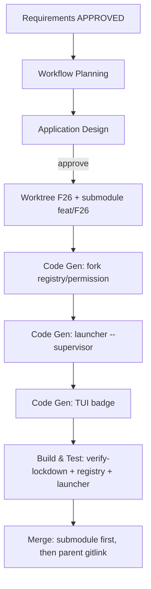

# F26 — Supervisor Mode 실행 계획 (Workflow Planning)

> Track F26 · Brownfield · 요구사항: `requirements/supervisor-mode.md` (APPROVED) · 설계 방식: DESIGN-NOTE-1 (1) 경로-스코프

## 1. 실행/스킵 단계 결정

| 단계 | 실행? | 깊이 | 근거 |
|---|---|---|---|
| Reverse Engineering | 스킵 | — | RE 아티팩트 존재(architecture.md) |
| Requirements Analysis | ✅ 완료 | Standard | Q1–Q10 승인 |
| User Stories | 스킵 | — | 단일 운영자 페르소나, 새 사용자 여정 없음(설정/권한 레벨) |
| Workflow Planning | ✅ 진행 | — | 항상 |
| **Application Design** | ✅ 실행 | Standard | 권한 프로파일·런처 플래그·lockdown web 복원·read 스코프·TUI 배지의 정확 변경점 정의 필요 |
| Units Generation | 스킵 | — | 단일 응집 변경(포크+런처+TUI). 분해 불필요 |
| **Code Generation** | ✅ 실행 | — | 단일 유닛으로 구현 |
| **Build & Test** | ✅ 실행 | — | verify-lockdown/registry.test 갱신 + 신규 테스트 |

## 2. 변경 패키지 시퀀스 (multi-package)

이 트랙은 **3개 영역**을 건드린다. 서브모듈 → 런처 → TUI 순으로 구현하고, 부모 gitlink는 머지 시점에만 커밋(서브모듈 머지 워크플로 준수 [[submodule-merge-workflow]]).

1. **포크 (서브모듈 `operator-console/cli`)** — 권한/툴 레지스트리 핵심
   - `packages/opencode/src/tool/registry.ts`: lockdown에서 `webfetch`/`websearch`만 **제거 대상에서 제외**(edit/write/bash/task/patch는 계속 제거).
   - 권한 설정: normal/supervisor 두 프로파일. `read` 경로-스코프, `glob`/`grep`/`lsp` normal deny·supervisor allow, `external_directory` 프로파일별 스코프, 비밀 글롭 deny. **비밀 deny 글롭은 `**/`-접두(`**/.env*`/`**/secrets/**`/`**/*.key`/`**/*.pem`/`**/logs/**`/`**/.git/**`) + deny-마지막 순서**(critic HIGH#1/②, DESIGN-NOTE-1 보정).
   - **프로파일 선택 메커니즘 = 신규 구현(critic HIGH#2)**: 정적 `opencode.json` 1개로는 불가. `fromConfig`는 파일 전용 → opencode config 로드에 **env(`AUTOSTOCK_SUPERVISOR`)→권한 규칙 생성** 지점을 신설. (Application Design R4의 확정 결론)
   - 런치 시점에 `$STEERING_DIR`/`$AUTOSTOCK_ROOT`를 **worktree-상대 글롭으로 환산**해 read 규칙에 주입(`expand()`는 `~`/`$HOME`만 푸므로 리터럴 주입 불가). external_directory는 절대경로 좌표계로 별도 주입.
   - `verify-lockdown.ts` + `test/tool/registry.test.ts` 두 프로파일로 갱신.
2. **런처 (parent repo `operator-console/launcher/`)**
   - `--supervisor`를 **consoleArgs에서 소거** + `consoleEnv()`가 `AUTOSTOCK_SUPERVISOR=on` 세팅(셸 접근 게이트, FR-4②). 현재 `cli.ts:56-57`은 args 무가공 전달이라 누수됨 → 파싱/소거 필수(critic HIGH#2). 플래그 없으면 normal.
   - `test/launcher.test.ts`에 `--supervisor`→`AUTOSTOCK_SUPERVISOR=on`·consoleArgs 비누수 / 무플래그→미설정 테스트 추가.
3. **TUI 배지 (서브모듈)** — 위치 정정: `packages/opencode/src/cli/cmd/tui/feature-plugins/sidebar/autostock.tsx`(이미 `process.env.STEERING_DIR`를 읽음 — 동일 경로로 `AUTOSTOCK_SUPERVISOR` 수신). `tui-trading` 아님(critic LOW).
   - supervisor일 때만 `MODE: SUPERVISOR` 배지 표시(FR-3/Q6).

## 3. Worktree 게이트 (코드 생성 직전, 필수)

- 부모: `scripts/worktree-setup.sh F26 --ts` (서브모듈 init/브랜치 + bun install + tsgo 검증; [[worktree-live-verification]]).
- 서브모듈 `operator-console/cli`: `feat/F26` 브랜치(detached HEAD 금지).
- 설계 문서(현재 단계)는 worktree 없이 `aidlc-docs/`에 작성 가능. **코드 생성은 worktree 안에서만.**

## 4. 검증 전략 (Build & Test 미리보기)

- `bun run verify-lockdown.ts` (두 프로파일): normal=소스 read deny·glob/grep deny·web allow·MCP 유지; supervisor=AUTOSTOCK_ROOT read allow·비밀 deny·write 빌트인 여전히 deny.
  - **경로 케이스 단언 필수(critic ④)**: 현재 verify-lockdown은 패턴 `"*"`만 평가(`verify-lockdown.ts:17`) → 경로 버그를 못 잡음. `../../.env`/`../../logs/x`(supervisor deny), `../../<steering>/monitor.json`(normal allow), `.`(normal cwd deny)를 명시 단언으로 추가. **비밀-제외 경로 테스트는 blocking(SECURITY-06/11).**
- `bun test test/tool/registry.test.ts`: lockdown이 web만 보존, 나머지 부작용 빌트인 부재.
- `bun test test/launcher.test.ts`: `--supervisor`→`AUTOSTOCK_SUPERVISOR=on`, 무플래그→미설정.
- 수동/컨테이너: `worktree-setup.sh F26 --docker-verify`로 attach 런타임에서 normal `Read .` 거부 + supervisor 상위 레포 read 허용·`.env` 거부 확인.

## 5. 위험 / 주의

- **R1**: read 패턴이 worktree-상대 → steering 글롭 환산 정확성. (Design에서 확정·테스트)
- **R2**: lockdown web 복원이 edit/write/bash 제거를 흔들지 않도록 registry.ts 변경 최소화 + registry.test로 회귀 방지.
- **R3 (AR-1)**: webfetch egress 유출 — 수용된 위험. 비밀 read 제외로 완화.
- **R4**: 프로파일 선택을 정적 `opencode.json` 하나로 못하면, 런치 시 두 config 중 선택 또는 env 기반 동적 권한 생성 필요 → Application Design 핵심 결정.

## 6. 워크플로 시각화

