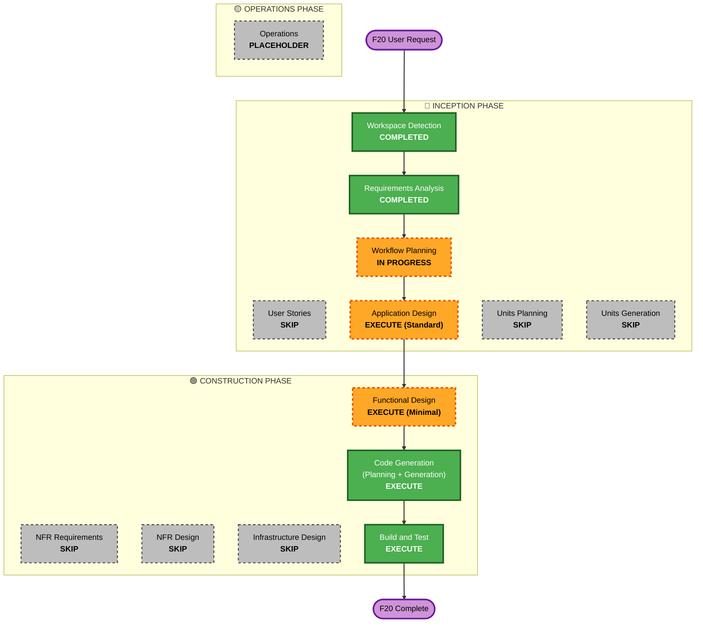

# F20 Execution Plan

> 생성: 2026-05-31T08:26:33Z | 기반: `requirements/requirements.md` + Q&A

## Detailed Analysis Summary

### Transformation Scope (Brownfield)
- **Transformation Type**: Single component — 신규 TS 모듈 1개 + 기존 MCP 서버 도구 등록 확장
- **Primary Changes**: `operator-console/src/alpaca-data.ts` (신규) + `operator-console/src/mcp-server.ts` (16개 `registerTool` 추가) + 서브모듈 opencode permission keys + env 배선
- **Related Components**: `docker-compose.verify.yml` (env 전달), `scripts/worktree-setup.sh` (문서)

### Change Impact Assessment
- **User-facing changes**: Yes — AI가 임의 종목 시세·주문·포지션을 조회할 수 있게 됨 (기존 불가능)
- **Structural changes**: No — 기존 FileDrop/데몬 아키텍처 영향 없음, TS 인프로세스에서만 추가
- **Data model changes**: No — 신규 DB 스키마 없음, Alpaca JSON 응답을 text로 변환만
- **API changes**: Yes — MCP 도구 16개 추가 (읽기 전용, 기존 도구 영향 없음)
- **NFR impact**: Low — TS→Alpaca HTTPS, env-only 자격증명, 기존 보안 경계 유지

### Component Relationships
```
Primary:    operator-console/src/alpaca-data.ts (NEW)  ← Alpaca REST v2
            operator-console/src/mcp-server.ts (MODIFY) ← imports alpaca-data, registers 16 tools

Submodule:  operator-console/cli/
              opencode.json              (MODIFY) ← permission keys + MCP env vars
              .opencode/opencode.jsonc   (MODIFY) ← same

Parent:     docker-compose.verify.yml    (MODIFY) ← pass ALPACA_API_KEY/SECRET to attach
            scripts/worktree-setup.sh    (MODIFY) ← document Alpaca key requirement
```

| Component | Change Type | Reason | Priority |
|-----------|------------|--------|----------|
| `alpaca-data.ts` | New | Core — Alpaca HTTP client | Critical |
| `mcp-server.ts` | Minor | Register 16 read tools | Critical |
| `opencode.json` | Config | Permission keys + env vars | Critical |
| `.opencode/opencode.jsonc` | Config | Same (fork canonical source) | Critical |
| `docker-compose.verify.yml` | Config (patch) | Pass env to attach service | Important |
| `worktree-setup.sh` | Doc | Mention key requirement | Optional |

### Risk Assessment
- **Risk Level**: Low — 읽기 전용, paper trading only, 데몬 영향 없음, rollback trivial (revert commit)
- **Rollback Complexity**: Easy — 단일 커밋 revert
- **Testing Complexity**: Simple — unit test (TS) + integration test (MCP tool 호출 → Alpaca API mock 응답)

---

## Workflow Visualization



---

## Phases to Execute

### 🔵 INCEPTION PHASE
- [x] Workspace Detection — COMPLETED (track opened)
- [x] Requirements Analysis — COMPLETED
- [x] User Stories — **SKIP**
  - **Rationale**: AI+운영자 내부 콘솔 도구. 사용자 페르소나·journey·acceptance criteria 필요 없음. 요구사항만으로 충분.
- [~] Workflow Planning — IN PROGRESS
- [ ] Application Design — **EXECUTE (Standard)**
  - **Rationale**: 신규 컴포넌트 `alpaca-data.ts` 설계 필요 — Alpaca API v2 엔드포인트 매핑, HTTP 클라이언트 인터페이스, 오류 처리 패턴, JSON→text 포맷 계약, Zod schema 정의.
- [ ] Units Planning — **SKIP**
  - **Rationale**: 단일 유닛(TS 모듈 1개 + 도구 등록). 분해 불필요.
- [ ] Units Generation — **SKIP**
  - **Rationale**: 단일 유닛, 분해 불필요.

### 🟢 CONSTRUCTION PHASE
- [ ] Functional Design — **EXECUTE (Minimal)**
  - **Rationale**: `alpaca-data.ts`의 데이터 흐름(Request→Alpaca→Response→Text)과 MCP 도구별 파라미터→API 매핑을 명확히. 복잡한 비즈니스 로직 없으므로 Minimal depth.
- [ ] NFR Requirements — **SKIP**
  - **Rationale**: NFR-1~6이 requirements.md에 이미 충분히 정의됨. 기술 스택도 확정. 추가 논의 불필요.
- [ ] NFR Design — **SKIP**
  - **Rationale**: 요구사항에 NFR 패턴이 모두 반영됨. 별도 설계 불필요.
- [ ] Infrastructure Design — **SKIP**
  - **Rationale**: 로컬 MCP stdio 서버. 클라우드 리소스·배포·네트워크 변경 없음.
- [ ] Code Generation — **EXECUTE (ALWAYS)**
  - **Rationale**: `alpaca-data.ts` + `mcp-server.ts` 도구 등록 + 설정 파일 + 테스트.
- [ ] Build and Test — **EXECUTE (ALWAYS)**
  - **Rationale**: TS typecheck + unit test + MCP tool smoke test.

### 🟡 OPERATIONS PHASE
- [ ] Operations — PLACEHOLDER

---

## Module Update Strategy (Brownfield — Parent Repo + Submodule)

- **Update Approach**: Sequential within parent, parallel with submodule
- **Critical Path**: `alpaca-data.ts` → `mcp-server.ts` (imports it) → parent config files
- **Coordination Points**: Submodule `opencode.json`/`.opencode/opencode.jsonc` — `feat/F20` branch in submodule, gitlink committed at merge only (concurrent-tracks rule)
- **Testing Checkpoints**: After TS code complete → typecheck; After config wired → MCP tool smoke test in attach container

| # | Module | Priority | Dependency | Change Scope |
|---|--------|----------|------------|--------------|
| 1 | `alpaca-data.ts` (parent, NEW) | Critical | — | Major (new file) |
| 2 | `mcp-server.ts` (parent) | Critical | #1 | Minor (import + 16 registerTool) |
| 3 | `opencode.json` + `.opencode/opencode.jsonc` (submodule) | Critical | — (parallel) | Config |
| 4 | `docker-compose.verify.yml` (parent) | Important | — (parallel) | Config (patch) |
| 5 | `worktree-setup.sh` (parent) | Optional | — | Doc |

---

## Submodule Coordination (concurrent-tracks rule)

Per `.aidlc-rule-details/common/concurrent-tracks.md` §MANDATORY worktree gate:

1. Submodule branch: `git -C operator-console/cli switch -c feat/F20` (inside worktree)
2. Commit submodule changes (`opencode.json`, `.opencode/opencode.jsonc`) on `feat/F20`
3. **Do NOT commit the parent gitlink** until merge — defer to merge time
4. At merge: merge submodule `feat/F20` → `main` first, push, then commit parent gitlink

---

## Estimated Timeline
- **Total Stages to Execute**: 5 (Application Design → Functional Design → Code Generation → Build and Test)
- **Estimated Duration**: Application Design + Functional Design = lightweight (1 turn each). Code Generation = main work (planning + generation: 2-3 turns). Build and Test = 1 turn.

## Success Criteria
- **Primary Goal**: AI가 콘솔에서 임의 종목의 시세·주문·포지션을 Alpaca MCP 공식 도구로 조회 가능
- **Key Deliverables**:
  - `alpaca-data.ts` — Alpaca REST v2 HTTP 클라이언트 (bun fetch, Zod validation, env-only auth)
  - `mcp-server.ts` — 16개 Alpaca MCP stock-only 읽기 도구 등록 (`allow` gating)
  - 서브모듈 opencode permission keys 16개 + MCP env vars (`ALPACA_API_KEY`, `ALPACA_API_SECRET`)
  - `docker-compose.verify.yml` — attach 서비스에 Alpaca env 전달
  - Unit tests (`alpaca-data.test.ts` — mock Alpaca API)
- **Quality Gates**:
  - `bun run typecheck` passes (worktree with `bun install --frozen-lockfile`)
  - All unit tests pass
  - MCP tool 호출 시 Alpaca API mock 응답 정상 포맷
  - `docker compose -f docker-compose.verify.yml run --rm verify smoke` — at least one read tool returns valid text
