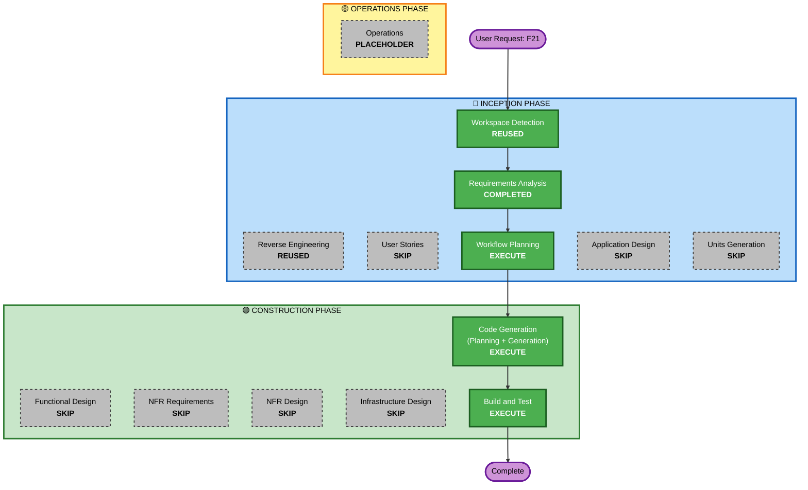

# F21 Execution Plan

> Track: F21 | Date: 2026-05-31 | Workflow Planning

## Detailed Analysis Summary

### Transformation Scope (Brownfield)

- **Transformation Type**: Single component — validation logic relocation within existing module boundaries
- **Primary Changes**: 
  1. Add zod `.refine()` cross-field validation to 3 MCP tool schemas (`mcp-server.ts`)
  2. Add degenerate-value check to `handleStructured` (`steer-handler.ts`)
  3. Simplify `_order_from_place_args` — remove FR-7 logic, keep only price-based sizing (`commands.py`)
  4. Add pre-queue arg validation to `_v_close_position`, `_v_close_all` (`commands.py`)
  5. Update wording for honest deferred-vs-accepted messaging
- **Related Components**: None outside the steering subsystem

### Change Impact Assessment

- **User-facing changes**: No — internal validation behavior. Operator sees synchronous rejection (instead of "OK" then async failure), which is a UX improvement.
- **Structural changes**: No — same component boundaries, same file-drop channel, same daemon gate
- **Data model changes**: No — `PlaceOrderArgs` pydantic model unchanged. `contract.json` command_args unchanged (same field names).
- **API changes**: No — MCP tool signatures unchanged. Same input/output shapes.
- **NFR impact**: Positive — fail-closed validation moves earlier (L1 synchronous), reducing misleading "accepted" reports

### Component Relationships

```
Primary (Python):
  src/agent/steering/commands.py      ← L3 daemon simplification
  src/agent/steering/records.py       ← PlaceOrderArgs (unchanged, reference only)

Primary (TypeScript):
  operator-console/src/mcp-server.ts  ← L1 zod .refine() + description tightening
  operator-console/src/steer-handler.ts ← L2 degenerate check
  operator-console/src/schema.ts      ← COMMAND_ARGS (verify no changes needed)

Contract:
  operator-console/contract/contract.json ← golden, verify sync

Tests:
  tests/test_steering_commands.py         ← update for simplified _order_from_place_args
  operator-console/test/contract.test.ts  ← verify still passes
```

### Risk Assessment

- **Risk Level**: **Low–Medium**
  - L1/L2: TypeScript-only, no daemon impact, fail-closed (extra validation), easy rollback
  - L3: Removes code, doesn't add new paths. `_order_from_place_args` gets simpler, not more complex.
  - All changes in worktree, isolated from main
- **Rollback Complexity**: **Easy** — revert worktree branch
- **Testing Complexity**: **Moderate** — cross-language (TS zod + Python daemon), need both unit tests and contract sync verification

## Workflow Visualization



## Phase Determination

### 🔵 INCEPTION PHASE

- [x] Workspace Detection — **REUSED** (brownfield, existing project)
- [x] Reverse Engineering — **REUSED** (artifacts exist)
- [x] Requirements Analysis — **COMPLETED** (awaiting approval)
- [x] User Stories — **SKIP**
  - **Rationale**: Bug fix with clear reproduction steps. No user personas, no UX change, no acceptance criteria beyond "rejection is synchronous and honest." Consistent with F1–F20 precedent (all operational/internal tracks skip user stories).
- [x] Application Design — **SKIP**
  - **Rationale**: Changes within existing component boundaries (`commands.py`, `mcp-server.ts`, `steer-handler.ts`). No new components, services, or methods. 3-layer validation is a layering of existing validation logic, not a new architectural component.
- [x] Units Generation — **SKIP**
  - **Rationale**: Single cohesive unit — no decomposition needed. All changes are in the steering subsystem's validation layer.

### 🟢 CONSTRUCTION PHASE

- [x] Functional Design — **SKIP**
  - **Rationale**: No new business logic. Validation rules are already fully specified in Requirements FR-1 through FR-7, and are a direct mechanical translation of existing Python validation into TypeScript zod `.refine()`. No new domain entities, no new business rules. The relocation table in requirements already serves as the design specification.
- [x] NFR Requirements — **SKIP**
  - **Rationale**: 0 new runtime dependencies. zod `.refine()`/`.superRefine()` is built into the existing `zod` dependency (already in `package.json`). No new tech stack decisions. NFR-1 through NFR-5 already documented in requirements.
- [x] NFR Design — **SKIP**
  - **Rationale**: No new concurrency patterns, security patterns, or logical components. 3-layer architecture is straightforward: synchronous pre-check → file-drop → daemon defense-in-depth. All three layers already exist; we're just relocating validation logic.
- [x] Infrastructure Design — **SKIP**
  - **Rationale**: Local CLI/daemon, no cloud infrastructure changes.
- [ ] Code Generation — **EXECUTE** (ALWAYS)
  - **Rationale**: Implementation with Part 1 (planning) + Part 2 (generation). Worktree required for Part 2.
- [ ] Build and Test — **EXECUTE** (ALWAYS)
  - **Rationale**: Unit tests + contract test + regression suite.

### 🟡 OPERATIONS PHASE

- [ ] Operations — **PLACEHOLDER**

## Module Update Strategy

- **Update Approach**: Sequential (TypeScript first → Python second → contract sync)
- **Critical Path**: TS L1 validation must land first (defines the synchronous rejection behavior); Python L3 simplification follows
- **Coordination Points**: `contract.json` auto-generated from pydantic models → no manual sync needed. `schema.ts` `COMMAND_ARGS` verified by contract test.
- **Testing Checkpoints**: 
  1. After TS: zod schema unit tests (valid args pass, invalid args rejected with correct messages)
  2. After Python: `test_steering_commands.py` updated for simplified `_order_from_place_args`
  3. Integration: contract test (`contract.test.ts` + `test_steering_contract.py`) passes
  4. Regression: full `pytest` suite, `tsgo` typecheck

## Estimated Timeline

- **Total Stages to Execute**: 2 (Code Generation + Build and Test)
- **Estimated Duration**: Short — ~2-3 files changed per side, well-understood logic

## Success Criteria

- **Primary Goal**: Malformed MCP orders are rejected synchronously with clear reason; agent can retry
- **Key Deliverables**:
  1. `mcp-server.ts`: 3 tool schemas with `.refine()` chains + tightened descriptions
  2. `steer-handler.ts`: degenerate value check in `handleStructured`
  3. `commands.py`: simplified `_order_from_place_args` + pre-queue validation for `close_position`/`close_all`
  4. Tests: zod unit tests, updated Python tests, passing contract test, full regression
- **Quality Gates**:
  - All invalid arg combinations rejected at L1 (synchronous) with descriptive messages
  - All valid arg combinations pass L1 and reach L3 unchanged
  - Existing FR-7 rejections still work (now at L1 instead of L3)
  - Regression suite (194+ tests) green
  - Contract test passes (cross-language field sync)
