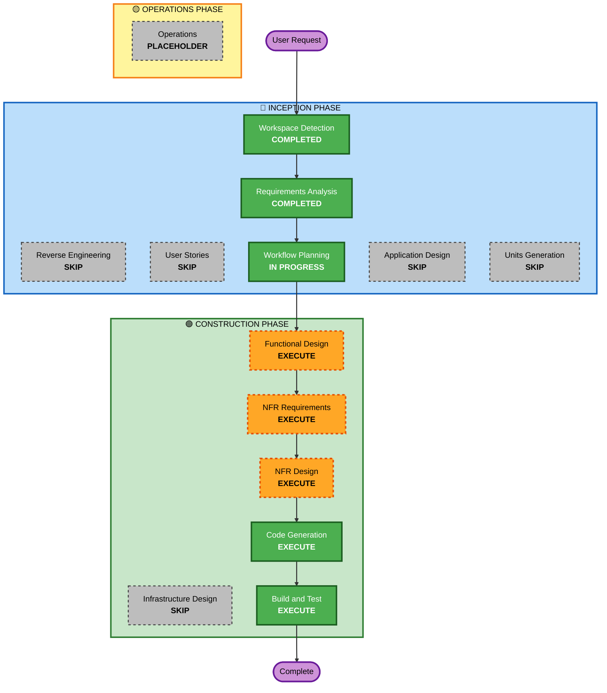

# F47 Execution Plan — 급등주 히스토리 기록 및 원인 분석

## Detailed Analysis Summary

### Transformation Scope
- **Transformation Type**: Single component (신규 독립 모듈)
- **Primary Changes**: `src/surge/` 신규 모듈 추가 + agent prompt 확장 + settings.yaml surge 블록 추가
- **Related Components**: agent prompts, agent tools, config/settings.yaml, steering/ 채널

### Change Impact Assessment
- **User-facing changes**: Yes — operator가 steering 채널에서 급등주 리스트 조회 가능
- **Structural changes**: No — 기존 아키텍처 변경 없음, 신규 모듈 추가
- **Data model changes**: Yes — SurgeRecord, SurgeAnalysis 신규 데이터 모델
- **API changes**: No — 내부 모듈 간 인터페이스만 추가
- **NFR impact**: Minimal — EOD 실행이므로 실시간 성능 영향 없음

### Component Relationships
- **Primary Component**: `src/surge/` (신규)
- **Shared Components**: `src/data/prices.py` (가격 데이터 조회), `config/settings.yaml` (설정)
- **Dependent Components**: `src/agent/prompts.py` (EOD 리뷰 프롬프트에 surge 분석 추가), `src/agent/tools/` (surge 데이터 읽기 도구)
- **Supporting Components**: `steering/` 채널 (operator read-view)

### Risk Assessment
- **Risk Level**: Low
- **Rollback Complexity**: Easy (신규 모듈 제거 + prompt 롤백)
- **Testing Complexity**: Simple (독립 모듈, 순수 데이터 처리 + agent integration)

---

## Workflow Visualization

---

## Phases to Execute

### 🔵 INCEPTION PHASE
- [x] Workspace Detection — COMPLETED
- [x] Reverse Engineering — SKIP (기존 코드베이스 충분히 이해됨)
- [x] Requirements Analysis — COMPLETED (Standard depth, 7+3 questions)
- [x] User Stories — SKIP
  - **Rationale**: 단일 operator 페르소나, 내부 데이터 파이프라인 + agent 분석 기능. FR로 사용자 워크플로우 충분히 커버됨.
- [x] Workflow Planning — IN PROGRESS
- [x] Application Design — SKIP
  - **Rationale**: 신규 모듈이나 단일 컴포넌트, 요구사항 문서에서 데이터 모델과 비즈니스 로직이 이미 상세히 정의됨. Functional Design에서 통합 설계.
- [x] Units Generation — SKIP
  - **Rationale**: 단일 유닛 (src/surge/ + agent prompt). 분해 불필요.

### 🟢 CONSTRUCTION PHASE
- [ ] Functional Design — EXECUTE (Standard depth)
  - **Rationale**: 신규 데이터 모델(SurgeRecord, SurgeAnalysis), 급등 감지 비즈니스 로직, agent 분석 프롬프트 구조 설계 필요.
- [ ] NFR Requirements — EXECUTE (Minimal depth)
  - **Rationale**: Tech stack 확인 (0 new deps 예상), 기존 인프라 재사용 확인.
- [ ] NFR Design — EXECUTE (Minimal depth)
  - **Rationale**: Atomic write, fail-isolated 패턴 적용. 단순한 NFR 요구사항.
- [ ] Infrastructure Design — SKIP
  - **Rationale**: Local daemon, 신규 인프라 없음.
- [ ] Code Generation — EXECUTE (ALWAYS)
  - **Rationale**: 구현 단계 — Part 1(plan) + Part 2(generate).
- [ ] Build and Test — EXECUTE (ALWAYS)
  - **Rationale**: 유닛 테스트 + 통합 테스트 + regression.

### 🟡 OPERATIONS PHASE
- [ ] Operations — PLACEHOLDER

---

## Package Change Sequence

단일 신규 모듈, 기존 코드 수정 최소화:
1. `config/settings.yaml` — `surge:` 설정 블록 추가
2. `src/surge/` — 신규 모듈 (records, detector, store)
3. `src/agent/prompts.py` — EOD 리뷰 프롬프트에 surge 분석 섹션 추가
4. `src/agent/tools/` — surge 데이터 읽기 agent tool (선택적)

---

## Unit: surge-detection

단일 유닛 `surge-detection`:
- **범위**: `src/surge/` (records.py + detector.py + store.py), agent prompt 확장, settings.yaml surge 블록
- **0 new runtime deps** 예상 (stdlib + pydantic + yfinance/alpaca 재사용)

---

## Estimated Timeline
- **Total Phases**: 6 (FD → NFRA → NFRD → CG → BT, ID skip)
- **Estimated Effort**: 소규모 (신규 모듈 ~200-300 LOC + 테스트)

## Success Criteria
- **Primary Goal**: EOD에 유니버스 급등주 자동 감지 → steering/watch_surge/에 JSONL 기록 → agent가 원인 분석
- **Key Deliverables**: `src/surge/` 모듈, surge 설정 블록, agent prompt 확장, 테스트
- **Quality Gates**: 급등 감지 정확도, JSONL idempotency, agent 분석 semi-structured 형식 준수, regression 0
