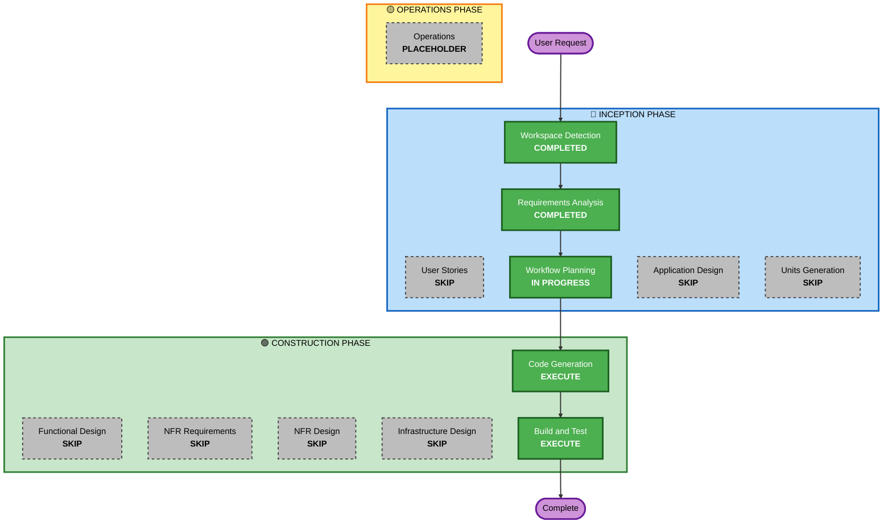

# F48 Execution Plan — 사이드바 정리

## Detailed Analysis Summary

### Transformation Scope
- **Transformation Type**: Single component (UI text/label changes only)
- **Primary Changes**: Sidebar footer, session ID display, LSP plugin removal, Context simplification, branding
- **Related Components**: None — all changes are in `operator-console/cli/packages/opencode/src/cli/cmd/tui/`

### Change Impact Assessment
- **User-facing changes**: Yes — sidebar UI appearance changes (branding, removed elements)
- **Structural changes**: No
- **Data model changes**: No
- **API changes**: No
- **NFR impact**: No — no new deps, no perf/security/scalability change

### Risk Assessment
- **Risk Level**: Low — isolated UI text/label changes, easy rollback, well-understood
- **Rollback Complexity**: Easy (git revert)
- **Testing Complexity**: Simple (visual verification + typecheck)

## Workflow Visualization

## Phases to Execute

### 🔵 INCEPTION PHASE
- [x] Workspace Detection (COMPLETED)
- [x] Requirements Analysis (COMPLETED)
- [x] User Stories — **SKIP**
  - **Rationale**: 순수 UI 텍스트/레이블 변경. 사용자 시나리오나 acceptance criteria 불필요.
- [x] Workflow Planning (IN PROGRESS)
- [x] Application Design — **SKIP**
  - **Rationale**: 신규 컴포넌트/비즈니스 로직 없음. 기존 컴포넌트 내 단순 텍스트 변경.
- [x] Units Generation — **SKIP**
  - **Rationale**: 단일 응집 단위. 7개 파일이지만 모두 같은 사이드바 UI 영역.

### 🟢 CONSTRUCTION PHASE
- [ ] Functional Design — **SKIP**
  - **Rationale**: 신규 비즈니스 로직/데이터 모델 없음.
- [ ] NFR Requirements — **SKIP**
  - **Rationale**: 신규 의존성 없음, NFR 영향 없음.
- [ ] NFR Design — **SKIP**
  - **Rationale**: NFR 패턴 변경 없음.
- [ ] Infrastructure Design — **SKIP**
  - **Rationale**: 인프라 변경 없음.
- [ ] Code Generation — **EXECUTE** (ALWAYS)
  - **Rationale**: 7개 파일 수정 (삭제/텍스트 변경)
- [ ] Build and Test — **EXECUTE** (ALWAYS)
  - **Rationale**: typecheck + visual verification

### 🟡 OPERATIONS PHASE
- [ ] Operations — PLACEHOLDER

## Files to Modify (7 files)
| # | File | Change |
|---|------|--------|
| 1 | `.../sidebar/footer.tsx` | 경로 표시 제거 + "OpenCode" → "AutoStock" |
| 2 | `.../routes/session/sidebar.tsx` | 세션ID 해시 제거 + 기본 브랜딩 변경 |
| 3 | `.../sidebar/context.tsx` | 3줄 → 1줄 (tokens + % + $) |
| 4 | `.../sidebar/lsp.tsx` | 파일 삭제 |
| 5 | `.../plugin/internal.ts` | LSP import/등록 제거 |
| 6 | `.../routes/session/footer.tsx` | LSP 카운트 제거 |
| 7 | `.../component/dialog-status.tsx` | LSP 목록 제거 |

## Estimated Timeline
- **Total Phases**: 2 (Code Generation + Build & Test)
- **Estimated Duration**: ~30 min (minor text/delete changes + typecheck)

## Success Criteria
- **Primary Goal**: 사이드바에서 트레이딩과 무관한 요소 제거, AutoStock 브랜딩 적용
- **Key Deliverables**: 수정된 6개 파일 + 삭제된 1개 파일
- **Quality Gates**: `bun run typecheck` 통과, TUI 정상 렌더링
