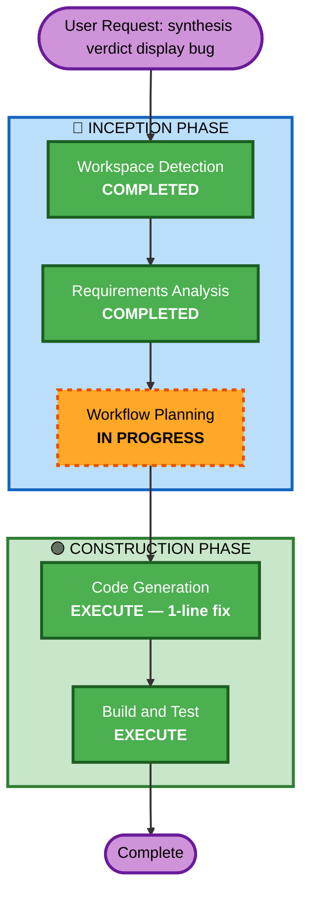

# F49 Execution Plan

## Detailed Analysis Summary

### Transformation Scope
- **Transformation Type**: Single component (display bug fix)
- **Primary Changes**: Add `wrapMode="word"` to `<text>` element in turn-overlay.tsx drill-down view
- **Related Components**: None

### Change Impact Assessment
- **User-facing changes**: Yes — synthesis verdict text will now wrap within overlay instead of overflowing
- **Structural changes**: No
- **Data model changes**: No
- **API changes**: No
- **NFR impact**: No

### Component Relationships
- **Primary Component**: `operator-console/cli/packages/tui-trading/src/components/turn-overlay.tsx`
- **No other components affected**

### Risk Assessment
- **Risk Level**: Low (single attribute change, easy rollback, well-understood pattern)
- **Rollback Complexity**: Easy (revert 1 line)
- **Testing Complexity**: Simple (existing test suite covers turn overlay)

## Workflow Visualization

## Phases to Execute

### 🔵 INCEPTION PHASE
- [x] Workspace Detection (COMPLETED)
- [x] Requirements Analysis (COMPLETED — Minimal depth)
- [x] Workflow Planning (IN PROGRESS)
- [ ] User Stories — **SKIP** (display bug fix, no user-facing feature)
- [ ] Application Design — **SKIP** (no new components)
- [ ] Units Generation — **SKIP** (single 1-line fix)

### 🟢 CONSTRUCTION PHASE
- [ ] Functional Design — **SKIP** (no new business logic)
- [ ] NFR Requirements — **SKIP** (no new deps/infra)
- [ ] NFR Design — **SKIP**
- [ ] Infrastructure Design — **SKIP**
- [ ] Code Generation — **EXECUTE** (ALWAYS)
  - **Rationale**: 1-line JSX attribute fix: `wrapMode="word"` on `<text>` element
- [ ] Build and Test — **EXECUTE** (ALWAYS)
  - **Rationale**: Verify tui-trading test suite passes (44 tests)

### 🟡 OPERATIONS PHASE
- [ ] Operations — PLACEHOLDER

## Estimated Timeline
- **Total Phases**: 2 execute (Code Generation + Build and Test)
- **Estimated Duration**: ~10 minutes

## Success Criteria
- **Primary Goal**: synthesis final verdict text renders without overlap in drill-down view
- **Key Deliverables**: 1-line change in `turn-overlay.tsx`
- **Quality Gates**: All 44 tui-trading tests pass, typecheck passes
