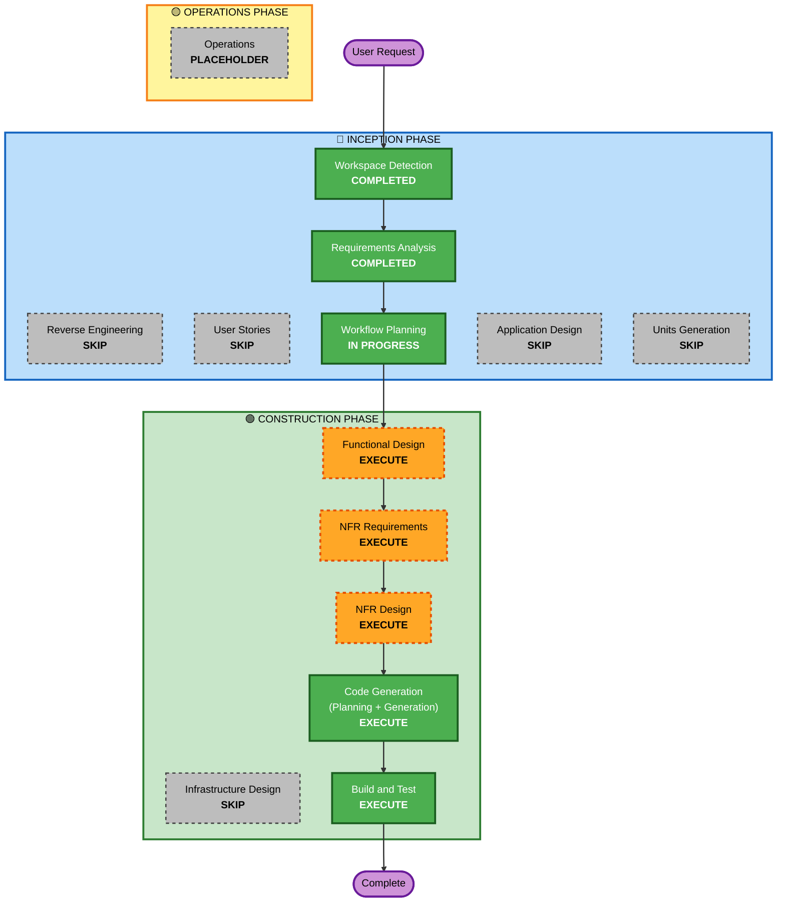

# F51 장초반 시그널 기록 및 분석 — 실행 계획

## Detailed Analysis Summary

### Transformation Scope (Brownfield)
- **Transformation Type**: Single component — 새 모듈 추가 + 데이터 프로바이더 소규모 확장
- **Primary Changes**: `src/early_session/` 신규 모듈 + `src/data/` provider 다중심볼 `get_bars` 확장 + `config/settings.yaml` `early_session:` 블록 추가
- **Related Components**: `src/data/` (provider 확장), `config/settings.yaml` (설정)

### Change Impact Assessment
- **User-facing changes**: No — operator visibility only (workspace 파일 조회)
- **Structural changes**: No — 기존 아키텍처 변경 없음, 새 모듈 추가
- **Data model changes**: Yes — `EarlySessionEvent` 레코드, `_index.jsonl` 인덱스, 구간 시계열 덤프
- **API changes**: Yes (minor) — `BaseDataProvider`에 다중심볼 `get_bars` 시그니처 확장
- **NFR impact**: Minimal — 0 new runtime deps 예상, F3 BarCache 패턴 재사용

### Component Relationships
- **Primary Component**: `src/early_session/` (신규)
- **Shared Components**: `src/data/providers/` (AlpacaDataProvider 다중심볼 확장)
- **Dependent Components**: 없음 (독립 모듈, 읽기 전용)
- **Supporting Components**: `src/agent/steering/` (steering 채널을 통한 operator 조회 — 기존 기능 그대로)

### Risk Assessment
- **Risk Level**: Medium-Low
- **Rollback Complexity**: Easy (worktree 격리, 독립 모듈, 기존 경로 변경 없음)
- **Testing Complexity**: Moderate (실시간 데이터 + 버퍼 동작 테스트)
- **Key Mitigations**: F3 검증된 BarCache/Detect 분리 패턴 재사용, provider 확장은 기존 단일심볼 호환 유지, 알파카 페이퍼 계정 라이브 검증(R1)

---

## Workflow Visualization

---

## Phases to Execute

### 🔵 INCEPTION PHASE
- [x] Workspace Detection — COMPLETED
- [x] Reverse Engineering — SKIP (brownfield, 기존 artifacts)
- [x] Requirements Analysis — COMPLETED (Standard depth, approved)
- [x] User Stories — SKIP
  - **Rationale**: 내부 데이터 수집 인프라, 단일 operator 페르소나, 사용자 대상 기능 없음. F47과 동일.
- [x] Workflow Planning — IN PROGRESS
- [x] Application Design — SKIP
  - **Rationale**: 단일 독립 모듈, 경계 명확. Functional Design에 통합. F47과 동일한 접근.
- [x] Units Generation — SKIP
  - **Rationale**: 단일 유닛. F47과 동일하게 단일 모듈로 구현.

### 🟢 CONSTRUCTION PHASE — 단일 유닛 `early-session-detection`
- [ ] Functional Design — EXECUTE
  - **Rationale**: 신규 데이터 모델(순환 버퍼, 이벤트 레코드, 인덱스, 시계열 덤프), 비즈니스 규칙(감지 로직, 덤프 윈도우), 도메인 엔티티 설계 필요
- [ ] NFR Requirements — EXECUTE (Minimal)
  - **Rationale**: Tech stack 결정 (0 new deps 예상, F47과 동일), 다중심볼 bars 확장 평가
- [ ] NFR Design — EXECUTE (Minimal)
  - **Rationale**: 버퍼 스레딩, APScheduler 폴링 케이던스, cache-vs-detect 분리(F3 패턴), atomic write
- [ ] Infrastructure Design — SKIP
  - **Rationale**: 로컬 데몬, 클라우드 인프라 없음. F47과 동일.
- [ ] Code Generation — EXECUTE (ALWAYS, Part 1 + Part 2)
- [ ] Build & Test — EXECUTE (ALWAYS)

### 🟡 OPERATIONS PHASE
- [ ] Operations — PLACEHOLDER

---

## Package Change Sequence

단일 패키지, 순차적 구현. 의존 순서:
1. `src/data/` — provider 다중심볼 `get_bars` 확장 (기반 인프라)
2. `src/early_session/` — 신규 모듈 (provider 위에 구축)
3. `config/settings.yaml` — `early_session:` 블록 추가

---

## Estimated Timeline
- **Total Stages**: 7 (Functional Design → NFR Req → NFR Design → Code Gen Part 1 → Code Gen Part 2 → Build & Test)
- **예상 규모**: F47 유사 — 신규 모듈 4~6개 파일, provider 확장 1~2개 파일, 설정 1개 파일, 테스트 4~6개 모듈

---

## Success Criteria
- **Primary Goal**: 장초반 1시간 동안 전 유니버스 실시간 모니터링, 급등/급락 감지 시 전후 구간 시계열 덤프
- **Key Deliverables**: `src/early_session/` 모듈, provider 다중심볼 `get_bars`, `workspace/early_session/` 저장 구조, CLI 인스펙션 도구
- **Quality Gates**:
  - 기존 테스트 스위트 회귀 없음
  - 단위 테스트: 버퍼, 감지, 덤프, idempotency
  - PBT: 순수 함수 (atr, percent_change, window_detection)
  - R1: 알파카 페이퍼 계정 라이브 검증 (다중심볼 bars + 덤프)
