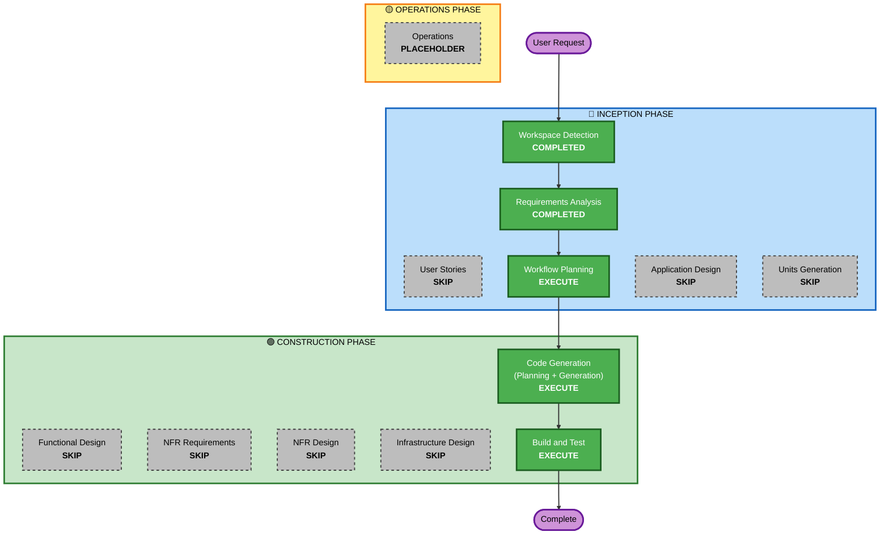

# F53 실행 계획 — MCP Position Thesis 노출

## 상세 분석 요약

### 변환 범위 (Brownfield)
- **변환 유형**: Single component — 데몬 `steer_read` 핸들러 확장
- **주요 변경**: `SteeringRuntime._handle_steer_read()`에 `/thesis <SYMBOL>`, `/theses` 서브커맨드 2건 추가
- **관련 컴포넌트**: `Journal` (기존 메서드 재사용, 변경 없음)

### 변경 영향 평가
- **사용자 영향**: Yes — TUI에서 thesis 조회 가능 (신규 기능)
- **구조적 변경**: No — 기존 `steer_read` channel/pass-through 구조 유지
- **데이터 모델 변경**: No — raw markdown passthrough, 구조화 없음
- **API 변경**: No — `steer_read` 인터페이스 불변, 서브커맨드만 추가
- **NFR 영향**: No — 0 new deps, 기존 보안/로깅 체계 내 동작

### 컴포넌트 관계
- **주 컴포넌트**: `src/agent/steering/runtime.py` — `steer_read` 핸들러
- **재사용 컴포넌트**: `src/agent/journal.py` — `read_position()`, `list_positions()` (변경 없음)
- **하위 컴포넌트**: `operator-console/src/steer-handler.ts` — 기존 pass-through (변경 없음)
- **의존 컴포넌트**: 없음 (TUI는 MCP 응답을 소비만 함)

### 리스크 평가
- **리스크 수준**: Low — 읽기 전용, 파일 I/O 격리, 실패 시 데몬 영향 없음
- **롤백 복잡도**: Easy — 서브커맨드 2개만 제거
- **테스트 복잡도**: Simple — 단위 테스트로 파일 유/무 시나리오 커버

---

## 워크플로 시각화

---

## 실행 단계 결정

### 🔵 INCEPTION PHASE
- [x] Workspace Detection — COMPLETED
- [x] Reverse Engineering — SKIPPED (artifacts exist)
- [x] Requirements Analysis — COMPLETED
- [x] User Stories — **SKIP**
  - **근거**: 내부 개선, 단일 운영자(operator), 새로운 사용자 워크플로 없음. Thesis 조회는 직관적인 단일 명령어.
- [x] Workflow Planning — EXECUTE (현재)
- [x] Application Design — **SKIP**
  - **근거**: 신규 컴포넌트/서비스 없음. 기존 `SteeringRuntime` 경계 내 변경. 컴포넌트 의존성 변화 없음.
- [x] Units Generation — **SKIP**
  - **근거**: 단일 단순 유닛. 분해 불필요. 데몬 1개 파일 변경.

### 🟢 CONSTRUCTION PHASE
- [x] Functional Design — **SKIP**
  - **근거**: 신규 비즈니스 로직 없음. 파일 읽기 → 텍스트 반환의 단순 데이터 패스스루. 설계할 도메인 엔티티/비즈니스 규칙 없음.
- [x] NFR Requirements — **SKIP**
  - **근거**: 0 new runtime dependencies. 기술 스택 변화 없음. Python stdlib + 기존 `Journal` 클래스.
- [x] NFR Design — **SKIP**
  - **근거**: 신규 NFR 패턴 불필요. 기존 steering channel 체계가 모든 동시성/직렬화를 처리. SECURITY-03/15는 코드 레벨에서 적용.
- [x] Infrastructure Design — **SKIP**
  - **근거**: 로컬 데몬, 클라우드 인프라 변경 없음.
- [ ] Code Generation — **EXECUTE** (ALWAYS)
  - **근거**: 코드 구현 필요. Part 1(계획) + Part 2(생성).
- [ ] Build & Test — **EXECUTE** (ALWAYS)
  - **근거**: 회귀 테스트, 신규 단위 테스트, 라이브 검증.

### 🟡 OPERATIONS PHASE
- [ ] Operations — PLACEHOLDER

---

## 예상 타임라인
- **실행 단계**: 2개 (Code Generation + Build & Test)
- **예상 변경 파일**: 1~2개 (`runtime.py` 주 변경, `steer-handler.ts` 문서화 업데이트 선택적)
- **예상 소요 시간**: 소규모 (단일 파일 변경, 간단한 테스트)

## 성공 기준
- **주요 목표**: TUI에서 `steer_read /thesis AAPL` 실행 시 해당 종목의 thesis markdown 전문이 반환됨
- **주요 결과물**: `/thesis <SYMBOL>` + `/theses` 서브커맨드
- **품질 게이트**: 
  - 기존 356개 테스트 회귀 없음
  - 신규 단위 테스트 (thesis 존재/부재/목록)
  - 라이브 검증 (실제 데몬에서 명령 실행)
