# Execution Plan — F54 숏 포지션 기능

> **Track**: F54
> **Phase**: Workflow Planning
> **Date**: 2026-06-04

---

## Detailed Analysis Summary

### Transformation Scope
- **Transformation Type**: Architectural (cross-cutting, 4 subsystems)
- **Primary Changes**: Position 모델 방향 추가 → RiskManager 숏 로직 → Broker 숏 매핑 → Agent 숏 분석
- **Related Components**: `src/core/`, `src/risk/`, `src/execution/`, `src/agent/`

### Change Impact Assessment
| Area | Impact | Description |
|------|--------|-------------|
| User-facing | Yes | `/short`, `/cover` steering commands, TUI L/S 마커 |
| Structural | Yes | Position.side, Signal/OrderSide 확장, RiskManager 분기 |
| Data model | Yes | Position.side, DecisionAction 확장, Order validator 확장 |
| API/Contract | Yes | BaseBroker method signatures, OrderSide enum 확장 |
| NFR | Yes | Security Baseline, PBT, fail-closed safety |

### Component Relationships
```
                    ┌──────────────────────┐
                    │   Unit A: Core+RISK  │
                    │  (types, models,     │
                    │   RiskManager,       │
                    │   Broker, Executor)  │
                    └──────────┬───────────┘
                               │ depends on
                               ▼
                    ┌──────────────────────┐
                    │  Unit B: AGENT+TOOLS │
                    │  (prompts, tools,    │
                    │   journal, TUI)      │
                    └──────────────────────┘
```

### Risk Assessment
- **Risk Level**: **High** — 실거래 경로 변경 (RiskManager, Broker), 무제한 손실 가능성
- **Rollback Complexity**: **Easy** — worktree 격리, feature branch, merge 전까지 main 무영향
- **Testing Complexity**: **Moderate** — PBT로 순수 함수 검증, live paper로 통합 검증
- **Mitigation**: fail-closed 설계, 필수 손절, Alpaca paper account 사전 검증

---

## Workflow Visualization

```mermaid
flowchart TD
    Start(["User Request: 숏 포지션 기능"])

    subgraph INCEPTION["🔵 INCEPTION PHASE"]
        WD["Workspace Detection<br/><b>COMPLETED</b>"]
        RE["Reverse Engineering<br/><b>COMPLETED</b>"]
        RA["Requirements Analysis<br/><b>COMPLETED</b>"]
        US["User Stories<br/><b>SKIP</b>"]
        WP["Workflow Planning<br/><b>IN PROGRESS</b>"]
        AD["Application Design<br/><b>SKIP</b>"]
        UG["Units Generation<br/><b>EXECUTE</b>"]
    end

    subgraph CONSTRUCTION["🟢 CONSTRUCTION PHASE"]
        FD_A["Unit A: Functional Design<br/><b>EXECUTE</b>"]
        NFRA_A["Unit A: NFR Requirements<br/><b>EXECUTE</b>"]
        NFRD_A["Unit A: NFR Design<br/><b>EXECUTE</b>"]
        ID_A["Unit A: Infrastructure Design<br/><b>SKIP</b>"]
        CG_A["Unit A: Code Generation<br/><b>EXECUTE</b>"]
        FD_B["Unit B: Functional Design<br/><b>EXECUTE</b>"]
        NFRA_B["Unit B: NFR Requirements<br/><b>SKIP</b>"]
        CG_B["Unit B: Code Generation<br/><b>EXECUTE</b>"]
        BT["Build and Test<br/><b>EXECUTE</b>"]
    end

    subgraph OPERATIONS["🟡 OPERATIONS PHASE"]
        OPS["Operations<br/><b>PLACEHOLDER</b>"]
    end

    Start --> WD
    WD --> RE
    RE --> RA
    RA --> US
    US --> WP
    WP --> AD
    AD --> UG
    UG --> FD_A
    FD_A --> NFRA_A
    NFRA_A --> NFRD_A
    NFRD_A --> ID_A
    ID_A --> CG_A
    CG_A --> FD_B
    FD_B --> NFRA_B
    NFRA_B --> CG_B
    CG_B --> BT
    BT --> End(["Complete"])

    style WD fill:#4CAF50,stroke:#1B5E20,stroke-width:3px,color:#fff
    style RE fill:#4CAF50,stroke:#1B5E20,stroke-width:3px,color:#fff
    style RA fill:#4CAF50,stroke:#1B5E20,stroke-width:3px,color:#fff
    style WP fill:#4CAF50,stroke:#1B5E20,stroke-width:3px,color:#fff
    style UG fill:#FFA726,stroke:#E65100,stroke-width:3px,stroke-dasharray: 5 5,color:#000
    style US fill:#BDBDBD,stroke:#424242,stroke-width:2px,stroke-dasharray: 5 5,color:#000
    style AD fill:#BDBDBD,stroke:#424242,stroke-width:2px,stroke-dasharray: 5 5,color:#000
    style FD_A fill:#FFA726,stroke:#E65100,stroke-width:3px,stroke-dasharray: 5 5,color:#000
    style NFRA_A fill:#FFA726,stroke:#E65100,stroke-width:3px,stroke-dasharray: 5 5,color:#000
    style NFRD_A fill:#FFA726,stroke:#E65100,stroke-width:3px,stroke-dasharray: 5 5,color:#000
    style ID_A fill:#BDBDBD,stroke:#424242,stroke-width:2px,stroke-dasharray: 5 5,color:#000
    style CG_A fill:#4CAF50,stroke:#1B5E20,stroke-width:3px,color:#fff
    style FD_B fill:#FFA726,stroke:#E65100,stroke-width:3px,stroke-dasharray: 5 5,color:#000
    style NFRA_B fill:#BDBDBD,stroke:#424242,stroke-width:2px,stroke-dasharray: 5 5,color:#000
    style CG_B fill:#4CAF50,stroke:#1B5E20,stroke-width:3px,color:#fff
    style BT fill:#4CAF50,stroke:#1B5E20,stroke-width:3px,color:#fff
    style OPS fill:#BDBDBD,stroke:#424242,stroke-width:2px,stroke-dasharray: 5 5,color:#000
    style Start fill:#CE93D8,stroke:#6A1B9A,stroke-width:3px,color:#000
    style End fill:#CE93D8,stroke:#6A1B9A,stroke-width:3px,color:#000
    style INCEPTION fill:#BBDEFB,stroke:#1565C0,stroke-width:3px,color:#000
    style CONSTRUCTION fill:#C8E6C9,stroke:#2E7D32,stroke-width:3px,color:#000
    style OPERATIONS fill:#FFF59D,stroke:#F57F17,stroke-width:3px,color:#000

    linkStyle default stroke:#333,stroke-width:2px
```



### Text Alternative
```
INCEPTION:
  Workspace Detection (COMPLETED) → Reverse Engineering (COMPLETED)
  → Requirements Analysis (COMPLETED) → User Stories (SKIP)
  → Workflow Planning (IN PROGRESS) → Application Design (SKIP)
  → Units Generation (EXECUTE)

CONSTRUCTION (Unit A — Trading Core):
  Functional Design (EXECUTE) → NFR Requirements (EXECUTE)
  → NFR Design (EXECUTE) → Infrastructure Design (SKIP)
  → Code Generation (EXECUTE)

CONSTRUCTION (Unit B — Agent Intelligence):
  Functional Design (EXECUTE) → NFR Requirements (SKIP)
  → Code Generation (EXECUTE)

CONSTRUCTION (Final):
  Build and Test (EXECUTE) → Complete
```

---

## Phases to Execute

### 🔵 INCEPTION PHASE
- [x] Workspace Detection (COMPLETED)
- [x] Reverse Engineering (COMPLETED)
- [x] Requirements Analysis (COMPLETED)
- [x] User Stories — **SKIP**
  - **Rationale**: 단일 운영자, 기존 steering console 확장, 프로젝트 전체 패턴(F1~F53)과 일관
- [x] Workflow Planning (IN PROGRESS)
- [ ] Application Design — **SKIP**
  - **Rationale**: 신규 서비스/패키지 없음. 기존 `src/` 패키지 내 확장. Functional Design에서 상세 메서드/비즈니스 룰 설계로 충분 (F3 패턴과 동일)
- [ ] Units Generation — **EXECUTE**
  - **Rationale**: 2개 유닛으로 분해 (Unit A: Trading Core, Unit B: Agent Intelligence). 의존성 체인이 명확하고, A→B 순차 실행

### 🟢 CONSTRUCTION PHASE

#### Unit A — Trading Core (types, models, RiskManager, Broker, Executor)
- [ ] Functional Design — **EXECUTE**
  - **Rationale**: 새 데이터 모델(Position.side), 복잡한 비즈니스 로직(RiskManager 숏 분기, bracket inversion, ratchet inversion, auto-flip), 도메인 엔티티 설계 필요
- [ ] NFR Requirements — **EXECUTE**
  - **Rationale**: Security Baseline(SECURITY-15 fail-closed) + PBT 적용 대상 식별. 숏 안전 필수 요건.
- [ ] NFR Design — **EXECUTE**
  - **Rationale**: Fail-closed 패턴, 숏 stop-loss 강제(invariant), defense-in-depth 설계 필요
- [ ] Infrastructure Design — **SKIP**
  - **Rationale**: 로컬 데몬/CLI, 클라우드 인프라 변경 없음
- [ ] Code Generation — **EXECUTE** (ALWAYS)
  - Part 1: Plan → Part 2: Implement (worktree `.claude/worktrees/F54`)

#### Unit B — Agent Intelligence (prompts, tools, journal, TUI)
- [ ] Functional Design — **EXECUTE**
  - **Rationale**: 숏 분석 도구 신규, 프롬프트 확장(리서치/인트라데이/EOD), journal 액션 추가, TUI 마커
- [ ] NFR Requirements — **SKIP**
  - **Rationale**: Unit A의 NFR 설계에서 이미 커버. Unit B는 기존 에이전트 패턴 확장으로 추가 NFR 없음
- [ ] Code Generation — **EXECUTE** (ALWAYS)
  - Part 1: Plan → Part 2: Implement

#### Final
- [ ] Build and Test — **EXECUTE** (ALWAYS)
  - 단위 테스트 + PBT + 통합 테스트 + full regression + Alpaca paper live verification

### 🟡 OPERATIONS PHASE
- [ ] Operations — PLACEHOLDER

---

## Package Change Sequence

Dependency order enforces sequential units:

```
Unit A (Trading Core)           Unit B (Agent Intelligence)
─────────────────────           ──────────────────────────
1. src/core/types.py            8. src/agent/tools/market.py
2. src/core/models.py           9. src/agent/journal.py
3. src/risk/manager.py         10. src/agent/prompts.py
4. src/risk/position_sizer.py  11. src/agent/executor.py
5. src/execution/base.py       12. src/agent/orchestrator.py
6. src/execution/brokers/      13. workspace/CLAUDE.md
   alpaca_broker.py            14. TUI (sidebar 등)
7. src/execution/brokers/
   simulated.py
```

**Unit A must complete before Unit B** — Unit B's executor changes depend on RiskManager/Broker interfaces from Unit A.

---

## Unit Definitions

### Unit A: Trading Core (숏 주문 실행 파이프라인)
**Goal**: 시스템이 숏 주문을 안전하게 접수, 검증, 실행할 수 있게 한다.
**Scope**:
- `PositionSide` 적용, `Position.side` 추가, P&L 계산 수정
- `OrderSide`/`Signal`/`DecisionAction` 확장 (SELL_SHORT, BUY_TO_COVER)
- `RiskManager` 숏 전면 지원 (진입, 청산, 손절, 익절, 래칫, 폴드, 서킷브레이커)
- `PositionSizer` 숏 마진 고려
- `AlpacaBroker` SELL_SHORT/BUY_TO_COVER 매핑, Position side 보존
- `SimulatedBroker` 숏 기본 지원
- `DecisionExecutor` auto-flip(FR-3) + 숏 액션 매핑

### Unit B: Agent Intelligence (숏 분석 + 의사결정)
**Goal**: LLM 에이전트가 숏 기회를 분석하고 의사결정할 수 있게 한다.
**Scope**:
- `market.py` 도구: short_interest, borrow_rate, locate 데이터 추가
- `journal.py`: DecisionAction 확장 (SELL_SHORT, BUY_TO_COVER)
- `prompts.py`: research/intraday/EOD/wake 프롬프트에 숏 컨텍스트 추가
- `executor.py`: _to_signal()에 숏 매핑, _place_protection() 방향 인식
- `orchestrator.py`: held_symbols에 숏 포지션 포함
- `workspace/CLAUDE.md`: 숏 트레이딩 규칙 섹션
- TUI: L/S 마커 + P&L 반전
- Human steering: `/short`, `/cover` 명령

---

## Estimated Timeline
- **Total Phases**: 9 (UG + FD×2 + NFR Req + NFR Des + CG×2 + BT)
- **Estimated Duration**: Inception(완료) + Construction(설계 2~3턴 + 코드 2~3턴)

## Success Criteria
- **Primary Goal**: Alpaca paper account에서 숏 진입/청산/손절/익절 전체 사이클 실행 성공
- **Key Deliverables**:
  - RiskManager 숏 풀지원 (FR-1~5)
  - AlpacaBroker SELL_SHORT/BUY_TO_COVER
  - 에이전트 숏 분석 + 의사결정 (FR-6~7)
  - Human steering `/short`, `/cover`
  - PBT: 숏 stop/target invariant, P&L sign 검증
- **Quality Gates**:
  - Full test suite regression green
  - PBT Hypothesis tests for short invariants
  - Live paper verification (read-only + 1 small short trade)
  - SECURITY-15 fail-closed: 손절 없는 숏 = 거부
