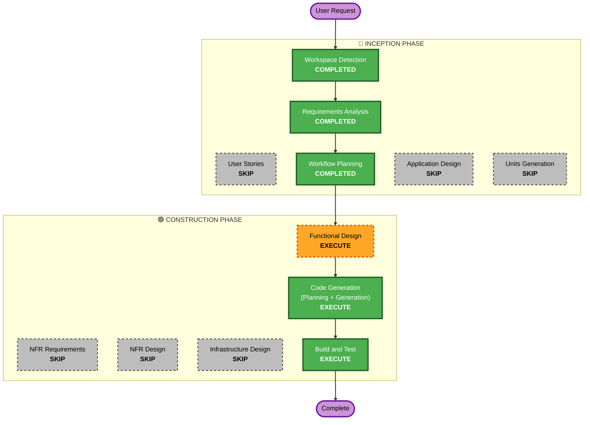

# F55 Execution Plan

## Detailed Analysis Summary

### Transformation Scope (Brownfield)
- **Transformation Type**: Single component (TUI 타임라인 렌더링 + 데몬측 MarketRule 발행)
- **Primary Changes**: 타임라인에 4번째 세션 region(`day` = Alpaca 오버나잇, 20:00 ET → 익일 04:00 ET) 추가
- **Related Components**:
  - `operator-console/cli/packages/tui-trading/src/types.ts` — `MarketRule` + region kind 확장
  - `.../tui-trading/src/utils/timeline-layout.ts` — `sessionBounds`/`computeLayout`/`phaseAt`/`labelCells`
  - `.../tui-trading/src/utils/format.ts` — `phaseShort`/`phaseColor`/`phaseLabel`에 `"day"` 추가
  - `.../tui-trading/src/components/timeline-bar.tsx` — `REGION_BG`에 `day` 밴드색 추가
  - `src/agent/steering/runtime.py` — `_DEFAULT_MARKET_RULE`(필요 시 파생/필드)
  - 테스트: `.../tui-trading/test/timeline-layout.test.ts`, `tests/test_timeline_f25.py`

### Change Impact Assessment
- **User-facing changes**: Yes — 타임라인에 새 밴드/라벨 표기 (운영자 가독성 향상)
- **Structural changes**: No — 기존 region 파이프라인에 항목 추가(아키텍처 불변)
- **Data model changes**: Minor — `MarketRule` 스키마(monitor.json 계약) 하위호환 확장
- **API changes**: Minor — daemon↔TUI 계약에 선택 필드/파생 추가(하위호환)
- **NFR impact**: 낮음 — DST/자정 횡단 정확성은 기존 `etWallToEpoch`/IANA tz 재사용으로 흡수

### Component Relationships
- **Primary Component**: `tui-trading` 타임라인 (layout + bar)
- **Shared Components**: `MarketRule` 타입 / 포맷 헬퍼 / 데몬 `_DEFAULT_MARKET_RULE`
- **Dependent Components**: NavRow 현재-세션 배지(`phaseAt`/`phaseLabel` 경유)
- **Supporting Components**: 기존 단위 테스트

### Risk Assessment
- **Risk Level**: Low–Medium (additive 변경이나 다중 트랙이 만지는 공유 파일 `runtime.py`/`timeline-layout.ts` 포함)
- **Rollback Complexity**: Easy (격리된 additive 변경)
- **Testing Complexity**: Moderate (자정 횡단·DST·view-window clamp 경계 케이스)

## Workflow Visualization

## Phases to Execute

### 🔵 INCEPTION PHASE
- [x] Workspace Detection (COMPLETED)
- [x] Reverse Engineering (SKIPPED — brownfield 아티팩트 기존재)
- [x] Requirements Analysis (COMPLETED)
- [x] User Stories (SKIPPED)
  - **Rationale**: 단일 표기 기능, 다중 페르소나/수용기준 불필요, 운영자 1인 워크플로.
- [x] Workflow Planning (IN PROGRESS)
- [ ] Application Design - **SKIP**
  - **Rationale**: 새 컴포넌트/서비스 없음. 기존 region 파이프라인 경계 내 변경.
- [ ] Units Generation - **SKIP**
  - **Rationale**: 단일 유닛.

### 🟢 CONSTRUCTION PHASE
- [ ] Functional Design - **EXECUTE**
  - **Rationale**: 열린 UI 결정(밴드색 hex, 라벨 "DAY" vs "OVN") + `MarketRule` 확장 형태 + region
    `kind` 추가가 공유 타입/포맷헬퍼/데몬 계약에 걸쳐 있어, 코드 전 작은 설계로 고정 가치 있음.
- [ ] NFR Requirements - **SKIP**
  - **Rationale**: 신규 성능/보안/확장성 요구 없음. DST/자정 정확성은 기존 검증된 `etWallToEpoch` 재사용(NFR-1).
- [ ] NFR Design - **SKIP**
  - **Rationale**: NFR Requirements 스킵.
- [ ] Infrastructure Design - **SKIP**
  - **Rationale**: 인프라 변경 없음(클라이언트 TUI + 로컬 데몬).
- [ ] Code Generation - **EXECUTE (ALWAYS)**
  - **Rationale**: 구현 + 단위 테스트 생성.
- [ ] Build and Test - **EXECUTE (ALWAYS)**
  - **Rationale**: typecheck/단위테스트/스모크 검증.

### 🟡 OPERATIONS PHASE
- [ ] Operations - PLACEHOLDER

## Module Update Strategy
- **Update Approach**: Sequential (단일 트랙 worktree 내)
- **Critical Path**: `types.ts`(MarketRule + kind) → `timeline-layout.ts`(파생/region) → `format.ts`(헬퍼) →
  `timeline-bar.tsx`(밴드색) → `runtime.py`(데몬 기본 rule). 데몬↔TUI 계약은 하위호환 유지.
- **Coordination Points**: monitor.json `market` 스키마(하위호환), region `kind` 유니온
- **Testing Checkpoints**: `timeline-layout.test.ts`(자정 횡단/clamp), `test_timeline_f25.py`(데몬 rule 키)

## Estimated Timeline
- **Total Phases (execute)**: 4 (Functional Design → Code Gen → Build & Test, + 완료된 Inception)
- **Estimated Duration**: 짧음 (additive UI 변경 1 유닛)

## Success Criteria
- **Primary Goal**: 타임라인에 "데이마켓"(오버나잇 20:00→04:00 ET) 세션이 PRE/OPEN/AFT와 일관된 밴드로 표기됨
- **Key Deliverables**: layout 4번째 region, 밴드색+라벨, `phaseAt` 분류, 데몬 rule, 단위 테스트
- **Quality Gates**: 기존 테스트 회귀 0, 자정 횡단/DST 경계 신규 테스트 통과, typecheck 통과
