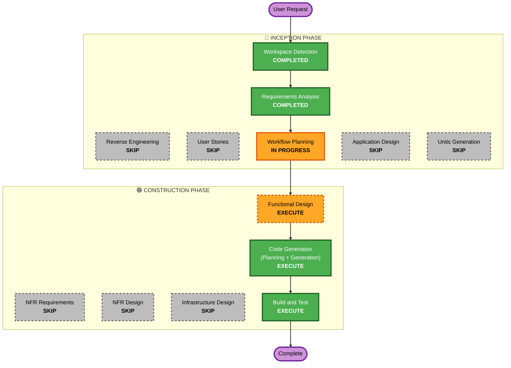

# F61 Execution Plan — 리서치 턴 주식 시그널 강화

## Detailed Analysis Summary

### Change Impact Assessment
- **User-facing changes**: Yes (간접) — PM 에이전트가 리서치 턴에 보는 입력이 바뀜(무버/전파/실적 브리프 prepend) + 운영자 콘솔에 노출될 신규 시그널. 직접 UI 개편은 없음.
- **Structural changes**: No (아키텍처 보존) — 기존 data providers / agent tools / prompts / orchestrator 위에 **추가**.
- **Data model changes**: Yes — 신규 시그널 레코드(무버, read-through 경고, 임박 실적), 정적 피어 맵 구조.
- **API changes**: 내부 추가 — 신규 툴(`movers`/`readthrough`/`earnings_calendar`), 신규 데이터 소스 어댑터 인터페이스. 기존 `news`/`earnings` 인터페이스는 호환 유지.
- **NFR impact**: Yes — fail-honest, 타임아웃 바운드, 레이트리밋/캐시, Tier 2 토큰 보호.

### 영향 컴포넌트 (Brownfield)
- **Primary**: `src/data/providers/` (뉴스/실적/시세 소스 어댑터), 신규 시그널 모듈(예: `src/signals/` 또는 `src/data/`).
- **Shared/배선**: `src/agent/tools/market.py`(+`__main__`), `src/agent/prompts.py`(push 브리프), `src/agent/orchestrator.py`(브리프 조립 주입), `config/settings.yaml`(임계·피어맵·bellwether·소스 토글).
- **Supporting**: 테스트(`tests/`), 시나리오 픽스처, env(`FINNHUB_API_KEY`).
- 알려진 동시 변경: F59/F60(숏, `prompts.py`의 `_SHORT_GUIDANCE` 영역) — 충돌 가능성 낮음.

### Risk Assessment
- **Risk Level**: **Medium** — 핵심 파일(prompts/tools/orchestrator) 다수 손대지만 전부 additive·fail-honest. 외부 API 의존 추가(부분 실패 시 degrade).
- **Rollback Complexity**: Easy (추가 코드 + config 토글; 비활성화로 무력화 가능).
- **Testing Complexity**: Moderate (결정적 코어 + 다유형 시나리오 코퍼스 + 온디맨드 LLM 하니스 분리).

## Workflow Visualization

## Phases to Execute

### 🔵 INCEPTION PHASE
- [x] Workspace Detection (COMPLETED)
- [x] Reverse Engineering (SKIPPED — 타깃 서브시스템 직전 진단 턴에서 분석 완료)
- [x] Requirements Analysis (COMPLETED)
- [x] User Stories (SKIPPED)
  - **Rationale**: 단일 운영자 + 내부 에이전트 도구. 페르소나/수용기준 협업 가치 낮고 요구사항이 이미 구체적.
- [x] Execution Plan (IN PROGRESS)
- [ ] Application Design — **SKIP**
  - **Rationale**: 신규 컴포넌트는 있으나 기존의 잘 정의된 구조(`data/providers`, `agent/tools`, `agent/prompts`, `config`) 위에 additive. 컴포넌트 경계·인터페이스 결정은 Functional Design에 흡수(별도 문서 중복 방지).
- [ ] Units Generation — **SKIP**
  - **Rationale**: 단일 응집 유닛("시장 시그널" 서브시스템). 다중 유닛 분해 불필요.

### 🟢 CONSTRUCTION PHASE (단일 유닛: market-signals)
- [ ] Functional Design — **EXECUTE**
  - **Rationale**: 핵심 설계 집중점 — 데이터 모델(무버/read-through/실적 레코드, 피어 맵), 소스 추상화 인터페이스(Alpaca/Finnhub/yfinance + 폴백), 순수 함수 시그널 로직(임계·전파·브리프 조립), push/툴 배선, **PBT-01 속성 식별**, **다유형 시나리오 코퍼스 명세**, 프레임워크 결정(PBT-09=Hypothesis, 기존 dep).
- [ ] NFR Requirements — **SKIP**
  - **Rationale**: NFR-1~7이 requirements.md에 이미 구체적으로 포착됨. PBT-09 프레임워크 결정은 Functional Design의 tech 노트로 캡처.
- [ ] NFR Design — **SKIP**
  - **Rationale**: NFR 패턴이 기존 1차 구현물의 재사용(F14 `install_session_timeout` 타임아웃 바운드, news 15분 TTL 캐시, `NewsPoller` best-effort/degrade, env-only 키). Functional Design에서 문서화.
- [ ] Infrastructure Design — **SKIP**
  - **Rationale**: 클라우드/배포/IaC 변경 없음. env var 1개 + pip 의존성만.
- [ ] Code Generation — **EXECUTE (ALWAYS)**
  - **Rationale**: 구현 + 테스트(Tier 1 결정적 + Tier 2 온디맨드 하니스).
- [ ] Build and Test — **EXECUTE (ALWAYS)**
  - **Rationale**: 빌드/타입체크/유닛/PBT/시나리오 재현 + (선택) 라이브 스모크.

### 🟡 OPERATIONS PHASE
- [ ] Operations — PLACEHOLDER

## Estimated Timeline
- **실행 단계 수**: 3 (Functional Design → Code Generation → Build & Test)
- **추정**: 설계 1 패스 + 구현/테스트 자율 진행. (설계 승인 후 Construction은 자율 — [[feedback-autonomy-construction]])

## Success Criteria
- **Primary Goal**: 리서치 턴이 큰 가격 변동·뉴스 catalyst와 그 종목 간 read-through, 임박 실적을 **선제적으로** 보게 만든다.
- **Key Deliverables**: 무버 스캔 + read-through 전파(정적맵+LLM) + 실적 캘린더; Alpaca뉴스+Finnhub 소스 어댑터; push 브리프 + 신규 툴 3종; Tier 1 결정적 테스트 + 다유형 시나리오 코퍼스 + Tier 2 온디맨드 하니스.
- **Quality Gates**: fail-honest(키 부재/실패 시 무크래시), 타임아웃 바운드, 토큰 0 자동 검증(Tier 2 CI 미포함), 기존 동작 회귀 없음.
