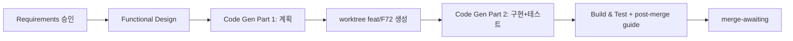

# F72 — Workflow Plan

**Track**: F72 · **Date**: 2026-06-11 · **Base**: requirements.md (승인 2026-06-11)

## 1. 영향 분석 (Impact)

**변경 예상 지점** (brownfield, 기존 컴포넌트 경계 내):

| 영역 | 파일 (예상) | 변경 |
|---|---|---|
| 스냅샷 저장 | `src/agent/screening_log.py` (신규) + `src/agent/tools/` scoreboard 경로 | quant 스캔 결과 ET-date 키로 영속화 (fail-honest) |
| 프롬프트 | `src/agent/prompts.py` | research Discovery 단계에 verdict 기록 의무 추가 |
| TUI verb | `operator-console/src/parser.ts`, `steer-handler.ts`, `filedrop.ts` | `/screening [date]` read-only verb (thesis 직접-read 패턴) |
| 테스트 | `tests/` + `operator-console/test/` | 단위 + PBT(직렬화 round-trip, 날짜 검증) |

**위험도**: 낮음 — 읽기 전용 채널 + 부수효과적 로깅. 주문/리스크 경로 무접촉.
**동시 트랙 충돌**: F71(모바일)은 opencode/cli 측 — 본 트랙은 operator-console/src 측이라 겹침 낮음.

## 2. 단계 결정 (Phase Determination)

| 단계 | 실행 | 근거 |
|---|---|---|
| User Stories | **SKIP** | 단일 운영자(개발자 본인) 페르소나, 요구 명확, 수용 기준이 requirements §7에 포함 |
| Application Design | **SKIP** | 신규 컴포넌트 경계 없음 — 기존 모듈 내 변경 + 소형 헬퍼 1개 (Functional Design에서 충분) |
| Units Generation | **SKIP** | 단일 유닛 "screening" (데몬 캡처 + 콘솔 verb가 한 기능의 양면) |
| Functional Design | **EXECUTE** | 신규 데이터 스키마 필요: 레코드 형식, verdict 어휘, 파일 레이아웃, `/screening` 출력 형식 |
| NFR Requirements / NFR Design | **SKIP** | NFR이 requirements §4에 이미 확정 (fail-honest, ET-date, 입력 검증) — 별도 단계 불요, Functional Design에 반영 |
| Infrastructure Design | **SKIP** | 인프라/배포 변경 없음 |
| Code Generation | **EXECUTE** | Part 1 계획 → Part 2 생성 (worktree `feat/F72`에서) |
| Build & Test | **EXECUTE** | typecheck + 단위/PBT + live smoke; **post-merge guide 작성** (user-facing: 데몬 재시작 후 `/screening` 검증 절차) |

## 3. 실행 순서

텍스트 대안: Requirements 승인 → Functional Design → Code Gen 계획 → worktree 생성 →
구현+테스트 → Build & Test(+post-merge guide) → merge-awaiting.

## 4. 승인 후 자율 진행

설계(Functional Design) 승인 이후 Construction(코드+테스트)은 자율 진행하고,
사람 판단이 필요한 지점(설계 변경, live smoke 결과 이상)에서만 멈춘다.
