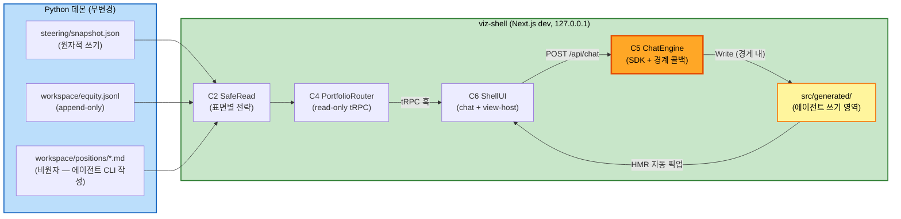

# F73 — Component Dependencies

## 의존 매트릭스 (행이 열에 의존)
| ↓ depends on → | C1 Paths | C2 SafeRead | C3 Schemas | C4 Router | C5 ChatEngine | C6 ShellUI |
|---|---|---|---|---|---|---|
| **C1 Paths** | — | | | | | |
| **C2 SafeRead** | | — | ✓ (zod 타입) | | | |
| **C3 Schemas** | | | — | | | |
| **C4 Router** | ✓ | ✓ | ✓ | — | | |
| **C5 ChatEngine** | ✓ (경계 상수) | | | | — | |
| **C6 ShellUI** | | | ✓ (출력 타입) | ✓ (tRPC 훅) | ✓ (/api/chat) | — |

- 순환 없음. C1~C3은 잎(leaf) — 순수/상수 계층이라 테스트 용이.
- C5가 C4에 의존하지 않는 점이 의도적: 생성 엔진과 데이터 계층은 완전 분리
  (S1/S2 플로우 독립). 접점은 "생성된 코드가 *런타임에* C4 훅을 호출"하는 것뿐.

## 외부 의존
| 컴포넌트 | 외부 의존 | 비고 |
|---|---|---|
| C2 | node:fs | read-only 호출만 (`readFile`, `stat`, `open+read`) |
| C5 | `@anthropic-ai/claude-code` SDK | 호스트 `~/.claude` 구독 자격 사용 |
| C5 | (간접) `steering/`·`workspace/` | **의존 아님** — 경계 콜백이 접근을 차단하는 대상 |
| C6 | webpack require.context | Next.js dev 번들러 기능 (Turbopack 비호환 시 webpack 모드 고정 — Code Gen에서 확정) |

## 통신 패턴
- C6→C4: tRPC over HTTP (localhost), react-query 폴링. 타입은 `AppRouter` export로 공유.
- C6→C5: POST 스트림 (Vercel AI SDK UIMessage 프로토콜 + 커스텀 data part 2종).
- C5→파일시스템: SDK 도구 경유 쓰기 (`generated/`만, C5b가 게이트).
- C4→파일시스템: read-only.
- **데몬과의 통신: 없음** (파일 스냅숏 단방향 소비).

## 데이터 플로우 다이어그램

