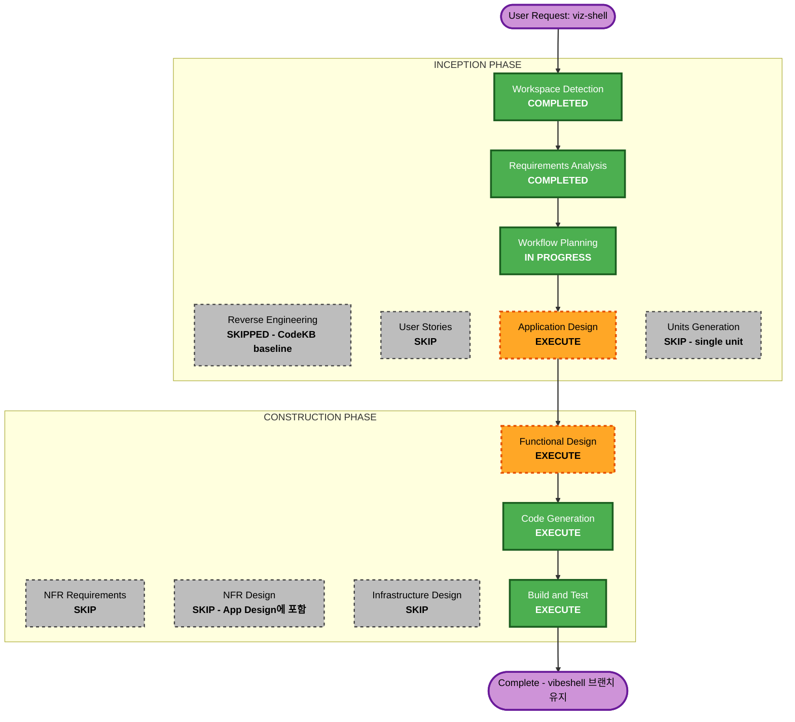

# F73 — 실행 계획 (Execution Plan)

## 상세 분석 요약

### 변환 범위 (Brownfield)
- **변환 유형**: 단일 신규 컴포넌트 추가 — 레포 루트 `viz-shell/` 사이드카 앱
- **주요 변경**: 신규 디렉토리 전체. 기존 코드 변경 없음(데몬/operator-console/steering 무변경)
- **관련 컴포넌트**: 읽기 대상 산출물 파일만 — `steering/snapshot.json`,
  `workspace/equity.jsonl`, `workspace/positions/` (모두 read-only 소비)

### 변경 영향 평가
- **사용자 노출 변경**: Yes — 신규 웹 대시보드 표면 (운영자=개발자 본인 1명)
- **구조 변경**: No — 기존 아키텍처 불변, 순수 additive 사이드카
- **데이터 모델 변경**: No — 기존 파일 포맷의 읽기 전용 소비 (TS 측 zod 미러 스키마 신규)
- **API 변경**: No — 기존 계약 불변. 신규 tRPC API는 viz-shell 내부 전용
- **NFR 영향**: Yes — 신규 보안 표면 (로컬 웹 + SDK 편집 경계) → requirements NFR-1~7

### 컴포넌트 관계
- **Primary**: `viz-shell/` (신규)
- **Shared(읽기만)**: `steering/`, `workspace/` 산출물 파일
  - 생산자 코드 현행 경로(critic 라운드 검증): snapshot=`src/agent/steering/channel.py`
    (원자적), equity=`src/agent/logs/equity.py`(append-only),
    positions=`src/agent/journal.py:224`(**비원자** — 리더 측 대응 필요)
- **참조 패턴**: `operator-console/src/filedrop.ts` (torn-safe tail은 events 전용 —
  일반화 필요), F72 스크리닝 계약(`readScreening`), vibeOS 조사 결과
- **Dependent**: 없음 (아무것도 viz-shell에 의존하지 않음)

### 리스크 평가
- **Risk Level**: Low — 격리된 신규 디렉토리, 별도 장기 브랜치(`vibeshell`), 롤백 = 브랜치 폐기
- **Rollback Complexity**: Easy (단, 아래 디버전스 노트)
- **Testing Complexity**: Moderate — SDK 편집 경계 강제와 실데이터 스모크가 핵심 검증점
- **장기 브랜치 디버전스 (critic 반영)**: main은 이미 움직였다 — 트랙 생성 시점 기록(76ff7b6)
  이후 F71/F72/R8이 머지됨(현 HEAD df57e0e). 장기 브랜치는 머지 시점 비용이 체류 기간에
  비례해 커진다. **정책: ① worktree 생성 시 그 시점의 최신 main에서 분기, ② 이후 main의
  유의미한 머지(특히 workspace/·steering/ 표면 변화)마다 주기적으로 vibeshell을 rebase**.
  viz-shell이 신규 디렉토리 위주라 충돌 자체는 적을 것이나, 읽는 데이터 계약의 드리프트가
  실제 리스크다

## Workflow Visualization

## Phases to Execute

### 🔵 INCEPTION PHASE
- [x] Workspace Detection (COMPLETED)
- [x] Reverse Engineering (SKIPPED — CodeKB baseline 사용, 신규 디렉토리 + 파일 읽기 전용 소비라 무거운 RE 불필요)
- [x] Requirements Analysis (COMPLETED — 2026-06-12 승인)
- [x] User Stories — SKIP
  - **Rationale**: 운영자=개발자 본인 1명, 페르소나/수용기준은 requirements로 충분
- [x] Workflow Planning (IN PROGRESS — 본 문서)
- [ ] Application Design — **EXECUTE**
  - **Rationale**: 신규 앱의 컴포넌트 경계 정의 필요 — tRPC 라우터 계층, chat/SDK 통합,
    generated 레지스트리, **SDK 편집 경계 강제 메커니즘(보안 핵심)**, 디렉토리 구조.
    NFR(보안) 설계를 이 단계에 포함해 별도 NFR Design은 생략
- [ ] Units Generation — SKIP
  - **Rationale**: 단일 유닛(viz-shell 앱 하나). 분해 불필요

### 🟢 CONSTRUCTION PHASE (단일 유닛: viz-shell)
- [ ] Functional Design — **EXECUTE**
  - **Rationale**: UI/UX는 추측 금지 영역(룰) — 대시보드 레이아웃, 채팅 패널 동작,
    생성 뷰 마운트/레지스트리 방식, 데이터 스키마(zod)를 구체화. 사용자 선택지 질문 포함
- [ ] NFR Requirements — SKIP
  - **Rationale**: requirements.md NFR-1~7에 이미 확정 (스택/보안/성능). 신규 도출 없음
- [ ] NFR Design — SKIP
  - **Rationale**: 보안 경계 설계는 Application Design에 통합 (중복 단계 회피)
- [ ] Infrastructure Design — SKIP
  - **Rationale**: 로컬 dev 서버 단일 프로세스. 클라우드/배포 인프라 없음
- [ ] Code Generation — EXECUTE (ALWAYS)
  - **Rationale**: Part 1 계획 → Part 2 생성. **worktree 게이트**: Part 2 전
    `.claude/worktrees/F73` + 브랜치 `vibeshell` 생성 필수
- [ ] Build and Test — EXECUTE (ALWAYS)
  - **Rationale**: typecheck + bun test(PBT Partial 포함) + 실데이터 스모크.
    **주의**: green이어도 merge-awaiting 전환 금지 (장기 브랜치 정책 — state.md Merge Policy)

### 🟡 OPERATIONS PHASE
- [ ] Operations — PLACEHOLDER

## Success Criteria
- **Primary Goal**: `bun run dev`로 띄운 viz-shell에서 ① 포트폴리오 코어 데이터가 기본
  뷰에 표시되고 ② 채팅으로 요청한 신규 뷰가 `generated/`에 **단일 파일 작성**만으로
  자동 레지스트리에 잡혀 HMR로 마운트되며 ③ SDK 경계 콜백(`canUseTool`/훅)이
  `generated/` 밖 Write/Edit 및 `steering/commands.jsonl` append를 **거부하는 테스트**가
  green임 (③은 희망사항이 아니라 테스트로 증명)
- **Key Deliverables**: viz-shell 앱(라우터 3표면 + chat 엔진 + 기본 뷰 1개), 테스트
  (PBT 2속성 + 라우터 단위 + 경계 거부), 실데이터 스모크 기록
- **Quality Gates**: typecheck green / bun test green / Security Baseline 컴플라이언스
  (특히 SECURITY-05/06/07/08) / 데몬 파일 write-경로 부재 확인

## Estimated Timeline
- **Total Stages**: 5 (남은 단계: Application Design → Functional Design → Code Gen → Build & Test)
- **Estimated Duration**: 설계 2단계 각 1세션 내, 구현+테스트 1~2세션 (모두 승인 게이트 포함)
