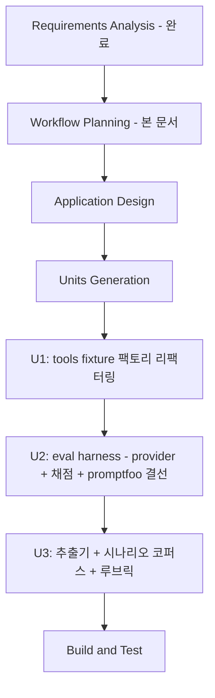

# F74 실행 계획 (Execution Plan)

## 상세 분석 요약

### 변환 스코프 (Brownfield)
- **아키텍처 변환**: 없음 — 기존 agent 경로는 동작 보존. 신규 `evals/` 서브시스템 추가 +
  `src/agent/tools/` 데이터 소스 결선의 주입화(behavior-preserving 리팩터링).
- **영향 컴포넌트**:
  - `src/agent/tools/__main__.py` + `market.py` — 단일 주입 팩토리 + 8개 명령 seam 신설 (수정)
  - `src/agent/orchestrator.py` — 수정 없음(재사용). provider가 인스턴스화
  - `src/agent/session.py` — 수정 없음(one_shot 기존 지원)
  - `src/agent/executor.py`, `src/risk/manager.py`, `src/execution/brokers/simulated_broker.py`
    — 수정 없음(Tier-1 채점에 재사용)
  - `evals/` — 신규 (promptfoo 설정, provider, 시나리오, 루브릭, 추출기)
- **교차 패키지 영향**: tools 리팩터링이 유일한 프로덕션 접점. F72(스크리닝 로깅)가
  `__main__.py` scoreboard 경로를 이미 수정함 — 머지 시 충돌 주의 (Merge Risk Notes 기재).

### 리스크 평가
- **수준**: 중간
- **주요 리스크**:
  1. tools 리팩터링이 프로덕션 turn의 tool 호출을 깨뜨릴 가능성 → 동작 보존 테스트 +
     fixture 미설정 시 기존 경로와 바이트 동일 결선으로 완화
  2. LLM 비결정성으로 행동 채점 신뢰도 한계 → non-blocking 운용(요구사항 확정)
  3. 평가 실행 자체의 토큰 비용 → Build & Test는 스모크(시나리오 1–2개)만, 전체 코퍼스는
     on-demand
  4. 시나리오 수동 보강 품질 의존 → positions/*.md 서술 1차 소스 + 루브릭으로 보정

## 워크플로 시각화

(텍스트 대안: RA → WP → Application Design → Units Generation → U1(tools 팩토리) →
U2(harness) → U3(시나리오) → Build & Test. U1→U2→U3은 의존 순서 — U2는 U1의 fixture 모드를,
U3은 U2의 provider/채점기를 필요로 한다.)

## 실행 단계 (Phases to Execute)

### 🔵 INCEPTION PHASE
1. ~~Workspace Detection~~ — 완료
2. ~~Requirements Analysis (standard)~~ — 완료 (critic 2R 반영, 승인됨)
3. **Workflow Planning** — 본 문서
4. **Application Design** — 실행. *근거*: 신규 컴포넌트 4종(fixture 팩토리, provider,
   채점기, 추출기)의 경계·의존·인터페이스 정의 필요. promptfoo 설치 방식 결정 포함.
5. **Units Generation** — 실행. *근거*: 의존 순서가 명확한 3개 유닛으로 분해(아래).

### 🟢 CONSTRUCTION PHASE (per-unit)
- **U1 — tools fixture 팩토리** (FR-1): Functional Design 실행(fixture 계약 스키마 = 새 데이터
  모델) → Code Generation. *NFR/Infra Design 스킵 근거*: NFR은 requirements에 확정(동작 보존
  + fail-honest), 인프라 변경 없음.
- **U2 — eval harness** (FR-4/5/6/7): Functional Design 실행(provider 흐름, 채점 파이프라인,
  Tier-1 체크 목록, 루브릭 구조) → Code Generation. promptfoo 결선 포함.
- **U3 — 추출기 + 시나리오 코퍼스** (FR-2/3): Functional Design 경량(시나리오 스키마는 U1/U2
  설계에서 대부분 확정) → Code Generation(추출기) + 시나리오 제작(추출 골격 + 수동 보강).
- **Build and Test** — 실행(항상). 토큰-0 단위/PBT 테스트 전체 + 스모크 eval(시나리오 1–2개,
  실 LLM) + 격리 증명. post-merge-guide 작성(on-demand 실행법, ANTHROPIC_API_KEY 요건).

## 스킵 단계 (Phases to Skip)

### 🔵 INCEPTION PHASE
1. **Reverse Engineering** — *근거*: CodeKB 존재(brownfield 아티팩트 충분).
2. **User Stories** — *근거*: 단일 개발자 내부 도구(developer tooling), 사용자 승인 시 skip 확정.

### 🟢 CONSTRUCTION PHASE
3. **NFR Requirements / NFR Design (per-unit)** — *근거*: NFR-1~6이 requirements에서 이미
   구체 확정(zero-token, 격리, 비결정성, 웹 허용, 비용, PBT Partial). 유닛별 재도출 불필요 —
   Functional Design에 직접 반영.
4. **Infrastructure Design** — *근거*: 클라우드/배포 변경 없음. promptfoo는 `evals/` 로컬
   dev 의존성.

## 유닛 의존 순서 (Package Change Sequence)
U1 (tools 팩토리 — 프로덕션 접점, 동작 보존 우선 검증) → U2 (harness — U1의 fixture 모드
사용) → U3 (시나리오 — U2의 provider로 검증). 각 유닛 완결 후 다음 진행.

## 성공 기준
requirements.md §6 수용 기준 6 + 1항 (13-tool fixture 응답, 시나리오 ≥10, Tier-1 리포트,
Tier-2 뷰어 비교, pytest 토큰-0, 운영 무부수효과, guidance 주입 증명).

## Extension Compliance (Workflow Planning 시점)
- Security Baseline: Disabled (N/A — opt-out)
- PBT Partial (02/03/07/08/09): 본 단계 N/A (계획 문서 — 코드 없음). U1~U3 Functional
  Design/Code Generation에서 적용 (시나리오 직렬화 round-trip, (action,side) 매칭 불변식,
  도메인 제너레이터 중앙화).
