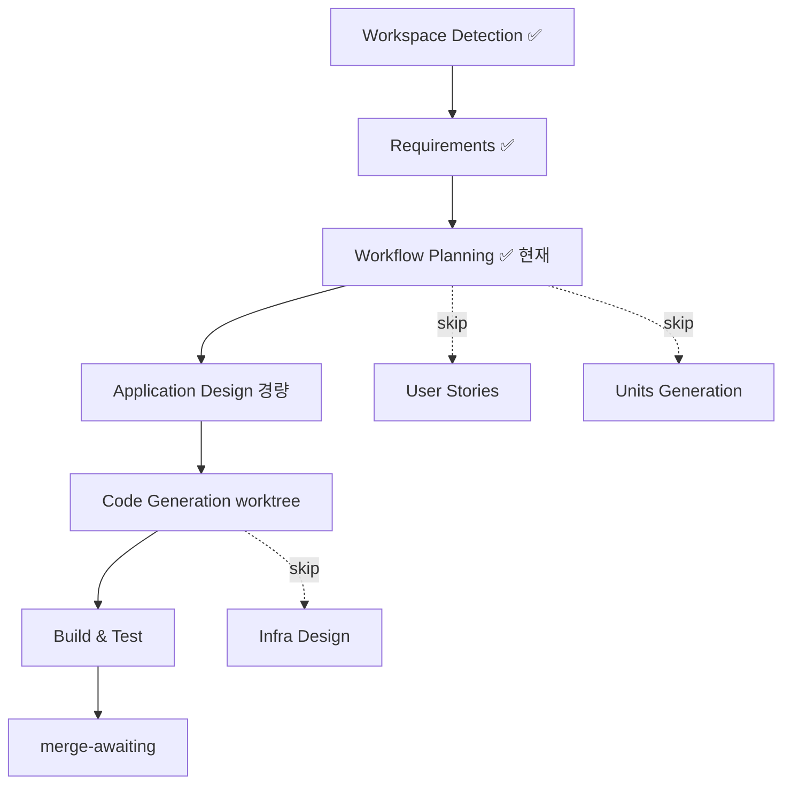

# F78 — Workflow Plan

**Date**: 2026-06-13 · **Base**: bacd341 · 요청 복잡도: **낮음~중간** (기존 F61 구조 위 additive)

## 실행/스킵 결정

| 단계 | 결정 | 깊이 | 근거 |
|---|---|---|---|
| Workspace Detection | ✅ 완료 | — | Brownfield, RE 아티팩트 존재 → reverse-eng skip |
| Requirements Analysis | ✅ 완료 | standard | 승인됨 |
| **User Stories** | ⏭️ **Skip** | — | 신규 사용자 페르소나/워크플로 없음. 내부 신호 채널 + 프롬프트 nudge로, 운영자는 더 풍부한 brief를 볼 뿐. 가치 낮음 |
| **Workflow Planning** | ✅ 실행 | — | 항상 |
| **Application Design** | ✅ **실행** | **경량(minimal)** | 신규 provider 인터페이스 / IPO record 타입 / 선별 pure 함수 시그니처 / config 키 / brief 섹션 계약 정의 필요 |
| **Units Generation** | ⏭️ **Skip** | — | 단일 응집 단위(signals 소스+brief+프롬프트). 분해 불필요 |

### Construction (단일 단위: `event-radar`)
| 단계 | 결정 | 깊이 | 근거 |
|---|---|---|---|
| Functional Design | ✅ 실행 | 경량 | IPO record 데이터 모델 + 선별 비즈니스 규칙(horizon/정렬/캡)을 Application Design에 흡수해 함께 처리 |
| NFR Requirements | ⏭️ Skip(흡수) | — | NFR-1~5가 요구사항에 이미 명시(F61 패턴 상속). 신규 NFR 평가 불필요 |
| NFR Design | ✅ 실행 | 경량 | fail-honest/timeout/cache/eval-seam을 코드 패턴으로 못박기 — Application Design 안에서 함께 |
| Infrastructure Design | ⏭️ Skip | — | 신규 인프라 없음(기존 Finnhub HTTP + env 키 재사용) |
| Code Generation | ✅ 실행 | — | 항상 (Part1 계획 → Part2 코드, worktree 게이트) |
| Build & Test | ✅ 실행 | — | 항상 (unit + PBT pure core + 회귀) |

## 흐름 시각화

## 병렬 트랙 / 머지 고려
- **F77 (StockTwits, F61 소스)** 와 `signals/` 계열·`prompts.py` 공유 가능 → additive 변경 유지,
  머지 시 brief 섹션·collector 와이어링 충돌만 수동 조정. (state.md Merge Risk Notes 참조)
- **F79 (MCP 리팩토링, 예정)** 와는 레이어가 달라(F78=데이터/프롬프트, F79=전달 메커니즘) 충돌 적음.
  F79가 CLI→MCP 전환 시 `ipo_calendar`도 자연 흡수, brief push는 유지.

## 사용자 통제
위 권고는 제안일 뿐, 어떤 단계든 **포함/제외를 지정**할 수 있습니다(예: User Stories 실행, 또는
Application Design 생략하고 바로 코드).
