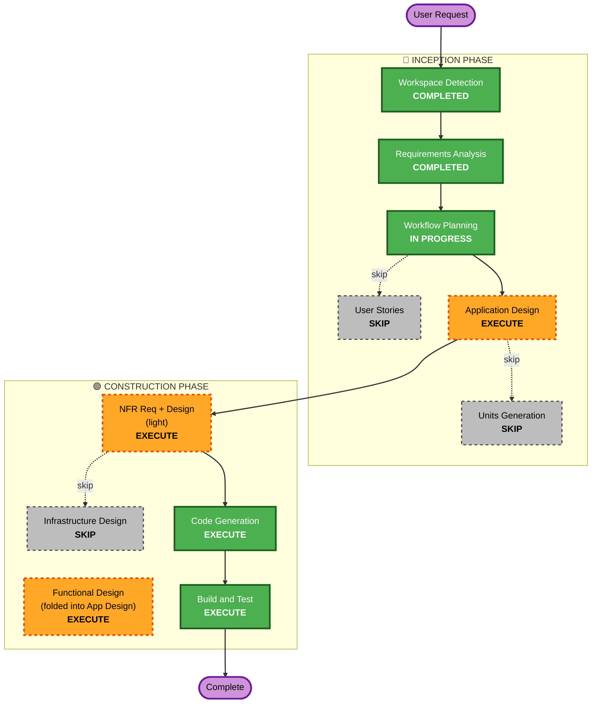

# F81 — Execution Plan

## Detailed Analysis Summary

### Transformation Scope (Brownfield)
- **Type**: Single-area feature addition (신규 서브패키지 + 2개 기존 모듈 배선).
- **Primary changes**: `src/signals/holdings/` 신규(소스-무관 추상화 + SEC 13F 구현 + overlay),
  `src/signals/` collector/brief/settings 배선, `src/universe/factory.py` 오버레이 병합, config.
- **Related components**: 숏 게이트(`src/risk/manager.py`, 변경 없이 소비), 유니버스 provider.

### Change Impact Assessment
- **User-facing**: Yes(간접) — 리서치 브리프에 13F 섹션, 유니버스에 종목 추가(봇 매매 후보 변화).
- **Structural**: Yes — 신규 소스-무관 `HoldingsProvider` 추상화 계층.
- **Data model**: Yes — `HoldingsSnapshot` / `HoldingRow` 정규화 레코드 신설.
- **API**: No(외부 계약 변화 없음). 내부 프로토콜 신설만.
- **NFR impact**: Yes — 외부 I/O(SEC), fail-honest, rate-limit, 보안(입력검증/역직렬화).

### Component Relationships
- **Primary**: `src/signals/holdings/` (신규).
- **Shared/consumed (무변경)**: `src/risk/manager.py`(숏 게이트), `src/universe/` provider, loguru.
- **Wired**: `src/signals/collector.py`·`brief.py`·`records.py`·`settings.py`, `src/universe/factory.py`.
- **Config**: `config/settings.yaml` `signals.disclosed_holdings`.

### Risk Assessment
- **Risk Level**: **Medium**. 유니버스(=tradeable pool)에 영향 → 봇이 거래 가능한 종목이 바뀜.
  방향성 오인(풋→롱) 차단이 핵심 정확성 리스크. 외부 I/O 신뢰성.
- **Rollback**: **Easy** — config 토글 off(`signals.disclosed_holdings` 비활성) 또는 커밋 revert.
  유니버스 오버레이/숏-사이드 모두 기본 보수값(롱-only, overlay off-able).
- **Testing**: **Moderate** — 순수 코어(파싱/diff/방향/staleness) 단위+PBT, fail-honest 경로,
  EDGAR fixture 기반 파서 테스트, 라이브 스모크(실 SEC fetch read-only).

## Stage 결정 (요청 복잡도 = Moderate)

### 실행 (EXECUTE)
- **Application Design** — 신규 `HoldingsProvider` 프로토콜/`HoldingsSnapshot` 레코드/overlay/
  collector·brief 배선/CUSIP 매핑 전략/staleness·cadence 기본값을 구체 설계. *사용자의 확장성
  우려의 핵심이라 반드시 설계로 못 박음.*
- **NFR Requirements + NFR Design (light, 묶음)** — fail-honest, SEC fair-access(UA/rate/host-pin),
  Security Baseline 적용 규칙(05/10/11/13/15)을 설계에 반영. requirements에 이미 다수 포착됨 →
  경량.
- **Code Generation** (ALWAYS) — 코드+테스트 생성. Construction은 설계 승인 후 자율 진행
  ([[feedback-autonomy-construction]]).
- **Build & Test** (ALWAYS) — 단위/PBT/통합/라이브 스모크 + post-merge guide(실사용 변화 있음).

### 스킵 (SKIP)
- **User Stories** — 단일 운영 자동화. 다중 페르소나/UX 표면 없음(브리프 한 섹션 + config).
- **Units Generation/Planning** — 단일 응집 유닛(`src/signals/holdings/`). 다중 유닛 분해 불필요.
- **Infrastructure Design** — 신규 클라우드 인프라 없음. 기존 데몬 프로세스 내 실행 + config/코드만.

## Workflow Visualization

## Phases to Execute / Skip

### 🔵 INCEPTION PHASE
- [x] Workspace Detection (COMPLETED)
- [x] Reverse Engineering (SKIPPED — CodeKB + per-track 코드 정독으로 충분)
- [x] Requirements Analysis (COMPLETED — approved)
- [x] User Stories (SKIP) — 단일 운영 자동화, 페르소나/UX 표면 없음
- [x] Execution Plan (IN PROGRESS)
- [ ] Application Design — **EXECUTE** — 신규 프로토콜/레코드/overlay/배선/매핑/기본값 설계
- [ ] Units Generation — **SKIP** — 단일 응집 유닛

### 🟢 CONSTRUCTION PHASE
- [ ] Functional Design — **EXECUTE** (Application Design에 통합 — 데이터모델/diff/방향/staleness)
- [ ] NFR Requirements — **EXECUTE** (light) — fail-honest/SEC fair-access/Security Baseline
- [ ] NFR Design — **EXECUTE** (light) — host-pin/rate/safe-XML/fail-closed 패턴
- [ ] Infrastructure Design — **SKIP** — 신규 인프라 없음
- [ ] Code Generation — **EXECUTE** (ALWAYS)
- [ ] Build and Test — **EXECUTE** (ALWAYS) + post-merge guide

### 🟡 OPERATIONS PHASE
- [ ] Operations — PLACEHOLDER

## Success Criteria
- **Primary Goal**: 공개 보유내역(1차 = SA LP 13F)을 주기적으로 따와 봇 유니버스/브리프에 안전하게
  공급. 13F 전용이 아닌 **plugin 가능한 소스-무관 구조**.
- **Key Deliverables**: `HoldingsProvider` 프로토콜 + `HoldingsSnapshot` 레코드 + `sec_13f`
  provider + 유니버스 overlay + 브리프 섹션 + config + 테스트(단위/PBT/통합/스모크).
- **Quality Gates**: fail-honest(턴 크래시 ❌) 검증, 방향 오인 차단(풋→롱 금지) 검증, 숏 게이트
  comply(기본 OFF long-only) 검증, Security Baseline(05/10/11/13/15) compliant, 라이브 SEC 스모크.

## Estimated Timeline
- Application Design + NFR(light) 1 게이트 → Code Generation(plan+gen) → Build & Test.
  설계 승인 후 Construction 자율 진행.
