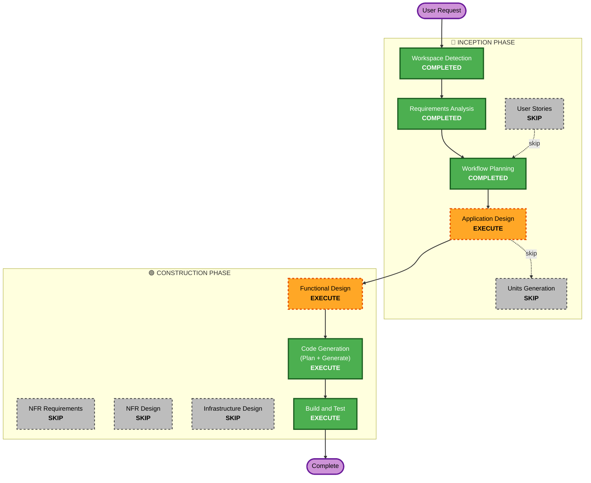

# F86 — Execution Plan

> 트랙: **F86** 모바일 대시보드 데이터 엔드포인트 (brownfield, monorepo). Requirements 승인 완료.

## Detailed Analysis Summary

### Transformation Scope (Brownfield)
- **Transformation Type**: Single-feature, additive (신규 read 라우트 + 클라 배선). 아키텍처/인프라 변경 없음.
- **Primary Changes**:
  1. **serve(node)**: `operator-console/cli/packages/opencode/src/server/autostock/`에 read 라우트 모듈 추가
     (`webauthn.ts`와 동형 fork-isolated) + `server.ts` 마운트 1줄.
  2. **PWA(SolidJS)**: `mobile-shell.tsx` 폴링 배선 + (필요 시) 작은 fetch 유틸. 기존 `assembleSnapshot`/
     `toDashboard`/`isStale`/`DashboardView` 코어 재사용.
- **Related Components**: 데몬 steering 발행물(`steering/snapshot.json`·`health.json`·`pending_approvals.json`)
  — **읽기만** 함(python 측 코드 변경 없음).

### Change Impact Assessment
- **User-facing changes**: **Yes** — 폰 `/autostock` 대시보드가 빈-모델 → 실데이터.
- **Structural changes**: No — 추가형 라우트, 기존 경계 유지.
- **Data model changes**: No (DB 없음). 신규 **API 응답 계약**만(Functional Design에서 확정).
- **API changes**: **Yes** — 신규 `GET /autostock/dashboard`(read-only, 추가형).
- **NFR impact**: **Yes** — 보안(원격 노출·fail-safe 신선도) + PBT(never-throw/staleness 불변).

### Component Relationships
- **Primary Component**: `server/autostock/` (신규 read 라우트) + `addons/autostock/mobile-shell.tsx`.
- **Shared Components**: `addons/autostock/{dashboard.ts, snapshot.ts, dashboard-view.tsx}` (재사용, 무변경 지향).
- **Dependent Components**: 없음(추가형). F84(모바일 차트)가 이 데이터에 의존 — 인접 스택, 별도 트랙.
- **Supporting Components**: 데몬 steering 발행물(read source) — 무변경.

### Risk Assessment
- **Risk Level**: **Low–Medium** — 단일 추가형 read 라우트, 기존 auth 경계 뒤, 롤백 단순(라우트 제거 + 마운트 1줄 + 클라 배선 되돌림).
- **Rollback Complexity**: Easy (`git revert` 1회; 추가형이라 타 경로 무영향).
- **Testing Complexity**: Moderate — PBT(파일→모델 변환 불변) + 서버 라우트 단위 + 실기기 폴링 스모크.

## Workflow Visualization

## Phases to Execute

### 🔵 INCEPTION PHASE
- [x] Workspace Detection (COMPLETED)
- [x] Reverse Engineering (SKIPPED — CodeKB present; 좁은 후속, 영역 코드 직접 확인 완료)
- [x] Requirements Analysis (COMPLETED)
- [x] User Stories (SKIP)
  - **Rationale**: F79가 이미 모바일 대시보드 스토리(US-2 "한눈 확인")를 정의. 단일 데이터-배선 후속이라 신규 페르소나/스토리 가치 낮음.
- [x] Workflow Planning (IN PROGRESS)
- [ ] Application Design — **EXECUTE**
  - **Rationale**: 신규 서버 read 라우트 + 응답 데이터 계약 + 컴포넌트/의존 정의 필요. 열린 설계질문 OQ-1~3 (데이터 소스 메커니즘 / market phase 파생 / agent activity 소스) 확정.
- [ ] Units Generation — **SKIP**
  - **Rationale**: 단일 유닛(엔드포인트 1 + 클라 배선). 분해 불필요.

### 🟢 CONSTRUCTION PHASE
- [ ] Functional Design — **EXECUTE**
  - **Rationale**: 대시보드 응답 스키마(필드/타입/누락 의미) 확정 + **PBT-01 속성 식별**(never-throw/staleness/조립 불변)을 설계 산출물에 문서화(PBT 확장 요건).
- [ ] NFR Requirements — **SKIP**
  - **Rationale**: NFR-1~6이 requirements.md에 이미 열거됨. 기술스택 확정(전송=폴링 GET, read=파일, **PBT 프레임워크=fast-check** F79 기존 도입 → PBT-09 충족). 신규 성능/스케일 아키텍처 없음.
- [ ] NFR Design — **SKIP**
  - **Rationale**: NFR Requirements 스킵. 보안(Security Baseline)·PBT는 **교차 제약으로 Application/Functional Design·Code Gen·Build&Test 게이트에서 강제 검증**(별도 NFR 설계 단계 불요).
- [ ] Infrastructure Design — **SKIP**
  - **Rationale**: 인프라 변경 없음 — 기존 `autostock serve` + tailscale-serve 재사용. 신규 클라우드/네트워크 리소스 없음.
- [ ] Code Generation — **EXECUTE (ALWAYS)**
  - **Rationale**: 서버 라우트 + 클라 배선 + PBT/example 테스트 구현. **worktree 게이트**: 코드 생성 Part 2 전 `feat/F86` 워크트리 생성.
- [ ] Build and Test — **EXECUTE (ALWAYS)**
  - **Rationale**: typecheck + 단위/PBT + 실기기 폴링 스모크 + post-merge-guide(실사용 검증) 작성.

### 🟡 OPERATIONS PHASE
- [ ] Operations — PLACEHOLDER

## Module Update Strategy (Brownfield)
- **Update Approach**: Sequential, 단일 워크트리(`feat/F86`).
- **Critical Path**: Functional Design(데이터 계약) → 서버 라우트(계약 생산) → 클라 배선(계약 소비).
- **Coordination Points**: 응답 JSON 계약 = 서버↔클라 단일 접점. python 데몬 발행물 스키마는 read-only 의존(무변경).
- **Testing Checkpoints**: 코어 변환 PBT(클라) → 서버 라우트 단위 → 통합(폴링 round-trip) → 실기기 스모크.

## Success Criteria
- **Primary Goal**: 폰 `/autostock` 대시보드가 데몬 실데이터(잔고/포지션·P&L/건강/승인대기/시장세션/에이전트활동)를 ~5s 주기로 표시, fail-safe 신선도 배지 포함.
- **Key Deliverables**: `GET /autostock/dashboard` read 라우트 + `mobile-shell` 폴링 배선 + PBT/example 테스트 + post-merge-guide.
- **Quality Gates**: typecheck 그린 · 단위/PBT 그린 · Security(SECURITY-05/08/15) 적합 · 실기기 폴링 스모크(사용자 1회).
- **Integration Testing**: 서버 라우트 ↔ 클라 폴링 round-trip; 데몬 워밍업(빈 스냅샷) graceful.
- **Out of scope**: portfolio history/자산곡선(F84), 세션입력 클라서명, SSE/푸시.
