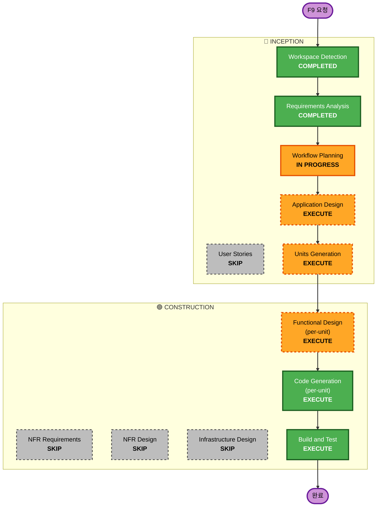

# F9 — 실행 계획 (Execution Plan)

> Workflow Planning 산출물. `requirements.md`(승인됨, v3) 기반. Single writer = F9 worktree
> 세션. 사용자 승인 대기. 본 트랙은 동시 다중 트랙 파티션 규칙에 따라 inception 산출물도
> 공유 `aidlc-docs/inception/` 대신 `tracks/F9/`에 둔다.

## 1. 상세 분석 요약

### 변환 범위 (Brownfield)
- **변환 유형**: 단일 component 변경이 아니라 **계약(contract) 변경 + 다언어 다패키지 확장**.
- **핵심 변경**: 게이트 입력 계약을 "슬래시 문자열 파싱" → "구조화 Alpaca형 MCP tool call"로 교체.
  결정적 파서(`parser.ts`) 제거, zod 경계 검증으로 대체. RiskManager가 완전 지정 주문을
  validator+auto-protect 하이브리드로 수신.
- **관련 component**: 콘솔 MCP(TS, 서브모듈) ↔ 데몬 steering 수신(Python) ↔ RiskManager/Order/
  AlpacaBroker(Python) ↔ 교차언어 golden contract.

### 변경 영향 평가
- **사용자(운영자) 영향**: 예 — 콘솔에서 가능한 주문 표현력이 시장가→Alpaca 전체 주문군으로 확대.
  단, 운영자 UX는 NL 그대로(opencode AI가 구조화 tool로 변환). 휴먼 컨펌(`ask`) 유지.
- **구조 변경**: 예 — 게이트 입력 계약/콘솔 MCP tool 표면 재설계.
- **데이터 모델 변경**: 예 — `Order`(trailing/notional/extended_hours/OTO/확장 TIF),
  `SteeringCommand.args`(Alpaca 파라미터)로 확장.
- **API/계약 변경**: 예 — MCP tool 시그니처(Alpaca 1:1) + TS↔pydantic golden contract.
- **NFR 영향**: 예 — advisor-only 불변, Security 베이스라인(11/03/15/13), fail-closed, PBT.

### Component 관계도
```text
[opencode 콘솔 AI]
      │ 구조화 Alpaca형 tool call (place_stock_order 등)
      ▼
[operator-console MCP server (TS, 서브모듈)]  ← parser.ts 삭제, schema.ts/zod 경계 검증
      │ opencode `ask` 휴먼 컨펌 → SteeringCommand+token file-drop
      ▼
[데몬 steering 수신 (records.py / commands.py, Python)]  ← golden contract (TS↔pydantic)
      │ 구조화 주문 핸들러
      ▼
[RiskManager.reception (manager.py)]  ← validate + clamp + auto-protect + price-sanity → reject/통과
      │
      ▼
[Order 모델 (models.py/types.py)] → [AlpacaBroker (alpaca_broker.py)] → 주문(들) / 구조화 reject

[research/intraday/PM advisor 에이전트] ──(decisions.jsonl → DecisionExecutor → RiskManager)── 변경 없음
```

### 리스크 평가
- **리스크 레벨**: **High** (critic 검토 후 상향). 단순 "필드 추가"가 아니라 ① `Order`/브로커
  실질 재작업, ② 휴먼 주문 경로에 budget/pool/breaker 게이트 **신규 도입**(현재 휴먼 BUY는
  무게이트), ③ TIF 무음강등 잠복버그 정정. 완화: advisor 에이전트 경로 무변경(decisions.jsonl),
  데몬 RiskManager/Broker가 최종 권위 + fail-closed, 기본 paper/TEST 계정, golden contract가
  **per-verb args까지** 다언어 드리프트 차단(NFR-3 강화), 안전동사는 결정적 경로 유지(FR-2 하이브리드).
- **롤백 복잡도**: 보통 — worktree + 서브모듈 브랜치, parent gitlink는 머지 시에만 커밋.
- **테스트 복잡도**: 보통-높음 — 교차언어 contract + 리스크/브로커 단위 + Hypothesis PBT + 스모크.

## 2. 워크플로 시각화



## 3. 실행/스킵 단계

### 🔵 INCEPTION
- [x] Workspace Detection — COMPLETED (brownfield; RE 산출물 존재)
- [x] Requirements Analysis — COMPLETED (v3 승인)
- [ ] User Stories — **SKIP**
  - **근거**: 운영자/AI 대상 tool 표면 변경. 새 페르소나·사용자 워크플로 신규 없음.
    수용 기준은 requirements FR-1..8로 충분히 표현됨.
- [~] Workflow Planning — IN PROGRESS (본 문서)
- [ ] Application Design — **EXECUTE**
  - **근거**: 신규 구조화 MCP tool 표면, RiskManager 수신 모드(validate/clamp/auto-protect/
    price-sanity), `Order`/`SteeringCommand` 모델 확장, `replace` ↔ resting 보호레그 정합,
    교차언어 계약 정의 — 메서드/계약/의존 명세 필요.
- [ ] Units Generation — **EXECUTE** (3 units, §4)

### 🟢 CONSTRUCTION
- [ ] Functional Design (per-unit) — **EXECUTE**
  - **근거**: 신규 데이터 모델 + 복잡 비즈니스 로직(예산 clamp 시 bracket leg 정합, 보호레벨
    해석, price-sanity, replace 의미론).
- [ ] NFR Requirements — **SKIP**
  - **근거**: NFR-1..5가 requirements.md에 이미 열거됨. 신규 기술스택 선정 없음(기존 TS/Python).
- [ ] NFR Design — **SKIP**
  - **근거**: Security 베이스라인은 **blocking 확장**으로 모든 stage에 inline 강제됨(별도 stage
    아님). 권한 격리(SECURITY-11)·토큰 비로깅(03)·fail-closed(15)·safe-deserialize(13)·zod 경계는
    Application/Functional Design 내에서 구체 설계. 별도 NFR Design stage는 중복.
- [ ] Infrastructure Design — **SKIP**
  - **근거**: 클라우드/IaC 없음. 기존 로컬 데몬 + 파일드롭 채널 그대로.
- [ ] Code Generation (per-unit) — **EXECUTE (ALWAYS)**
  - **근거**: 구현 + 테스트 생성. worktree + 서브모듈 브랜치는 Code Gen Part 2에서 생성.
- [ ] Build and Test — **EXECUTE (ALWAYS)**
  - **근거**: 교차언어 golden contract, 리스크/브로커 단위, Hypothesis PBT(순수함수),
    TEST 계정 스모크(containerized verify harness).

### 🟡 OPERATIONS
- [ ] Operations — PLACEHOLDER

## 4. Units 분해 (잠정 — Application Design에서 확정)

데이터 흐름의 **bottom-up** 순서로 빌드(각 unit은 design→code 완결 후 다음으로). 교차언어
golden contract는 U-CONSOLE 완료 시 최종 일치, Build & Test에서 전체 검증.

| 순서 | Unit | 언어/위치 | 범위 (critic 반영 후) |
|------|------|-----------|------|
| 1 | **U-RISK** | Python | `src/core/types.py`·`models.py` **`Order` 실질 재작업**(`OrderType`에 trailing_stop, `OrderClass`에 oto, `notional`/`extended_hours`/`client_order_id`/`trail_price`/`trail_percent` 필드 + validator), `src/execution/brokers/alpaca_broker.py`(trailing/notional/extended_hours 매핑, `_time_in_force` **미지원 TIF reject**(무음 DAY강등 제거), **신규** `replace_order`/`cancel_all_orders`/`close_all_positions` 브로커 메서드 + leg-aware replace), `src/risk/manager.py` 수신(validate+**budget/pool/breaker 검사(휴먼 경로 신규)**+clamp+auto-protect+price-sanity+FR-5a override, 구조화 reject) |
| 2 | **U-DAEMON** | Python | `src/agent/steering/records.py` `SteeringCommand` 리치 args(+`Literal` verb set에 replace/close_all/close_position 추가), `src/agent/steering/commands.py` 구조화 주문 핸들러(`build_human_buy`/`_v_buy`/`_v_sell`를 FR-5 게이트 경유 핸들러로 대체) + replace/close-all 동사, **안전동사 결정적 디스패치 유지**, `tests/test_steering_contract.py`(Python 측 contract, **per-verb args 포함**) |
| 3 | **U-CONSOLE** | TS (서브모듈) | `operator-console/src/mcp-server.ts` 구조화 주문 tool 등록, `steer-handler.ts` args→SteeringCommand 빌더, `schema.ts` 확장 + zod 경계, **`parser.ts`는 주문 문법만 제거(안전/lifecycle 동사 결정적 경로 유지) — 완전 삭제 아님**, `test/contract.test.ts`(envelope + **per-verb 주문 args 고정, parser 문법 제거 전 선행**) |

**의존/시퀀스 근거**: U-RISK가 `Order`/브로커/리스크 수신의 토대 → U-DAEMON 핸들러가 그 `Order`를
FR-5 게이트 경유로 구성 → U-CONSOLE가 SteeringCommand를 생성해 데몬으로 투입. 이 순서가
forward-stub을 최소화.

**Worktree 게이트(blocking)**: 코드 생성은 worktree(`feat/console-alpaca-orders`) 안에서만. 서브모듈
(`operator-console/cli`)도 동일 브랜치로 branch(detached HEAD 금지). parent gitlink는 **머지 시에만** 커밋.

## 5. 예상 타임라인
- **실행 stage 수**: 5 (Application Design, Units Generation, Functional Design×units,
  Code Generation×units, Build & Test) + 완료 2 (WD, RA).
- **추정**: 설계 게이트 후 construction은 autonomy 원칙(승인 후 자율 진행)으로 진행.

## 6. 성공 기준
- **주요 목표**: 콘솔에서 Alpaca 전체 주식 주문군(limit/stop/stop_limit/trailing/TIF/notional/
  bracket·oco·oto/cancel·replace·close)을 **구조화 tool**로 표현 가능하되, 데몬 RiskManager→Broker
  게이트를 그대로 통과(또는 구조화 reject).
- **핵심 산출물**: 구조화 MCP tool 표면, 확장 `Order`/`SteeringCommand`, RiskManager 수신,
  AlpacaBroker 매핑+replace, 교차언어 golden contract.
- **품질 게이트**: advisor-only 불변 유지(에이전트 도달 불가), 토큰 비로깅, fail-closed,
  golden contract green, Hypothesis PBT green, TEST 계정 스모크 통과.
