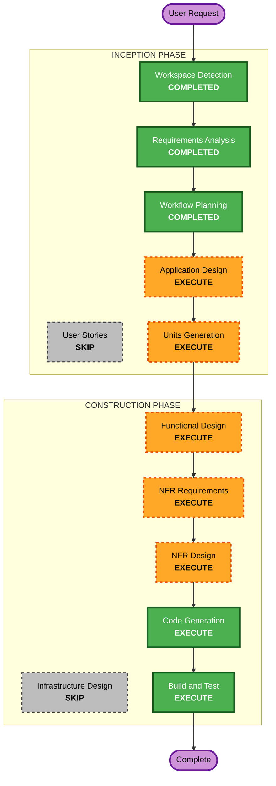

# F95 — Execution Plan

> Track F95 · Workflow Planning. 대상: TUI 심볼 클릭 → 플로팅 패널(실시간 시세 항상 + 현행 있으면).

## Detailed Analysis Summary

### Transformation Scope (Brownfield)
- **Transformation Type**: 2-component 기능 추가 (아키텍처 변형 아님).
- **Primary Changes**:
  1. **Python 데몬** (`src/`): 클릭-후보 심볼 집합(보유 ∪ 주문 ∪ 최근 turn/decision/intervention 등장) 계산 → **~1-2s 배치 REST**(`fetch_latest_prices`, `src/data/prices.py`)로 갱신 → **warm-cache 원자적 기록**(인스턴스 steering 경로, ts+TTL, `_price_book` 패턴 `runtime.py:178,435-463`). 지속 연결 없음. 조회 불가 시 패널 "시세 없음/오류"(fail-honest, 데몬 무크래시).
  2. **TS TUI** (`operator-console/cli/packages/tui-trading` + `.../opencode/.../routes/session`): intervention 심볼 클릭화, SymbolOverlay에 시세 섹션 추가(+"as of" 신선도), warm-cache 리더 훅(`use-quote`) + 짧은 폴링, 캐시-미스 시 온클릭 1회 fetch.
- **Related Components**: `snapshot.json`(보유·주문 즉시가 fast-path), 데이터 provider(`create_data_provider` — yfinance 기본/Alpaca 옵션, 브로커와 분리), steering 파일채널(`channel.py`, 원자적 단일 writer), steering workspace 경로(인스턴스 격리).

### Change Impact Assessment
- **User-facing changes**: Yes — 새 클릭 진입점 + 패널에 시세 섹션.
- **Structural changes**: No — 기존 오버레이/채널 구조 계승, 신규 파일채널 1종 추가.
- **Data model changes**: Yes(경량) — warm-cache 파일 스키마 신규(심볼→가격+ts+TTL; Functional Design 확정).
- **API changes**: No 외부 API 시그니처 변경. 데몬 내부에 candidate 산출 + 배치 시세 갱신 잡 추가.
- **NFR impact**: Yes — 반응성(클릭 즉시)·신선도(~1-2s)·인스턴스 격리·fail-honest·레이트리밋/캐시.

### Component Relationships
- **Primary**: `@tui-trading/core` (SymbolOverlay, use-overlay, 신규 use-quote 훅), `intervention-overlay.tsx`.
- **Shared**: steering 파일채널(`channel.py`), `snapshot.json` 리더(`use-snapshot-data.ts`).
- **Dependent**: 데몬 시세 프로듀서(신규, `src/agent/steering/` 또는 인접), Alpaca market-data 어댑터.
- **Change types**: TUI=Minor(추가), 데몬=Minor(신규 프로듀서), 파일스키마=신규.

### Risk Assessment
- **Risk Level**: **Medium** — 2 컴포넌트 + 신규 per-instance warm-cache 파일 + 데이터 provider REST 의존. (스트리밍 미채택으로 인프라/연결-한도 리스크 제거.)
- **해소된 리스크**: Alpaca websocket 1-연결 한도·공유 볼륨·사이드카 — per-instance REST(지속 연결 없음) 채택으로 **원천 배제**(§ requirements ADR §9).
- **잔여 고려**: provider별 시세 지연(yfinance 기본은 지연 가능) → "as of" 정직 표기. yfinance 간헐 실패 → 백오프/graceful.
- **Rollback Complexity**: Easy~Moderate — 기능 플래그/파일 부재 시 시세 섹션만 비활성(패널·기존 동작 무영향).
- **Testing Complexity**: Moderate — warm-cache 라운드트립 단위/통합 + TUI 렌더 + fail-honest(조회 실패) + candidate 집합 산출.

## Workflow Visualization

## Phases to Execute

### 🔵 INCEPTION PHASE
- [x] Workspace Detection (COMPLETED)
- [x] Reverse Engineering (SKIPPED — CodeKB 존재, feasibility 조사로 대체)
- [x] Requirements Analysis (COMPLETED — Standard)
- [x] User Stories (SKIP)
  - **Rationale**: 단일 운영자 페르소나, 시나리오/수용기준이 requirements.md에 이미 명료. 팀 협업/다중 페르소나 없음.
- [x] Workflow Planning (IN PROGRESS)
- [ ] Application Design — **EXECUTE**
  - **Rationale**: 데몬 warm-cache 프로듀서 ↔ TUI 리더 경계(candidate 산출, warm-cache 파일 위치·격리, 리더 훅 구조) 정의 필요.
- [ ] Units Generation — **EXECUTE**
  - **Rationale**: 2개 파티션(Python 데몬 warm-cache 프로듀서 / TS TUI 패널·리더)로 분해. warm-cache 파일 스키마가 계약.

### 🟢 CONSTRUCTION PHASE
- [ ] Functional Design — **EXECUTE**
  - **Rationale**: 시세 요청/응답 파일 스키마, 패널 콘텐츠 규칙(시세 always / 현행 graceful), 로딩·타임아웃·에러 상태, snapshot 즉시가 fast-path 정의.
- [ ] NFR Requirements — **EXECUTE (경량)**
  - **Rationale**: 지연(≤2s)·인스턴스 격리·fail-honest·레이트리밋/캐시 요건 명문화.
- [ ] NFR Design — **EXECUTE (경량)**
  - **Rationale**: 원자적 write/torn-read 방지, 폴링 주기·디바운스, 캐시 TTL, 데몬 크래시 방지 패턴.
- [ ] Infrastructure Design — **SKIP**
  - **Rationale**: 신규 클라우드/인프라/배포 모델 변경 없음. 기존 데몬·파일채널·워크스페이스 재사용.
- [ ] Code Generation — **EXECUTE (ALWAYS)**
- [ ] Build and Test — **EXECUTE (ALWAYS)**

### 🟡 OPERATIONS PHASE
- [ ] Operations — PLACEHOLDER

## Package Change Sequence (Brownfield)
1. **Python 데몬 시세 프로듀서** (`src/`) — warm-cache 파일 스키마(계약) 먼저 확정·생산. 스트리밍 구독 + fail-honest 폴백 포함.
2. **TS TUI 컨슈머/패널** (`operator-console/cli`) — warm-cache 파일을 읽어 렌더(+신선도). intervention 클릭화 포함.
   - 두 유닛은 **warm-cache 파일 스키마(계약)**로만 결합 → 스키마 확정 후 병렬 구현 가능, 통합은 라운드트립 + fail-honest 테스트.

## Estimated Timeline
- **실행 스테이지 수**: 8 (Inception 2 + Construction 6, SKIP 제외).
- **개략 규모**: 소~중 (UI 배선 작음, 데몬 시세 채널이 주요 작업). 단일 세션 자율 구축 가능 범위.

## Success Criteria
- **Primary Goal**: TUI에서 심볼 클릭 시 실시간 시세가 항상 뜨는 플로팅 패널(현행 정보는 있으면 표시).
- **Key Deliverables**:
  - intervention 심볼 클릭 → SymbolOverlay 오픈.
  - 시세 **클릭 즉시 + ~1-2s 신선도**(per-instance REST warm-cache + snapshot fast-path + 캐시-미스 온클릭 1회 fetch), "as of" 신선도 표기.
  - 현행(포지션/thesis/결정) graceful 표시/생략.
- **Quality Gates**:
  - TS typecheck(worktree bun) + Python 단위테스트 그린.
  - warm-cache 라운드트립 통합테스트 + candidate 집합 산출.
  - fail-honest(조회 실패/키 부재 → 데몬 무크래시, 패널 "시세 없음/오류"+신선도).
  - 기존 오버레이/turn 클릭 비회귀.
  - 인스턴스 격리(멀티 인스턴스 시 warm-cache 파일 교차 오염 없음).
