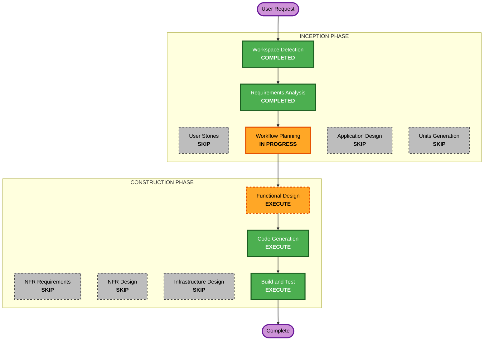

# F97 실행 계획 (Execution Plan)

## Detailed Analysis Summary

### Transformation Scope (Brownfield)
- **Transformation Type**: Single feature — 기존 데이터(`workspace/equity.jsonl`) 위에 지표 계산 코어 + 노출 배선 추가.
- **Primary Changes**:
  1. 신규 순수 코어 모듈 — SPY buy-and-hold 정규화 + 누적수익/alpha/오늘 델타 계산 (`src/agent/logs/` 하위 예정).
  2. EOD 훅 배선 — `src/trading/modes/agent.py:_eod`에서 `record_equity` 직후 지표 계산·발행.
  3. 스냅샷 payload 확장 — `src/agent/steering/runtime.py`(publish_snapshot)에 `perf_vs_benchmark` 블록 추가.
  4. TUI 렌더 — `operator-console/cli/packages/tui-trading` 헤드라인 표시.
  5. 모바일 대시보드(F86) — `dashboard-read.ts` 계약에 벤치마크 필드 추가 + app addon 렌더.
- **Related Components**: `src/agent/logs/equity.py`(reader 재사용), `src/backtest/metrics.py`/`src/benchmark/metrics.py`(참고), F86 dashboard 계약, TUI 훅.

### Change Impact Assessment
- **User-facing changes**: Yes — 오퍼레이터가 TUI/모바일에서 성과 헤드라인 확인.
- **Structural changes**: No — 신규 모듈 1개 + 기존 계약에 필드 추가만.
- **Data model changes**: No new persisted schema — 기존 `equity.jsonl` 읽기 전용 소비. (payload에 계산값 필드 추가는 있음, 영속 스키마 변경 아님.)
- **API changes**: Additive only — 스냅샷 JSON / dashboard JSON에 필드 추가(제거·rename 없음, 하위호환).
- **NFR impact**: Fail-honest, 순수/결정론 코어, PBT. 신규 tech stack 없음(Python + hypothesis 기존).

### Component Relationships
- **Primary Component**: 신규 perf 코어 모듈 (Python).
- **Shared Components (읽기)**: `equity.py:read_equity`, 지표 라이브러리.
- **Dependent/노출 Components**: steering runtime(publish_snapshot), TUI, F86 dashboard-read + app addon.
- **동시 트랙 주의**: F95/F96(동시 세션, 내용 미상) — steering/dashboard 계약을 건드릴 경우 머지 전 재확인. F94가 최근 dashboard/mcp 계약 수정 → main 반영됨(base 4f3fcbf 포함).

### Risk Assessment
- **Risk Level**: Low — read-only 로그 소비 + additive 노출. EOD 파이프라인은 fail-honest로 보호.
- **Rollback Complexity**: Easy — 신규 모듈 + additive 필드, 되돌리기 단순.
- **Testing Complexity**: Simple~Moderate — 순수 코어 PBT + example, 배선 스모크, live 1회.

## Workflow Visualization

## Phases to Execute

### INCEPTION PHASE
- [x] Workspace Detection (COMPLETED)
- [x] Reverse Engineering (SKIPPED — CodeKB + targeted Explore RE 사용)
- [x] Requirements Analysis (COMPLETED)
- [ ] User Stories — **SKIP**
  - **Rationale**: 단일 개발자, 명확·단순 스코프, 헤드라인 표시. 다중 페르소나/수용기준 협업 불필요.
- [ ] Application Design — **SKIP**
  - **Rationale**: 신규 서비스 계층 없음. 단일 소형 모듈 + 기존 계약 필드 추가. 컴포넌트 메서드/의존 설계는 Functional Design에서 커버.
- [ ] Units Planning / Generation — **SKIP**
  - **Rationale**: 단일 논리 유닛. 분해 불필요.

### CONSTRUCTION PHASE
- [ ] Functional Design — **EXECUTE**
  - **Rationale**: 핵심 = 정규화/수익률/alpha 순수 함수의 정확한 정의 + payload 계약 + EOD 배선 지점 + PBT-01 property 식별. 설계 승인 게이트.
- [ ] NFR Requirements — **SKIP**
  - **Rationale**: 신규 tech stack 없음(Python + hypothesis 기존). 성능 무시 가능(하루 1회 소량). NFR은 requirements/functional design에 이미 반영.
- [ ] NFR Design — **SKIP**
  - **Rationale**: NFR Requirements 스킵. fail-honest/순수코어 패턴은 기존 관례 재사용.
- [ ] Infrastructure Design — **SKIP**
  - **Rationale**: 인프라 변경 없음. 기존 데몬/스케줄러/파일드롭 채널 재사용.
- [ ] Code Generation — **EXECUTE (ALWAYS)**
  - **Rationale**: 코어 모듈 + 배선 + PBT/example 테스트 생성.
- [ ] Build and Test — **EXECUTE (ALWAYS)**
  - **Rationale**: 빌드/typecheck/테스트/실계좌 live smoke + post-merge guide(user-facing).

### OPERATIONS PHASE
- [ ] Operations — PLACEHOLDER

## Execution Approach (autonomy)
[[feedback-autonomy-construction]] 준수: **Functional Design 승인 이후** Code Generation + Build & Test는
자율 진행하고, 진짜 사람 판단이 필요할 때만(설계 재검토/예상 밖 충돌) 멈춘다.

## Estimated Timeline
- **Total Stages to Execute**: 3 (Functional Design, Code Generation, Build & Test)
- **Estimated Duration**: 짧음 — 코어 함수 1개 + 3~4곳 배선 + 테스트.

## Success Criteria
- **Primary Goal**: 매일 TUI/모바일에서 "에이전트 누적% vs S&P500 % (alpha%) + 오늘 델타" 확인.
- **Key Deliverables**: perf 코어 모듈, EOD 배선, 스냅샷 payload 필드, TUI/모바일 렌더, PBT+example 테스트, post-merge guide.
- **Quality Gates**: PBT 컴플라이언스, typecheck/테스트 그린, 손계산 검증, live smoke 1회.
- **Integration Testing**: EOD → snapshot.json → TUI/dashboard 경로 스모크.
